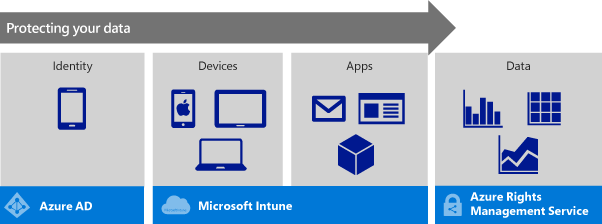
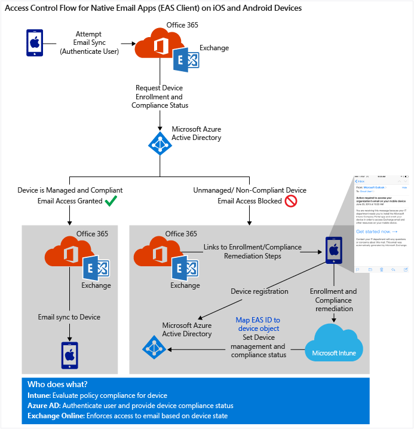
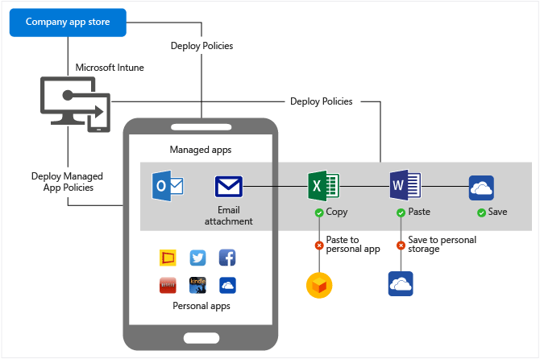

# Doporučen&#237; ohledně architektury pro ochranu firemn&#237;ch e-mailů a dokumentů
Toto téma začíná přehledem toho, jak můžete své společnosti zajistit ochranu dat a zároveň zachovat jednoduché prostředí pro koncové uživatele, které nemá negativní vliv na produktivitu. Potom se konkrétně zaměříme na to, co můžete udělat, abyste zajistili zabezpečený přístup k firemním e-mailům a pomohli chránit firemní data v e-mailech a přílohách pomocí řešení Microsoft Enterprise Mobility Suite.

> [!TIP]
> Kopii celého tématu ke stažení najdete v [Galerii TechNet](https://gallery.technet.microsoft.com/Managing-Access-and-Help-b7a05d0d/file/140056/1/Managing%20Access%20and%20Help%20Protect%20Corporate%20Email%20Data%20on%20Mobile%20Devices.pdf).

## Rovnováha mezi produktivitou a zabezpečením
Zaměstnanci chtějí mít možnost využívat pro přístup k firemním prostředkům a kancelářským nástrojům svá vlastní zařízení. Tým IT si ale musí být jistý, že zaměstnanci sice tuto možnost mají, ale citlivá firemní data jsou přitom chráněná. Funkce [Přineste si vlastní zařízení](https://technet.microsoft.com/en-us/library/Dn656905(l=en-us,v=WS.11).aspx) představuje specifickou výzvu v tom, že je v osobních zařízeních nutné oddělit osobní a pracovní data a zabránit úmyslnému i neúmyslnému sdílení firemních dat.

**Studie ukazují, že:**

-   37 % celosvětové pracovní síly je mobilní.&#42;

-   Ve 3. čtvrtletí 2014 se celkem 53 % e-mailů otevřelo v mobilním telefonu nebo tabletu.&#42;&#42;

-   61 % pracovníků ve svých zařízeních směšuje osobní a pracovní úkoly.&#42;&#42;&#42;

Zvažte proto:

-   E-mail je často nejpoužívanější aplikací na všech zařízeních.

-   Obsah e-mailů a e-mailových příloh se dá zkopírovat, sdílet nebo přesunout do jiných umístění mimo dosah vašeho IT oddělení a to může vést k ohrožení zabezpečení vaší firmy.

Vzhledem k tomu, že koncoví uživatelé chtějí používat svá osobní zařízení pro pracovní účely a e-mail je nejčastěji používanou aplikací, musí tým IT nejdřív zajistit, aby koncoví uživatelé měli svých zařízeních přístup k firemnímu e-mailu, ale současně se taky ubezpečit, že citlivá data v e-mailu nejsou ohrožená.

## Přehled
Microsoft nabízí komplexní řešení pro ochranu dat a správu identit, mobilních zařízení a aplikací – Enterprise Mobility Suite (EMS). EMS zajišťuje vrstvený model zabezpečení, který umožňuje vašemu oddělení IT spravovat přístup k e-mailům, datům a firemním aplikacím z takřka všech zařízení.

EMS tvoří tyto cloudové služby:

EMS chrání data uvnitř vaší firemní sítě i mimo ni:

-   Zaměstnanci mají na zařízení, které si sami vyberou, přístup k firemnímu e-mailu, pracovním aplikacím a firemním datům a nemusí si přitom dělat starosti se zabezpečením citlivých firemních informací.

-   Firemní data se chrání na všech úrovních, na úrovni uživatele, zařízení, aplikace a v neposlední řadě i na úrovni dat.

-   Správce IT může zajistit, aby k firemním datům měli přístup jenom důvěryhodní uživatelé na spravovaných a kompatibilních zařízeních a jenom v kontextu spravovaných aplikací.

Mezi aplikace spravované Intune patří mobilní aplikace Office, na které se toto řešení soustředí. Mobilní aplikace Office pomůžou zaměstnancům zvýšit produktivitu na maximum a současně předcházet únikům dat. Správce IT může třeba nastavit zásady, které zabraňují kopírování firemních dat do osobního cloudového úložiště, jako je Dropbox.

Pro případ, že se zaměstnanci přestěhují, změní práci nebo ztratí své zařízení, EMS nabízí možnost vzdáleně a selektivně vymazat firemní data ze zařízení. Udělat to může koncový uživatel nebo správce IT.

## Jak EMS může pomoct chránit vaše data
Čtyřvrstevný model zabezpečení pro identity, zařízení, aplikace a data zajišťuje, že k firemním prostředkům přistupuje jenom určený uživatel, na zařízení, které splňuje sadu zásad dodržování předpisů, které jste nakonfigurovali, a v rámci hranic spravovaných aplikací.

Ochrana dat začíná zřízením a ověřením identity uživatele.*Azure AD*, nástroj pro správu přístupu a identit na podnikové úrovni, zajišťuje jednotné přihlašování, vícefaktorové ověřování, samoobslužná hesla a další věci. V modelu zabezpečení poskytuje funkce pro **vrstvu identit**.

Správce IT může na základě identit pomocí *Microsoft Intune* ověřit, že mobilní zařízení jsou zaregistrovaná, spravovaná a odpovídají vašim podnikovým zásadám. To je **vrstva zařízení**.

Třetí vrstvou je **vrstva správy aplikací** s ekosystémem aplikací spravovaným pomocí Intune. Tento ekosystém, který uživatelům umožňuje zajistit produktivitu a využívat nástroje, které potřebují a znají, jako je Office, taky umožňuje týmu IT uchovávat citlivá data uvnitř ekosystému spravovaných aplikací.

*Azure Rights Management (Azure RMS)* je poslední částí modelu zabezpečení a chrání data na úrovni souborů. Zásady zabezpečení, které jsou pro data použité, s daty cestují a pomáhají je zabezpečit při transitu i v klidu, bez ohledu na zařízení, pomocí kterého se k nim přistupuje. To je **datová vrstva** modelu zabezpečení.

## Ochrana podnikových e-mailů a dokumentů
Ochrana podnikových e-mailů má dva hlavní cíle:

-   Povolit přístup k firemnímu e-mailu jenom kompatibilním zařízením

-   Ochrana obsahu v e-mailech a přílohách

### Povolit přístup k firemnímu e-mailu jenom kompatibilním zařízením
Důležitým krokem při ochraně firemních dat je omezení přístupu k zařízením, která nepoužívají silné heslo, nemají jailbreak nebo nejsou šifrovaná. Microsoft Intune vám dává možnost nastavit podmínky, které uživatelé musí splnit, aby získali přístup k vašim firemním firemním prostředkům. To se označuje jako podmíněný přístup.

Podmíněný přístup je určený dvěma typy zásad, které můžete nastavit v Intune:

**Zásady dodržování předpisů** určují kompatibilitu zařízení. Vyhodnocují nastavení a podmínky, jako jsou:

-   **Kódy PIN a hesla**: Tým IT může vytvořit pravidla, která vyžadují hesla k odemknutí zařízení, složitost, dobu platnosti a další nastavení hesel.

-   **Šifrování**: Tým IT může omezit přístup k zařízením, která jsou šifrovaná.

-   **Zařízení nemá jailbreak ani root**: Intune může zjistit, jestli má zaregistrované zařízení jailbreak, a tým IT může nastavit zásady tak, aby k takovým zařízením blokovaly přístup.

**Zásady podmíněného přístupu** se konfigurují pro konkrétní službu, jako je Exchange Online nebo SharePoint Online. U každé služby můžete definovat, na které skupiny uživatelů se tyto zásady mají vztahovat. Můžete například zkontrolovat, že všichni ve finančním oddělení mají přístup k firemnímu e-mailu jenom z kompatibilních zaregistrovaných zařízení.

V [tomto](https://www.youtube.com/watch?feature=player_embedded&v=lYx3YIezccg) čtyřminutovém videu se dozvíte, jak podmíněný přístup ovlivňuje vaše koncové uživatele.

## Proč na záleží na architektuře
Různé komponenty EMS a Office 365 jsou navrženy pro spouštění v cloudu. To přináší veškeré výhody, které cloud nabízí: škálovatelnost, flexibilitu a snadnou správu.

Vzhledem k tomu, že různé firmy mají různé požadavky, je sada EMS navržená tak, aby umožňovala integraci se stávající místní infrastrukturou, jako je Active Directory, Exchange Server nebo System Center Configuration Manager. To umožňuje používat přihlašovací údaje, které jsou už ve vaší síti vytvořené, pro místní i cloudové prostředky.

Následující oddíly popisují architekturu navrženou pro spouštění v cloudu a stručně se věnují i místní možnosti.

### Přístup k e-mailu
V závislosti na typu e-mailové aplikace, kterou používáte pro přístup k Exchangi Online, se může postup zřízení zabezpečeného přístupu trochu lišit. Klíčové komponenty Azure Active Directory (Azure AD), Office 365/Exchange Online a Microsoft Intune ale zůstávají stejné. Prostředí IT a činnost koncového uživatele jsou taky podobné. EMS teď podporuje nativní e-mailové aplikace a aplikaci Microsoft Outlook pro iOS a Android.

### Řízení přístupu pro nativní e-mailové aplikace
U klientů Exchange ActiveSync (EAS), kteří se pokoušejí o přístup k e-mailu v Exchangi Online, se vyhodnotí tyto vlastnosti:

-   Je zařízení spravované pomocí Intune?

-   Je zařízení registrované v Azure Active Directory?

-   Je zařízení kompatibilní?

-   Je klientské ID EAS mapované na registrované zařízení?

Pro zajištění kompatibilního stavu zařízení, ve kterém je spuštěný klient EAS, musí:

-   Zaregistrovat se v Intune

-   Zaregistrovat se v [Azure Active Directory](https://msdn.microsoft.com/en-us/6a14cb1f-a058-4453-8ede-d9f4a66a7073.aspx)

-   Vyhovovat zásadám zařízení nastaveným správcem IT

Na většině platforem se registrace zařízení v Azure Active Directory provede automaticky při zápisu. Služba Intune zapíše stavy zařízení do Azure Active Directory, kde je pak přečte Exchange Online, když se klient EAS pokusí získat e-mail. Pokud zařízení není registrované, uživatel dostane do složky doručené pošty zprávu s pokyny, jak postupovat při registraci (používá se taky termín zápis). Pokud zařízení nevyhovuje, uživatel dostane jiný e-mail, který ho přesměruje a webový portál Intune, kde může získat další informace o tomto problému a jeho řešení.

**Azure AD** ověří uživatele a zařízení, Microsoft Intune spravuje zásady podmíněného přístupu a dodržování předpisů a **Exchange Online** spravuje přístup k e-mailu na základě stavu zařízení.

### Řízení přístupu pro aplikace Outlook
U e-mailové aplikace Outlook, která se pokouší o přístup k e-mailu v Exchangi Online, se podobně jako u klienta EAS vyhodnotí tyto vlastnosti:

-   Je zařízení spravované pomocí Intune?

-   Je zařízení registrované v Azure Active Directory?

-   Je zařízení kompatibilní?

Kompatibilita zařízení se nastavuje hodně podobným způsobem, jak je popsané u řízení přístupu klienta EAS. U aplikací Outlook se ale postup mezi komponentami trošku liší. Když se aplikace Outlook pokusí získat e-mail, přesměruje se na Azure AD. Pokud se úspěšně vyhodnotí, že zařízení je registrované a kompatibilní, Azure AD vydá token zabezpečení. Ten se pak použije k získání firemního e-mailu z Exchange Online. E-mailová synchronizace je zprostředkovaná cloudovou službou Outlooku, která v zastoupení uživatele získá přístupový token služby EAS pro dokončení ověření a doručí e-maily.

### Z pohledu správce IT:
Pro Azure AD nebo Exchange se nevyžaduje žádné složité nastavení infrastruktury. Správci IT:

-   Konfigurují a nasazují zásady dodržování předpisů, které se používají k vyhodnocení stavu kompatibility zařízení.

-   Konfigurují zásady podmíněného přístupu Exchange Online a určují, které skupiny zabezpečení Azure AD budou těmito zásadami ovlivněné nebo naopak vyloučené.

-   Povolují nebo blokují zařízení, která se nemůžou zaregistrovat v Intune. Seznam podporovaných operačních systémů pro mobilní zařízení najdete dál.

Může být potřeba volitelná fáze nastavení. Monitorování, které slouží ke správě a sledování přístupu a stavu zařízení, vyžaduje, aby byl nastavený konektor Service to Service Connector Microsoft Intune.

### Činnost koncového uživatele:
Když se uživatel poprvé pokusí o přístup k e-mailu v zařízení, nebo při následné synchronizaci, se kontroluje registrace zařízení a stav kompatibility. Při registraci nebo řešení potíží s kompatibilitou je dostupný průvodce. Koncovému uživateli se zobrazí nezbytné kroky pro registraci zařízení a zajištění jeho kompatibility, a není přitom potřeba volat IT helpdesk:

-   **Pokud zařízení není zaregistrované**, na přihlašovací stránce se zobrazí odepření přístupu a výzva k registraci. Zařízení se automaticky registruje v Azure Active Directory. Intune zkontroluje kompatibilitu zařízení a nabídne kroky pro odstranění problémů při řešení potíží s nekompatibilitou. Když je zařízení kompatibilní, Intune pro něj nastaví stav kompatibility v Azure Active Directory.

-   **Pokud je zařízení zaregistrované, ale není kompatibilní**, odešle se do zařízení odkaz s kroky pro odstranění těchto problémů. Až koncový uživatel vyřeší tyto potíže (třeba nastavením hesla nebo šifrování), služba Intune, která spravuje zásady dodržování předpisů, provede aktualizaci stavu kompatibility zařízení v Azure AD.

Jakmile se zařízení vyhodnotí jako registrované a kompatibilní, měly by během několika minut proběhnout synchronizace e-mailu.

## Ochrana e-mailu a příloh před únikem dat
V předchozí části jsme se věnovali tomu, jak zajistit, aby k firemnímu e-mailu měla přístup jenom kompatibilní zařízení. Obsah e-mailů a e-mailových příloh se ale neochrání jenom zabezpečením přístupu. Obsah se dá kopírovat, přesunout, uložit do jiného umístění nebo sdílet s jiným uživatelem. EMS tento problém řeší pomocí zásad správy mobilních aplikací.

Spravované aplikace jsou aplikace nasazené správcem IT, které vyhovují požadavkům zabezpečení vaší společnosti. IT přímou kontrolu nad nasazením těchto aplikací, jejich průběžnou správou, jako je inventarizace nebo aktualizace, a selektivním vymazáním těchto aplikací a jejich přidružených dat. Pomocí sady zásad správy mobilních aplikací (MAM) Intune navíc umožňuje měnit funkce aplikací a omezovat sdílení dat:

-   Blokovat kopírování a vkládání nebo zabránit přenosu dat ze spravované aplikace do aplikace bez zásad MAM.

-   Zabránit zálohování do osobního cloudového úložiště, zabránit použití příkazu Uložit jako atd.

-   Zabezpečit přístup k aplikacím chráněným MAM vyžadováním PINu, hesla nebo firemních přihlašovacích údajů.

-   Nakonfigurovat aplikaci tak, aby všechny webové odkazy otvírala v prohlížeči spravovaném Intune.

-   Selektivně vymazat jenom data, která jsou přidružená ke spravované aplikaci. Pokud dojde ke ztrátě nebo krádeži zařízení nebo pokud zařízení už není spravované vaším IT, může selektivní vymazání odstranit z aplikací všechna firemní data a ponechat jenom osobní aplikační data. Tomu se říká víc identit.

Pomocí [služeb Azure Rights Management](https://technet.microsoft.com/en-us/library/jj585026.aspx) můžete rozšířit ochranu e-mailu následujícími způsoby:

-   E-mailové zprávy se můžou šifrovat, takže jejich obsah můžou číst nebo zobrazovat jenom ti správní uživatelé, ať už ve vaší společnosti, nebo mimo ni.

-   Uživatelé můžou chránit e-mailové zprávy a příjemce může číst a používat chráněné e-mailové zprávy, které dostane.

-   Správce může nastavit pravidla, která umožňují:

    -   Automatické použití pravidel pro zadanou skupinu uživatelů nebo vytvoření šablon pro konkrétní oddělení.

    -   Automatické zjištění a použití pravidel pro e-mailové zprávy s citlivým obsahem. Pravidlo může být založené na odesílateli, příjemci, předmětu zprávy nebo obsahu.

    -   Rozpoznání citlivého obsahu a zaslání výstrahy uživateli, aby před odesláním e-mailu použil ochranná pravidla.

### Komponenty spravovaných aplikací

-   Místem, kde konfigurujete zásady, přidružujete zásady k aplikacím nebo používáte nástroj pro zabalení aplikací, abyste interní aplikaci povolili použití zásad správy mobilních aplikací, je **Microsoft Intune**.

-   **Portál společnosti** je aplikace, která buď běží nativně na všech zařízeních, nebo využívá prohlížeč. IT nasadí spravované aplikace uživatelům nebo zařízením a koncoví uživatelé se je mohou nainstalovat z portálu. Zásady přidružené k aplikacím se přenášejí do zařízení společně s aplikacemi.

### Z pohledu správce IT:
Správce IT vytvoří zásady správy mobilních aplikací, přidruží je k aplikaci a pak ji nasadí uživatelům nebo zařízením. Když se spravovaná aplikace instaluje do zařízení, uplatní se omezení této aplikace. Vytváření a nasazování spravovaných aplikací nevyžaduje skoro žádné nebo vůbec žádné další úsilí:

-   Existují aplikace, které už mají sadu App SDK, která u aplikací umožňuje použití omezení. Ty nevyžadují žádné další zpracování, ale jenom přidání odkazu na obchod s aplikacemi, jako je iTunes nebo Google Play. Seznam spravovaných aplikací najdete v [tomto](https://technet.microsoft.com/en-us/library/dn708489.aspx) článku.

-   Pokud chcete spravovat aplikace, které jste vytvořili interně, můžete je znovu zabalit pomocí nástroje Microsoft Intune App Wrapping Tool. Tento nástroj aplikace znovu zabalí a to vám umožní použít pro ně omezení.

### Činnost koncového uživatele
Koncoví uživatelé můžou instalovat spravované aplikace a využívat je při své práci. Budou moct přesouvat a sdílet data jenom mezi spravovanými aplikacemi. Pokusy o přesunutí dat mimo ekosystém spravovaných aplikací se budou blokovat.

## Provoz a reakce na incidenty
Když naimplementujete toto řešení, musíte se pustit do správy prostředí a zjistit potenciální rizika zabezpečení. Intune i Azure AD mají funkce pro monitorování a vytváření sestav, které vám můžou pomoct při monitorování a a zajistit rychlou reakci v případě incidentu zabezpečení.

Tady jsou některé z možností vytváření sestav:

-   Sestavy a výstrahy Intune vám pomůžou sledovat stav zařízení spravovaných pomocí Intune.

-   Azure AD má protokolování aktivit a auditování. Můžete sledovat třeba změny hesel nebo správu uživatelů. Azure Active Directory Premium zahrnuje rozšířené sestavy a výstrahy anomálií zabezpečení. Tyto výstrahy jsou založené na podrobných sestavách využívajících Machine Learning, které zaznamenávají přihlašovací aktivity, nekonzistentní přístupové vzorce a potenciální hrozby.

## Místní implementace
Pokud už máte implementaci System Center Configuration Manageru, Active Directory nebo Exchange Serveru, můžete stávající infrastrukturu rozšířit integrací s Intune, Azure AD a Office 365. Pomocí této hybridní implementace můžete poskytovat konzistentní správu správu zařízení místně i v cloudu. Intune a Configuration Manager nabízejí podobnou sadu možností umožňujících omezený přístup k e-mailu na základě stavu zařízení.

Jestli u implementací Exchange Online Dedicated můžete využít výš popsaná cloudová řešení nebo hybridní implementaci, závisí na tom, jaká je vaše aktuální implementace. Promluvte si s týmem, který se stará o účty, abyste určili, co bude vaše implementace zahrnovat.

## Co byste měli vzít v úvahu při plánování implementace:

-   **Podpora platforem zařízení**: Musíte taky zvážit, jestli chcete umožnit přístup k e-mailu na platformách, které Intune nepodporuje. Správa mobilních zařízení Intune podporuje následující operační systémy:

    -   Apple iOS 7.1 a novější (zařízení iOS 6.0 a 7.0 dřív registrovaná jako zůstanou přihlášená, ale nová zařízení se nemůžou přihlašovat)

    -   Google Android 2.3.4 nebo novější (zahrnuje Samsung KNOX);

    -   Windows Phone 8.0 nebo novější

    -   Windows RT nebo novější;

    -   Počítače s Windows 8.1. a novější

-   **Typ e-mailových aplikací**: Řešení EMS teď podporuje klienty, kteří používají protokol EAS, a aplikace Outlook (dříve Accompli v systémech iOS a Android).

-   **Zásady**: Řešení EMS a jeho komponenty mají několik zásad, pomocí kterých se spravuje zabezpečení a přístup. Určete, které zásady musí správce IT nakonfigurovat. Tři klíčové zásady, které se používají pro výzkum a plánování při zabezpečení přístupu k e-mailu a e-mailovým datům, jsou:

    -   **Zásady dodržování předpisů pro zařízení**: Zjistěte, co pro vaši společnost znamená dodržování předpisů. Intune zahrnuje několik pravidel, která můžete nastavit, ale tato pravidla se na vaši společnost vůbec nemusejí vztahovat. Zásady se sice dají kdykoli měnit, ale je dobrým zvykem určit základní sadu zásad společnosti. Zásady dodržování předpisů cílí na skupiny zařízení a skupiny uživatelů Intune.

    -   **Zásady podmíněného přístupu**: Zásady podmíněného přístupu cílí na skupiny zabezpečení Azure AD. Určete, na které uživatele mají zásady cílit, a kteří uživatelé se naopak mají vyloučit. Podmíněný přístup podporuje jak cloudové řešení, tak hybridní implementace.

    -   **Správa mobilních aplikací**: Určete, které aplikace se mají spravovat a jaké zásady MAM se mají pro tyto aplikace použít.

-   **Aspekty správy zařízení**: Než řešení implementujete, vyberte možnost správy zařízení, která nejlépe splňuje požadavky vaší organizace. Existují dvě možnosti:

    -   Sjednocení System Center Configuration Manageru s Microsoft Intune a správa všech aplikací pomocí jediné konzoly. Tomu se říká *hybridní implementace*. Výhody tohoto přístupu:

        -   Jediná konzola pro správu se spoustou ovládacích prvků pro správu práv, která umožňuje správu místních počítačů i mobilních zařízení

        -   Bohaté možnosti cílení a nasazení

        -   Měřítko vhodné pro velké podniky

    -   Správa mobilních zařízení pomocí Microsoft Intune nezávislá na správě místních zařízení pomocí System Center Configuration Manageru. Tomu se říká *samostatná implementace Intune*. Výhody tohoto přístupu:

        -   Jednoduchá webová konzola upravená speciálně pro správu mobilních zařízení

        -   Rychlý přístup k nejnovějším funkcím

    Migrace je sice vždycky možná, ale doporučujeme, abyste toto rozhodnutí udělali dřív, než ho implementujete, protože ovlivní spoustu dalších rozhodnutí, která během tohoto procesu uděláte.

-   **Prostředí Exchange**:

    -   Nasazení konektorů Exchange a jejich propojení při implementaci nástrojů pro vyrovnávání zatížení sítě.

    -   Je Exchange Online s více klienty, nebo vyhrazený? Pokud je vyhrazený, zjistěte, jakou architekturu klient používá. Určí se tak, jestli se dá použít podmíněný přístup využívající Azure AD, nebo jestli bude nutný místní konektor.

-   **Synchronizace Azure AD a služeb AD FS (Active Directory Federated Services), nebo jiná federovaná služba jiného výrobce**:

    -   Podmíněný přístup je navržený pro zákazníky, kteří federovali svou službu identit do AD FS. Pravidla klientské přístupu budou obecně stále platit, ale doporučuje se provést plné testování. Požadavky na synchronizaci adresářů a AD FS nejsou jiné než u Office 365.

    -   Služby federování třetích stran, jako je Ping, by taky měly fungovat. Před zahájením implementace se doporučuje provést testování.

## Kam jít dál
V tomto [videu](https://www.youtube.com/watch?v=ltcZvm4VOFU) se naučíte, jak si zaregistrovat zkušební účet a začít.

&#42; IDC: „Worldwide Mobile Worker Population 2011–2015 Forecast“

&#42;&#42; Experian: „Quarterly email benchmark report“ (3. čtvrtletí 2014)

&#42;&#42;&#42; Forrester Research: „BT Futures Report: Info workers will erase boundary between enterprise &amp; consumer technologies“, 21. února 2013

## Viz také
[Architektura EMS](https://azure.microsoft.com/en-us/documentation/infographics/enterprise-mobility/)
[Začít používat Intune](https://technet.microsoft.com/en-us/library/dn646953.aspx)
[Co je Azure Active Directory](https://azure.microsoft.com/en-us/documentation/articles/active-directory-whatis/)
[Jak Azure Active Directory podporuje Office 365, Microsoft Intune a další služby Microsoftu?](https://azure.microsoft.com/en-us/documentation/articles/active-directory-administer/#what-is-an-azure-ad-tenant)
[Jak Azure Active Directory pomáhá spravovat identity](https://azure.microsoft.com/en-us/documentation/articles/active-directory-administer/)
[Co je Azure Rights Management?](https://technet.microsoft.com/en-us/library/jj585026.aspx)
[Jak aplikace podporují Azure Rights Management](https://technet.microsoft.com/en-us/library/jj585004.aspx)
[Automatická ochrana e-mailů pomocí Exchange Online a zásad prevence ztráty dat](https://technet.microsoft.com/en-us/library/jj585026.aspx#BKMK_Example_DLP)

