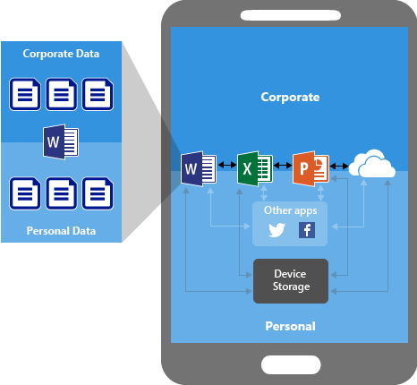
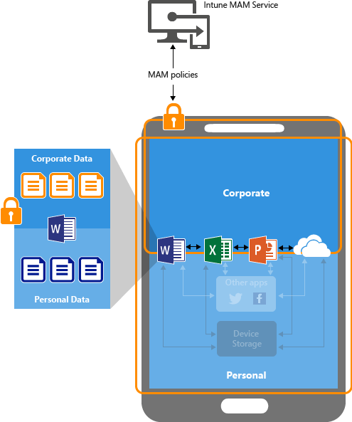
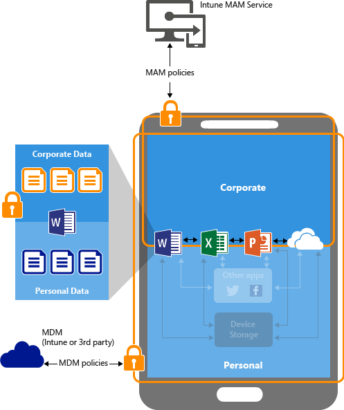

# Nakonfigurujte z&#225;sady ochrany před &#250;nikem informac&#237; pomoc&#237; Microsoft Intune.
Pomocí zásad správy mobilních aplikací ve službě [!INCLUDE[wit_firstref](../Token/wit_firstref_md.md)] použijte pro aplikace omezení, která vám pomohou ochránit firemní data.

**V tomto tématu**

[Způsob ochrany dat aplikací](#bkmk_protectdata)

[Jak zásady MAM chrání data aplikací](#bkmk_howMAMworks)

[Způsoby konfigurování zásad MAM](#bkmk_WaystoConfigure)

[Další kroky](#bkmk_nextsteps)

### Způsob ochrany dat aplikací
Vaši zaměstnanci používají mobilní zařízení pro osobní a pracovní úkoly.  Chcete, aby vaši zaměstnanci byli produktivní, ale také chcete zabránit případným záměrným či neúmyslným ztrátám dat.  Navíc chcete být schopni chránit data i v zařízeních, která vaše společnost nespravuje.

Zásady správy mobilních aplikací (MAM) vám pomohou ochránit vaše firemní data. Protože tato funkce **není závislá na řešení správy mobilních zařízení**, můžete ji použít k ochraně firemních dat i bez registrace zařízení do řešení správy zařízení. Implementací **zásad na úrovni aplikace** můžete snadno omezit přístup k prostředkům společnosti a ponechat data v působnosti IT oddělení.

Zásady MAM podporují následující scénáře:

-   **Zařízení, která jsou spravovaná a zaregistrovaná** ve službě [!INCLUDE[wit_nextref](../Token/wit_nextref_md.md)].  Jsou to obvykle podniková zařízení, která spravujete.

    > [!IMPORTANT]
    > Pokud ke správě zařízení se systémem iOS a Android používáte Intune s Configuration Managerem, můžete vytvořit zásady správy mobilních aplikací pro mobilní aplikace Office, které se připojují ke službám Office 365. Aplikace, které se připojují k místním službám Exchange nebo SharePoint, nejsou podporované.

-   **Zařízení, která jsou spravovaná a zaregistrovaná do řešení správy mobilních zařízení třetích stran** (dále označovaná jako **MDM**).   Jsou to obvykle podniková zařízení, která spravujete.

    > [!NOTE]
    > Zásady správy mobilních aplikací není vhodné používat s řešeními pro správu mobilních aplikací třetích stran nebo zabezpečeného kontejneru.

-   **Zařízení, která nejsou spravovaná**.  Obvykle se jedná o zařízení vašich zaměstnanců, která nejsou zaregistrovaná nebo spravovaná pomocí řešení MDM.

> [!IMPORTANT]
> Firmy mohou současně využívat řešení MDM se zásadami MAM, což přináší i další výhody. Zaměstnanci mohou například používat podnikový telefon i vlastní tablet.  V takovém případě je podnikový telefon zaregistrovaný do řešení MDM a chráněný zásadami MAM, zatímco vlastní zařízení zaměstnance je jenom chráněné zásadami MAM.

**Řešení MDM zajišťuje ochranu zařízení**.  Můžete například přístup do zařízení zabezpečit kódem PIN nebo do zařízení nasadit spravované aplikace. Do zařízení můžete aplikace nasadit také pomocí řešení MDM, čímž získáte větší kontrolu nad správou aplikací.

**Zásady MAM zajišťují, že se zavede ochrana aplikační vrstvy**. Otevírání aplikací v pracovním kontextu, sdílení dat mezi dvěma aplikacemi nebo ukládání firemních dat na soukromá úložiště můžete například zabezpečit pomocí kódu PIN.

**Hlavní výhody použití zásad MAM:**

-   Ochrana podnikových dat na úrovni aplikace.  Protože správa mobilních aplikací nevyžaduje správu zařízení, můžete firemní data chránit na spravovaných i nespravovaných zařízeních. Správa dat je zaměřená na identitu uživatele, odpadá tedy požadavek správy zařízení.

-   Produktivita koncového uživatele není ovlivněná a při použití aplikace pro osobní účely se zásady neaplikují.  Zásady se použijí jenom v pracovním kontextu, což umožňuje chránit firemní data bez zásahu do osobních dat.

### Jak zásady MAM chrání data aplikací
Následující obrázky znázorňují, jak MAM chrání firemní data v aplikacích.

Jak je vidět na **obrázku 1**, jsou-li aplikace používané bez omezení, můžou se osobní a firemní data prolínat.  Firemní data můžou být uložená v osobním úložišti nebo přenesená do aplikací mimo váš dosah, a může tím dojít ke ztrátě dat. Následující diagram ukazuje stav bez jakýchkoli omezení. Šipky zobrazují přesun dat mezi aplikacemi (podnikovými a osobními) a úložišti.

Obrázek 2 představuje stejné prostředí, ale s použitím zásad omezujících sdílení dat.  Pomocí zásad ochrany dat můžete nakonfigurovat zásady, které zabrání ukládání firemních dat do místního úložiště nebo jejich sdílení mezi aplikacemi, které nejsou chráněné zásadami ochrany dat. Tyto zásady umožňují nastavit různá přemístění dat a pravidla přístupu, které pomohou zabezpečit firemní data. Zásady se ale neaplikují, pokud koncový uživatel používá aplikaci pro soukromé účely, protože omezení se vztahují jenom na pracovní kontext.  Díky tomu můžou koncoví uživatelé používat aplikace pro osobní i pracovní účely. Říkáme tomu podpora více identit.

**Podpora více identit:**

Podpora více identit umožňuje v aplikacích používat různé účty (pracovní i osobní).  V zařízeních, ve kterých se aplikace používají pro osobní i pracovní účely, chcete použít zásady v případě, že se koncový uživatel přihlásí v aplikaci do svého pracovního účtu, ale ne v případě osobního účtu.  Přesně k tomu slouží zásady MAM služby [!INCLUDE[wit_nextref](../Token/wit_nextref_md.md)].  Omezení se použijí jenom v případě, kdy se uživatel přihlásí pomocí pracovního účtu. Pokud se uživatel do té samé aplikace přihlásí pomocí svého osobního účtu, nastavení zásad se nevynutí a uživatel může data přesouvat bez omezení.

Všechny mobilní aplikace Office podporují více identit.

V článku [Činnost koncových uživatelů pro aplikace přidružené k zásadám správy mobilních aplikací Microsoft Intune](../Topic/End-user_experience_for_apps_associated_with_Microsoft_Intune_mobile_app_management_policies.md) najdete další informace, jak zásady MAM ovlivňují činnost koncového uživatele.

**Zařízení spravovaná řešením MDM**

**Týká se zařízení zaregistrovaných v řešení MDM** –

Řešení MDM:

-   Zaregistruje zařízení.

-   Na zařízení nasadí aplikace.

-   Zajišťuje neustálé dodržování předpisů a správu zařízení.

**Zásady MAM navíc pomáhají:**

-   Chránit před únikem firemních dat v uživatelských aplikacích a službách

-   Aplikovat omezení (Uložit jako, schránka, kód PIN atd.) v mobilních aplikacích

-   Vymazat firemní data z aplikací bez nutnosti tyto aplikace ze zařízení odebrat

Obrázek 3 ukazuje vrstvy ochrany, které zásady MDM a MAM nabízejí.

**Nespravovaná vlastní zařízení uživatelů**

V případě vlastních zařízení uživatelů nezaregistrovaných do řešení MDM můžou zásady MAM pomoct chránit firemní data na úrovni aplikace. Je ale potřeba mít na paměti některá omezení, jako například:

-   Aplikace nejde do zařízení nasadit.  Koncový uživatel musí aplikace sám nainstalovat.

-   V těchto zařízeních nejde zřídit profily certifikátů.

-   V těchto zařízeních nejde zřídit firemní sítě Wi-Fi a nastavit síť VPN.

Obrázek 4 ukazuje, jak fungují zásady ochrany dat na úrovni aplikace bez správy mobilních zařízení.

### Způsoby konfigurování zásad MAM
Zásady MAM můžete nakonfigurovat jedním z následujících dvou způsobů:

1.  Zásady můžete nakonfigurovat a nasadit pomocí **portálu Azure Preview**.  Prostřednictvím tohoto portálu můžete nakonfigurovat zásady třemi způsoby:

    -   Zařízení nespravovaná žádným řešením správy mobilních zařízení.

    -   Zařízení zaregistrovaná ve službě [!INCLUDE[wit_nextref](../Token/wit_nextref_md.md)] nebo v řešení MDM třetí strany. Můžete vytvořit zásady MAM a nasadit aplikace pro uživatele na tomto portálu. Koncoví uživatelé budou muset stahovat aplikace z Apple Storu nebo Google Play.  Pokud chcete nasadit aplikace do zařízení se zásadami MAM, použijte **Konzolu správce Intune**. Další podrobnosti najdete v článku [Ochrana dat pomocí zásad správy mobilních aplikací v Microsoft Intune](../Topic/Configure_and_deploy_mobile_application_management_policies_in_the_Microsoft_Intune_console.md).

        > [!IMPORTANT]
        > Pokud ke správě zařízení se systémem iOS a Android používáte Intune s Configuration Managerem, můžete vytvořit zásady správy mobilních aplikací pro mobilní aplikace Office, které se připojují ke službám Office 365.  Aplikace, které se připojují k místním službám Exchange nebo SharePoint, nejsou podporované.

    Další podrobnosti o portálu Azure Preview najdete v článku [Začínáme se zásadami správy mobilních aplikací na portálu Azure](../Topic/Get_started_with_mobile_app_management_policies_in_the_Azure_portal.md).

2.  Konzola správce [!INCLUDE[wit_nextref](../Token/wit_nextref_md.md)] podporuje jenom konfiguraci zásad MAM pro zařízení, která jsou zaregistrovaná ve službě [!INCLUDE[wit_nextref](../Token/wit_nextref_md.md)].

    Zjistěte, jak jde provést [Ochrana dat pomocí zásad správy mobilních aplikací v Microsoft Intune](../Topic/Configure_and_deploy_mobile_application_management_policies_in_the_Microsoft_Intune_console.md).

### Další kroky
[Začínáme se zásadami správy mobilních aplikací na portálu Azure](../Topic/Get_started_with_mobile_app_management_policies_in_the_Azure_portal.md)

[Vytvoření a nasazení zásad správy mobilních aplikací pomocí Microsoft Intune](../Topic/Create_and_deploy_mobile_app_management_policies_with_Microsoft_Intune.md)

## Viz také
[Configure apps](../Topic/Configure_apps.md)
[Nasazení a konfigurace aplikací v Microsoft Intune](../Topic/Deploy_and_configure_apps_with_Microsoft_Intune.md)

