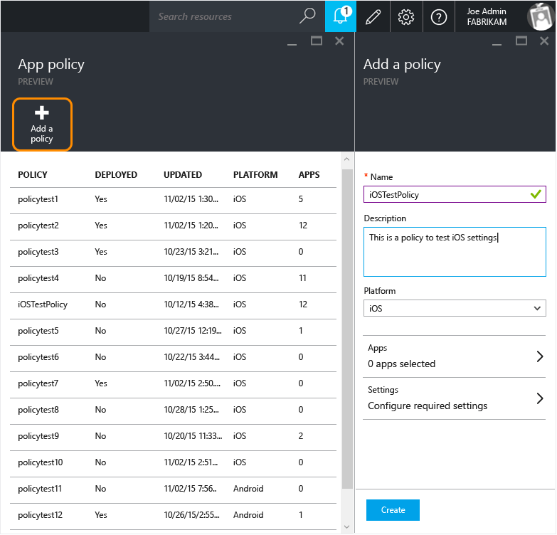
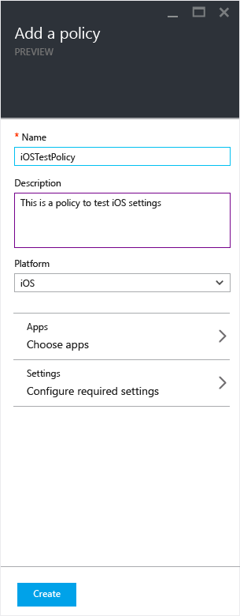
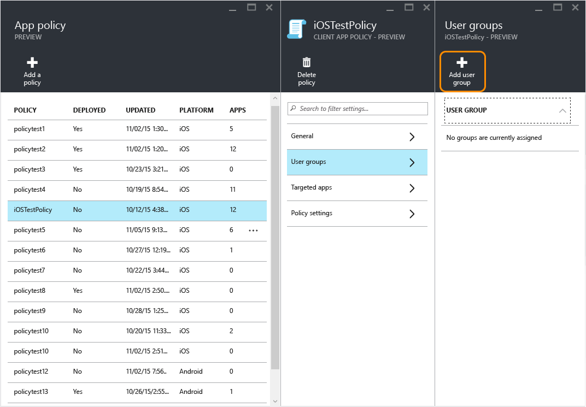
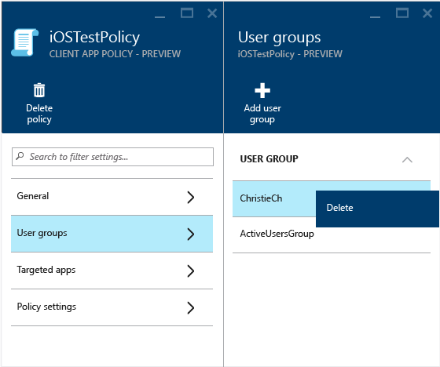
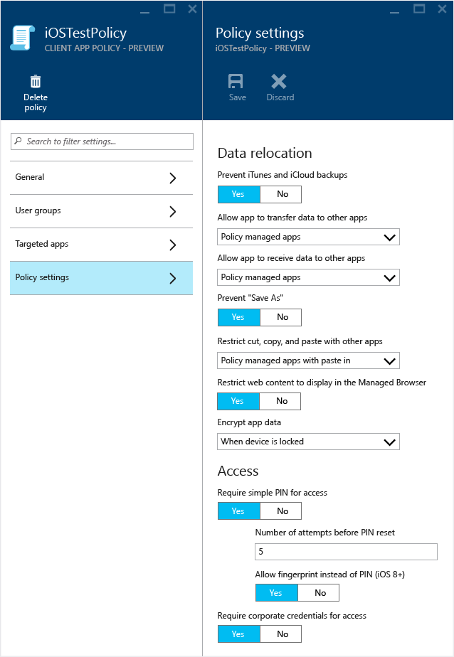

# Vytvořen&#237; a nasazen&#237; z&#225;sad spr&#225;vy mobiln&#237;ch aplikac&#237; pomoc&#237; Microsoft Intune
Můžete vytvořit zásady správy mobilních aplikací (MAM) a nasadit je uživatelům na portálu Azure Preview.  Zásady MAM, které tady vytvoříte, nezávisejí na registraci zařízení. To znamená, že je jde použít na zařízeních, která nejsou vůbec spravovaná, i na zařízeních, které spravuje [!INCLUDE[wit_firstref](../Token/wit_firstref_md.md)] nebo jiné řešení třetí strany.

**V tomto tématu**

[Vytvoření a nasazení zásad MAM](#bkmk_createanddeploy)

[Změna existujících zásad](#bkmk_changepolicy)

[Nastavení zásad](#bkmk_policysettings)

[Další kroky](#bkmk_nextsteps)

### Vytvoření a nasazení zásad MAM

##### Vytvoření zásady MAM

1.  Kliknutím na **Správa mobilních aplikací Intune &gt; Nastavení** otevřete okno **Nastavení**.

    

    > [!TIP]
    > Pokud portál Azure používáte poprvé, přečtěte si [Začínáme se zásadami správy mobilních aplikací na portálu Azure](../Topic/Get_started_with_mobile_app_management_policies_in_the_Azure_portal.md) a seznamte se s tím, jak portál funguje.

2.  V okně **Nastavení** klikněte na **Zásady aplikací**.  Otevře se okno **Zásady aplikací**, kde můžete vytvářet nové zásady a upravovat zásady, které už existují.

    

3.  Klikněte na **Přidat zásadu**.

    

4.  Zadejte název zásady, přidejte stručný popis a vyberte, jestli se má zásada vytvořit pro platformu iOS nebo Android.  Pro každou platformu můžete vytvořit několik zásad.

    

5.  Kliknutím na **Aplikace** otevřete **okno Aplikace**, kde se zobrazí seznam dostupných aplikací. Ze seznamu můžete vybrat jednu nebo několik aplikací a přidružit je k zásadě, kterou vytváříte. Jakmile vyberete aplikace, uložte svůj výběr kliknutím na tlačítko **Vybrat** v dolní části okna **Aplikace**.

    > [!IMPORTANT]
    > Při vytváření zásady musíte vybrat aspoň jednu aplikaci.

6.  V **okně Přidat zásadu** klikněte na **Konfigurovat požadované nastavení**. Otevře se okno nastavení zásad.

    Existují dvě kategorie nastavení zásad, **Přemístění dat** a **Přístup**.  Zásady přemístění dat platí pro přesun dat do aplikace a z aplikace, zatímco zásady přístupu určují, jak koncový uživatel přistupuje k aplikaci v pracovním kontextu. Nastavením zásad jsou pro začátek přiřazené výchozí hodnoty.  Pokud tyto výchozí hodnoty splňují vaše požadavky, nemusíte nic měnit.

    > [!TIP]
    > Tato nastavení zásad se vynutí jen při použití aplikace v pracovním kontextu.  Když uživatel použije aplikaci k provedení osobní úlohy, tyto zásady ho neovlivní.

    

    Úplný seznam výchozích hodnot a nastavení zásad najdete v části [Nastavení zásad](#bkmk_policysettings) v tomto tématu.

7.  Tuto konfiguraci uložíte kliknutím na **OK**.  A jste zpátky v okně **Přidat aplikaci**. Kliknutím na **Vytvořit** vytvoříte zásadu a uložíte své nastavení.

    

    

Zásada není po vytvoření pomocí výš uvedeného postupu nasazená pro žádného uživatele.  Pokud ji chcete nasadit, použijte následující postup.

> [!NOTE]
> Pokud jste zásady správy mobilních aplikací vytvořili pomocí konzoly Intune nebo Configuration Manageru, vytvořili jste taky zásadu správy aplikací pomocí konzoly Azure a pak jste obě zásady přidružili stejné aplikaci, dostane přednost zásada vytvořená na portálu Azure Preview. Při generování sestav v konzole Configuration Manageru nebo Intune se ale použijí nastavení zásad vytvořená na portálu Azure Preview. Například:
> 
> -   V konzole správy Intune jste vytvořili zásadu správy mobilních aplikací, která blokuje kopírování z aplikace.
> -   V konzole Azure jste vytvořili zásadu správy mobilních aplikací, která umožňuje kopírování z aplikace.
> -   Obě tyto zásady jste přidružili ke stejné aplikaci.
> -   Výsledkem je, že bude mít přednost zásada vytvořená pomocí konzoly Azure a kopírování bude povolené.
> -   Stav a sestavy v konzole Intune budou ale nesprávně indikovat, že kopírování je blokované.

##### Nasazení zásady pro uživatele

1.  V okně **Zásada** klikněte na **Skupiny uživatelů**. Otevře se okno **Skupiny uživatelů**. Kliknutím na **Přidat skupinu uživatelů** v okně in **Skupiny uživatelů** otevřete okno **Přidat skupinu uživatelů**.

    

2.  V okně **Přidat skupinu uživatelů**  se zobrazí seznam skupin uživatelů. Je to seznam všech skupin zabezpečení v **Azure Active Directory**.  Můžete vybrat skupiny uživatelů, pro které chcete tuto zásadu použít, a pak kliknout na **Vybrat**.**Kliknutím na Vybrat nasadíte tuto zásadu uživatelům**.

    

    > [!NOTE]
    > Tyto zásady ovlivní jen uživatele, kteří mají přiřazené licence [!INCLUDE[wit_nextref](../Token/wit_nextref_md.md)].  Uživatele, kteří jsou ve skupinách zabezpečení, které jste vybrali, a kteří nemají přiřazenou licenci [!INCLUDE[wit_nextref](../Token/wit_nextref_md.md)], tyto zásady neovlivní.

    > [!NOTE]
    > Pokud ke správě zařízení s iOS a Androidem používáte Intune s Configuration Managerem, zásady se použijí jenom pro uživatele přímo ve skupinách, které jste vybrali.  Členy podřízených skupin vnořených ve skupinách, které jste vybrali, tyto zásady neovlivní.

Teď je zásada vytvořená a nasazená uživatelům.

### Změna existujících zásad
Když změníte existující zásady, uživatelům, kteří se už přihlásili k aplikacím, se změny po dobu 8 hodin nezobrazí.

Pokud testujete a chcete změněné zásady vidět hned, odhlaste se od aplikace a přihlaste se znovu.

##### Změna seznamu aplikací přidružených k zásadě

1.  V okně **Zásady aplikací** klikněte na zásadu, kterou chcete změnit. Otevře se speciální okno pro právě vybranou zásadu.

    

2.  V okně zásady klikněte na **Cílené aplikace**. Otevře se seznam aplikací.

3.  V seznamu odeberte nebo přidejte aplikace a kliknutím na **ikonu Uložit** uložte změny, které jste provedli.

##### Změna seznamu skupin uživatelů

1.  V okně **Zásady aplikací** klikněte na zásadu, kterou chcete změnit. Otevře se speciální okno pro právě vybranou zásadu.

2.  V okně zásady klikněte na **Skupiny uživatelů**. Otevře se okno **Skupiny uživatelů**, ve kterém se zobrazí seznam aktuálních skupin uživatelů s touto zásadou.

3.  Pokud chcete k zásadě **přidat novou skupinu uživatelů**, klikněte na **Přidat skupinu uživatelů** a vyberte skupinu uživatelů. Kliknutím na **Vybrat** nasadíte zásadu do skupiny uživatelů, kterou jste vybrali.

    

4.  Pokud chcete **odstranit skupinu uživatelů**, zvýrazněte skupinu uživatelů, kterou chcete odebrat, klikněte na výpustky (…) a pak skupinu odeberte kliknutím na **Odstranit**.

    

##### Změna nastavení zásad

1.  V okně **Zásady aplikací** klikněte na zásadu, kterou chcete změnit. Otevře se speciální okno pro právě vybranou zásadu.

    

2.  Kliknutím na **Nastavení zásad** otevřete okno **Nastavení zásad**.

3.  Změňte nastavení a pak změny uložte kliknutím na **ikonu Uložit**.

    

### Nastavení zásad
**Zásady přemístění dat pro iOS**

||||
|-|-|-|
|**Nastavení zásad**|**Popis**|**Výchozí hodnota**|
|**Zakázat zálohování dat v iTunes a na iCloudu**|Pokud chcete povolit zálohování informací z aplikací spravovaných zásadou, vyberte **Ano**. Pokud ho chcete zakázat, vyberte **Ne**.|**Ano**|
|**Povolit aplikaci přenos dat do ostatních aplikací**|Vyberte jednu z možností pro zadání aplikací, kterým můžou aplikace spravované zásadou odesílat data:  -   **Aplikace spravované podle zásad**: Povoluje přenos jenom do ostatních aplikací s omezeným přístupem. -   **Všechny aplikace**: Povoluje přenos do všech aplikací. -   **Žádné**: Nepovoluje přenos dat do žádné aplikace.|**Aplikace spravované zásadou**|
|**Povolit aplikaci, aby přijímala data z jiných aplikací**|Určete, ze kterých aplikací se data můžou přenášet do aplikací spravovaných zásadou:  -   **Aplikace spravované podle zásad**: Povoluje přenos dat jenom z ostatních aplikací s omezeným přístupem. -   **Všechny aplikace**: Povoluje přenos dat ze všech aplikací. -   **Žádné**: Nepovoluje přenos dat ze žádné aplikace.|**Všechny aplikace**|
|**Zakázat možnost Uložit jako**|Výběrem **Ano** zakážete použití možnosti Uložit jako ve všech aplikacích, které používají tuto zásadu. Pokud chcete povolit použití Uložit jako, vyberte **Ne**.|**Ano**|
|**Omezit vyjmutí, kopírování a vkládání v ostatních aplikacích**|Určete, jestli by se měly omezit operace vyjmutí, kopírování a vložení. Vybírejte z těchto možností:  -   **Blokované**: Nepovoluje operace vyjmutí, kopírování a vložení mezi aplikacemi spravovanými zásadou. -   **Aplikace spravované podle zásad**: Povoluje operace vyjmutí, kopírování a vložení jenom mezi aplikacemi spravovanými zásadou. -   **Aplikace s vložením spravované podle zásad**: Povoluje vyjmutí a kopírování dat mezi  aplikacemi spravovanými zásadou. Povolí vložení dat vyjmutých nebo zkopírovaných z jakékoliv aplikace do této aplikace. -   Libovolná aplikace: Nejsou žádná omezení pro operace vyjmutí, kopírování a vložení mezi aplikacemi.|**Aplikace s vložením spravované podle zásad**|
|**Zašifrovat data aplikací**|Pro aplikace, které jsou přidružené k zásadám správy mobilních aplikací nástroje [!INCLUDE[wit_nextref](../Token/wit_nextref_md.md)], jsou neaktivní uložená data zašifrovaná pomocí šifrování na úrovni zařízení poskytovaného operačním systémem. Když se vyžaduje PIN, data se zašifrují podle nastavení v zásadách správy mobilních aplikací. Jak uvádí dokumentace Apple, [moduly používané v iOS 7 mají certifikaci FIPS 140-2](http://support.apple.com/en-us/HT202739).  V nastavení zásad můžete zadat hodnoty šifrování PIN.  Tyto hodnoty určují, kdy se data zašifrují. Možnosti:  -   **Když je zařízení blokované:** Všechna data aplikace přidružená k této zásadě jsou při uzamčení zařízení zašifrovaná. -   **Když je zařízení blokované (kromě otevřených souborů):** Všechna data aplikace přidružená k této zásadě jsou při uzamčení zařízení zašifrovaná, kromě dat v souborech, které jsou v aplikaci otevřené. -   **Po restartování zařízení:** Všechna data aplikace přidružená k této zásadě jsou při restartování zařízení zašifrovaná až do doby, než se zařízení poprvé odemkne. -   **Použít nastavení zařízení:** Data aplikace se zašifrují podle výchozího nastavení v zařízení.  Pokud povolíte toto nastavení, musí si koncový uživatel nastavit PIN a používat ho pro přístup k zařízení.  Pokud pro přístup k zařízení není nastavený PIN, aplikace se nespustí a koncový uživatel se vyzve k nastavení PIN zprávou podobnou následující: Vaše společnost vyžaduje, abyste před přístupem k této aplikaci nejdřív povolili použití PIN zařízení.|Možnost šifrování není vybraná|
**Nastavení zásad přístupu pro iOS**

||||
|-|-|-|
|**Nastavení zásad**|**Popis**|**Výchozí hodnota**|
|**Požadovat jednoduchý kód PIN pro přístup**|Pokud pro použití aplikací spravovaných zásadou vyžadujete PIN, vyberte **Ano**. Uživatel se vyzve k jeho nastavení při prvním spuštění aplikace v pracovním kontextu.|**Ano**|
|**Počet pokusů o zadání před obnovení kódu PIN**|Zadejte počet pokusů o zadání kódu PIN, které může uživatel udělat před resetováním kódu PIN.|Pro toto nastavení neexistuje výchozí hodnota|
|**Vyžadovat otisk prstu místo kódu PIN (iOS 8.0+)**|Pokud pro přístup k aplikaci místo číselného kódu PIN požadujete otisk prstu, vyberte **Ano**.  V zařízeních s iOS můžete uživatelům povolit, aby se místo číselného kódu PIN identifikovali pomocí otisku prstu na zařízení iOS. Když se koncový uživatel pokusí o přístup k této aplikaci pomocí svého pracovního účtu, vyzve se k zadání otisku prstu a nemusí zadávat PIN.|**Ano**|
|**Vyžadovat podnikové přihlašovací údaje pro přístup**|Pokud pro přístup k aplikaci místo číselného kódu PIN požadujete podnikové přihlašovací údaje, vyberte **Ano**. **Note:** Pokud nastavíte Ano, přepíše se tím požadavek na PIN nebo Touch ID.  Uživatel se vyzve k zadání podnikových přihlašovacích údajů.|**Ne**|
|**Blokovat spuštění spravovaných aplikací v zařízení s jailbreakem nebo rootem**|Pokud chcete blokovat spuštění aplikací v zařízení s jailbreakem nebo rootem, vyberte **Ano**. Uživatel bude moct i dál používat zařízení pro své osobní účely, ale při práci bude muset používat jiné zařízení.|**Ano**|
|**Znovu zkontrolovat požadavky na přístup po (minuty)**|-   **Časový limit:** Určuje čas (v minutách), než se znovu zkontrolují požadavky na přístup k aplikaci. -   **Období odkladu pro offline režim:** Pokud je zařízení offline, určuje časové období před opakovaným zkontrolováním požadavků na přístup k aplikaci.|**Časový limit 30 minut a období odkladu pro offline režim 720 minut**|
|**Offline interval před vymazáním dat aplikace (dny)**|Můžete vybrat, že se firemní data vymažou, když je zařízení po určitou dobu offline.  V okně nastavení zásady můžete zadat počet dnů, po který zařízení může být offline, než se z něj odeberou firemní data. **Tip:** Zadáním hodnoty 0 toto nastavení vypnete.|**90 dnů**|
**Nastavení přemístění dat v Androidu**

||||
|-|-|-|
|**Nastavení zásad**|**Popis**|**Výchozí hodnota**|
|**Zakázat zálohování dat v zařízeních s Androidem**|Pokud chcete povolit zálohování informací z aplikací spravovaných zásadou, vyberte **Ano**. Pokud ho chcete zakázat, vyberte **Ne**.|**Ano**|
|**Povolit aplikaci přenos dat do ostatních aplikací**|Vyberte jednu z možností pro zadání aplikací, kterým můžou aplikace spravované zásadou odesílat data:  -   **Aplikace spravované podle zásad**: Povoluje přenos jenom do ostatních aplikací s omezeným přístupem. -   **Všechny aplikace**: Povoluje přenos do všech aplikací. -   **Žádné**: Nepovoluje přenos dat do žádné aplikace.|**Aplikace spravované zásadou**|
|**Povolit aplikaci, aby přijímala data z jiných aplikací**|Určete, ze kterých aplikací se data můžou přenášet do aplikací spravovaných zásadou:  -   **Aplikace spravované podle zásad**: Povoluje přenos dat jenom z ostatních aplikací s omezeným přístupem. -   **Všechny aplikace**: Povoluje přenos dat ze všech aplikací. -   **Žádné**: Nepovoluje přenos dat ze žádné aplikace.|**Všechny aplikace**|
|**Zakázat možnost Uložit jako**|Výběrem **Ano** zakážete použití možnosti Uložit jako ve všech aplikacích, které používají tuto zásadu. Pokud chcete povolit použití Uložit jako, vyberte **Ne**.|**Ano**|
|**Omezit vyjmutí, kopírování a vkládání v ostatních aplikacích**|Určete, jestli by se měly omezit operace vyjmutí, kopírování a vložení. Vybírejte z těchto možností:  -   **Blokované**: Nepovoluje operace vyjmutí, kopírování a vložení mezi aplikacemi spravovanými zásadou. -   **Aplikace spravované podle zásad**: Povoluje operace vyjmutí, kopírování a vložení jenom mezi aplikacemi spravovanými zásadou. -   **Aplikace s vložením spravované podle zásad**: Povoluje vyjmutí a kopírování dat mezi  aplikacemi spravovanými zásadou. Povolí vložení dat vyjmutých nebo zkopírovaných z jakékoliv aplikace do této aplikace. -   Libovolná aplikace: Nejsou žádná omezení pro operace vyjmutí, kopírování a vložení mezi aplikacemi.|**Aplikace s vložením spravované podle zásad**|
|**Zašifrovat data aplikací**|Pro aplikace, které jsou přidružené k zásadám správy mobilních aplikací nástroje [!INCLUDE[wit_nextref](../Token/wit_nextref_md.md)] zajišťuje šifrování Microsoft. Data jsou v průběhu souborových vstupně-výstupních operací zašifrovaná synchronně podle nastavení zásad správy mobilních aplikací.  Spravované aplikace v systému Android používají v režimu CBC šifrování AES-128 využívající kryptografické knihovny platformy. Metoda šifrování nemá certifikaci FIPS 140-2. Šifrování SHA-256 se podporuje jako explicitní instrukce pomocí parametru SigAlg a funguje jen pro zařízení 4.2 a vyšší. Obsah v úložišti zařízení je zašifrovaný vždycky.  Pokud nastavíte **Ano**, musí si koncový uživatel nastavit PIN a používat ho pro přístup k zařízení.  Pokud pro přístup k zařízení není nastavený PIN, aplikace se nespustí a koncový uživatel se vyzve k nastavení PIN zprávou podobnou následující: *Vaše společnost vyžaduje, abyste před přístupem k této aplikaci nejdřív povolili použití PIN zařízení.*|Možnost šifrování není vybraná|
**Nastavení zásad přístupu pro Android**

||||
|-|-|-|
|**Nastavení zásad**|**Popis**|**Výchozí hodnota**|
|**Požadovat jednoduchý kód PIN pro přístup**|Pokud pro použití aplikací spravovaných zásadou vyžadujete PIN, vyberte **Ano**. Uživatel se vyzve k jeho nastavení při prvním spuštění aplikace v pracovním kontextu.|**Ano**|
|**Počet pokusů o zadání před obnovení kódu PIN**|Zadejte počet pokusů o zadání kódu PIN, které může uživatel udělat před resetováním kódu PIN.|Pro toto nastavení neexistuje výchozí hodnota|
|**Vyžadovat podnikové přihlašovací údaje pro přístup**|Pokud pro přístup k aplikaci místo číselného kódu PIN požadujete podnikové přihlašovací údaje, vyberte **Ano**. **Note:** Pokud nastavíte **Ano**, přepíše se tím požadavek na PIN nebo Touch ID.  Uživatel se vyzve k zadání podnikových přihlašovacích údajů.|**Ne**|
|**Blokovat spuštění spravovaných aplikací v zařízení s jailbreakem nebo rootem**|Pokud chcete blokovat spuštění aplikací v zařízení s jailbreakem nebo rootem, vyberte **Ano**. Uživatel bude moct i dál používat zařízení pro své osobní účely, ale při práci bude muset používat jiné zařízení.|**Ano**|
|**Znovu zkontrolovat požadavky na přístup po (minuty)**|-   **Časový limit:** Určuje čas (v minutách), než se znovu zkontrolují požadavky na přístup k aplikaci. -   **Období odkladu pro offline režim:** Pokud je zařízení offline, určuje časové období před opakovaným zkontrolováním požadavků na přístup k aplikaci.|**Časový limit 30 minut a období odkladu pro offline režim 720 minut**|
|**Offline interval před vymazáním dat aplikace (dny)**|Můžete vybrat, že se firemní data vymažou, když je zařízení po určitou dobu offline.  V okně nastavení zásady můžete zadat počet dnů, po který zařízení může být offline, než se z něj odeberou firemní data. **Tip:** Zadáním hodnoty 0 toto nastavení vypnete.|**90 dnů**|
|**Blokovat snímek obrazovky a Android Assistanta (Android 6 Marshmallow nebo novější)**|Výběrem **Ano** určíte, že při použití této aplikace jsou v zařízení zablokované funkce snímání obrazovky a **Android Assistant**.||

### Další kroky
[Monitorování zásad správy mobilních aplikací s Microsoft Intune](../Topic/Monitor_mobile_app_management_policies_with_Microsoft_Intune.md)

## Viz také
[Nakonfigurujte zásady ochrany před únikem informací pomocí Microsoft Intune.](../Topic/Configure_data_loss_prevention_app_policies_with_Microsoft_Intune.md)

