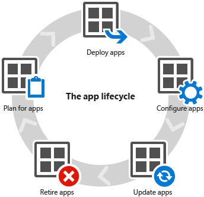

# Nasazen&#237; a&#160;konfigurace aplikac&#237; v&#160;Microsoft Intune

Jeden z hlavních důvodů, proč mnoho společností používá [!INCLUDE[wit_firstref](../Token/wit_firstref_md.md)], je možnost nasazovat aplikace, které uživatelé potřebují k práci. Před nasazením aplikací musí [být zařízení spravovaná](https://technet.microsoft.com/library/dn646962.aspx).

Vaše společnost třeba používá Microsoft Word, ale ten existuje ve verzích pro Windows, iOS, Android a další platformy. Jako IT správce stojíte před obrovskou výzvou – musíte se postarat o správu velkého množství dostupných aplikací na mnoha různých mobilních a počítačových platformách, umožnit uživatelům práci a současně zajistit zabezpečení firemních dat.

Kromě toho [!INCLUDE[wit_nextref](../Token/wit_nextref_md.md)] poskytuje celou řadu možností, které vám pomáhají spravovat zabezpečení aplikací, a funkce, jako jsou zásady správy mobilní aplikace, které umožňují spravovat aplikace na zařízeních, která nejsou zaregistrovaná v [!INCLUDE[wit_nextref](../Token/wit_nextref_md.md)] nebo je spravuje jiné řešení.

## Princip životního cyklu aplikací
Stejně jako zařízení i aplikace mají životní cyklus od přípravy, přes nasazení, monitorování, aktualizace až po vyřazení.[!INCLUDE[wit_nextref](../Token/wit_nextref_md.md)] vám může pomoct ve všech fázích tohoto životního cyklu.

### Plán
V tématu [Začínáme s nasazováním aplikací v Microsoft Intune](../Topic/Plan_for_app_deployment_in_Microsoft_Intune.md) se dozvíte o některých předpokladech a konceptech, které budete potřebovat, než začnete pracovat s aplikacemi, zorientujete se v pracovním prostoru **Aplikace** a získáte informace i o různých typech aplikací, které můžete nasadit.

[!INCLUDE[wit_nextref](../Token/wit_nextref_md.md)] také nabízí nástroje k tomu, abyste mohli [zjistit, jaké aplikace se už ve vaší organizaci používají](https://technet.microsoft.com/en-us/library/jj733634.aspx) a kde jsou nainstalované.

[!INCLUDE[wit_nextref](../Token/wit_nextref_md.md)] podporuje [instalaci mnoha různých aplikací](https://technet.microsoft.com/en-us/library/dn646955.aspx), třeba aplikací z obchodů s aplikacemi, webových aplikací a aplikací napsaných interně.

### Nasadit
Jakmile porozumíte základům, můžete začít nasazovat aplikace. V těchto částech najdete všechny potřebné informace, abyste mohli připravit aplikace na nasazení a potom je nasadit na [mobilní zařízení](https://technet.microsoft.com/library/dn646972.aspx) a [počítače](https://technet.microsoft.com/library/dn646961.aspx).

### Konfigurace
[!INCLUDE[wit_nextref](../Token/wit_nextref_md.md)] nabízí nástroje, které vám pomůžou spravovat, konfigurovat a chránit firemní data ve vašich aplikacích.

-   Zásady konfigurace mobilní aplikace určují nastavení konfigurace spuštěných aplikací. U aplikace můžete například zadat jazyk, zabezpečení nebo nastavení sítě.

-   Zásady správy mobilní aplikace pomáhají chránit data firemních aplikací omezením funkcí, které zajišťují přenosy dat mezi aplikacemi. Ve spravované aplikaci můžete například omezit operace vyjmutí, zkopírování a vložení.

-   Zásady spravovaného prohlížeče konfigurují seznam povolených nebo blokovaných webů. Tyto seznamy omezují weby, které můžou uživatelé spravovaného prohlížeče [!INCLUDE[wit_nextref](../Token/wit_nextref_md.md)] navštívit.

Viz [Konfigurace aplikací v Microsoft Intune](../Topic/Configure_apps_with_Microsoft_Intune.md).

### Aktualizovat
Moderní aplikace jsou často pravidelně aktualizované. Vyzkoušet a zajistit, že všichni uživatelé používají nejnovější verzi nějaké aplikace, může být obtížné.[!INCLUDE[wit_nextref](../Token/wit_nextref_md.md)] naštěstí poskytuje jednoduchou funkci, která vám umožní aktualizovat už nasazenou aplikaci na novější verzi.

Viz [Aktualizace aplikací pomocí služby Microsoft Intune](../Topic/Update_apps_using_Microsoft_Intune.md).

## Vyřadit
Od uplynutí určité doby už asi aplikace nasazené na zařízeních nebudete potřebovat a budete je chtít odinstalovat. I tento proces vám u spravovaných aplikací [!INCLUDE[wit_nextref](../Token/wit_nextref_md.md)] zjednoduší.

Viz [Vyřazení aplikací pomocí služby Microsoft Intune](../Topic/Retire_apps_using_Microsoft_Intune.md).

## Viz také
[Zabezpečený přístup k prostředkům společnosti z libovolného místa a na jakémkoli zařízení](https://technet.microsoft.com/en-us/library/dn550982.aspx)
[Dokumentace pro Microsoft Intune](../Topic/Documentation_for_Microsoft_Intune.md)

