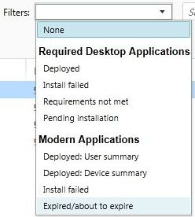

# Nasazen&#237; aplikac&#237; do poč&#237;tačů s Windows v Microsoft Intune
Už jste se [seznámili se základy](https://technet.microsoft.com/library/dn646955.aspx) nasazování aplikací v [!INCLUDE[wit_firstref](../Token/wit_firstref_md.md)]. V tomto tématu se naučíte skutečně konfigurovat vámi spravované počítače s Windows a nasazovat do nich aplikace. V podstatě jde o tři kroky:

-   [Konfigurace aplikace](#BKMK_Conf)

-   [Nasazení aplikace](#BKMK_Depl)

-   [Monitorování aplikace](#BKMK_Monitor)

Informace o aktualizaci a vyřazení aplikací z provozu najdete v tématu [Aktualizace aplikací pomocí služby Microsoft Intune](../Topic/Update_apps_using_Microsoft_Intune.md).

> [!IMPORTANT]
> Informace v tomto tématu vám pomůžou nasadit aplikace do [počítačů s Windows, které spravujete pomocí klientského softwaru](https://technet.microsoft.com/library/dn646959.aspx). Pokud chcete aplikace nasazovat do [zaregistrovaných počítačů s Windows](https://technet.microsoft.com/library/mt346003.aspx) nebo do jiných mobilních zařízení, přečtěte si téma [Nasazení aplikací do mobilních zařízení v Microsoft Intune](../Topic/Deploy_apps_to_mobile_devices_in_Microsoft_Intune_-_deleted.md).

## Konfigurace aplikace
V tomto postupu budete používat Vydavatele softwaru Microsoft Intune ke konfiguraci vlastností aplikace a k jejímu odeslání do cloudového úložiště.

#### Konfigurace aplikace

1.  V [konzole pro správu Microsoft Intune](https://manage.microsoft.com) klikněte na **Aplikace** &gt; **Přidat aplikace**. Spustí se Vydavatel softwaru Microsoft Intune.

    > [!TIP]
    > Před spuštěním vydavatele softwaru možná budete muset zadat svoje uživatelské jméno a heslo k Intune.

2.  Ve vydavateli softwaru nakonfigurujte na stránce **Instalace softwaru** následující údaje:

    **Vyberte, jak bude tento software přístupný pro zařízení** – zvolte **Instalační program softwaru** a pak zadejte:

    |Nastavení|Podrobnosti|
    |-------------|---------------|
    |**Vyberte typ souboru instalačního programu softwaru**|Označuje typ softwaru, který chcete nasadit. U počítačů s Windows zvolte **Instalační služba systému Windows**.|
    |**Zadejte umístění instalačních souborů softwaru**|Zadejte umístění instalačních souborů nebo klikněte na **Procházet** a vyberte umístění ze seznamu.|
    |**Zahrnout další soubory a podsložky ze stejné složky**|Software, který používá Instalační službu systému Windows, někdy potřebuje podpůrné soubory. Ty se většinou nacházejí ve stejné složce jako instalační soubory. Tuto možnost vyberte, když chcete nasadit i podpůrné soubory.|
    U tohoto typu instalace se využívá část prostoru cloudového úložiště.

3.  Na stránce **Popis softwaru** nakonfigurujte následující nastavení:

    > [!TIP]
    > Některé hodnoty můžou být vyplněné automaticky nebo se nemusí zobrazit. Záleží na používaném instalačním souboru.

    |Nastavení|Podrobnosti|
    |-------------|---------------|
    |**Vydavatel**|Zadejte jméno vydavatele aplikace.|
    |**Název**|Zadejte název aplikace, který se zobrazí na portálu společnosti. **Tip:** Ověřte, že názvy všech aplikací jsou jedinečné. Pokud stejný název aplikace existuje dvakrát, zobrazí se na portálu společnosti uživatelům jenom jedna z aplikací.|
    |**Popis**|Zadejte popis aplikace. Zobrazí se uživatelům na portálu společnosti.|
    |**Adresa URL informací o softwaru**|(volitelné) Zadejte adresu URL webu, který obsahuje informace o této aplikaci. Adresa URL se zobrazí uživatelům na portálu společnosti.|
    |**Adresa URL zásad ochrany osobních údajů**|(volitelné) Zadejte adresu URL webu, který obsahuje informace o ochraně osobních údajů v této aplikaci. Adresa URL se zobrazí uživatelům na portálu společnosti.|
    |**Kategorie**|(volitelné) Vyberte některou kategorii, do které patří integrovaná aplikace. Uživatelé ji budou moct při procházení portálu snáz najít.|
    |**Ikona**|(volitelné) Nahrajte ikonu, která bude k aplikaci přidružená. Tato ikona se u aplikace zobrazí, když uživatelé procházejí portál společnosti.|

4.  Na stránce **Požadavky** vyberte požadavky, které musejí být splněné, aby bylo možné aplikaci do zařízení nainstalovat:

    -   **Architektura** – vyberte, do jakých systémů je možné aplikaci instalovat: 32bitové, 64bitové nebo obojí.

    -   **Operační systém** – vyberte minimální verzi operačního systému, který umožňuje aplikaci nainstalovat.

5.  Platí jen pro typ souboru **Instalační služba systému Windows** (jenom exe): Na stránce **Pravidla detekce** můžete nakonfigurovat pravidla, která zjistí, jestli už je konfigurovaná aplikace na počítači nainstalovaná. Nebo můžete použít výchozí pravidla detekce k automatickému přepsání dříve nainstalovaných verzí aplikace. Jaká pravidla můžete konfigurovat:

    -   **Soubor existuje** – zadejte cestu k souboru, který chcete detekovat. Můžete hledat ve složce **%ProgramFiles%** (prohledá složku **Program Files**\*&lt;cesta&gt;* a **Program Files (x86)**\*&lt;cesta&gt;*) na počítači nebo ve složce **%SystemDrive%** (prohledá kořenovou jednotku počítače, většinou je to jednotka C:)

        .

    -   **Kód produktu MSI existuje** – pokud chcete vybrat soubor Instalační služby systému Windows (msi), který chcete detekovat, klikněte na **Procházet**.

    -   **Klíč registru existuje** – zadejte klíč registru, který začíná **HKEY_LOCAL_MACHINE\**. Prohledají se 32bitové i 64bitové cesty registru. Pokud zadaný klíč v některém umístění existuje, pravidlo detekce je splněné.

    Pokud aplikace odpovídá některému z nakonfigurovaných pravidel, nebude se instalovat.

6.  Platí jen pro typ souboru **Instalační služba systému Windows** (msi a exe): Na stránce **Argumenty příkazového řádku** můžete vybrat, jestli chcete instalačnímu programu poskytnout volitelné argumenty příkazového řádku. Některé instalační programy můžou například podporovat argument **/q** pro tichou instalaci bez zásahu uživatele.

7.  Platí jen pro typ souboru **Instalační služba systému Windows** (jenom exe): Na stránce **Návratové kódy** můžete přidat nové chybové kódy, které Intune dokáže interpretovat při instalaci aplikace na spravovaný počítač s Windows.

    Ve výchozím nastavení [!INCLUDE[wit_nextref](../Token/wit_nextref_md.md)] používá standardní návratové kódy, kterými oznamuje úspěch nebo selhání instalace balíčku aplikace:

    -   **0** – úspěch

    -   **3010** – úspěch s restartem

    Do seznamu taky můžete přidat vlastní návratové kódy. Pokud zadáte seznam návratových kódů a instalace aplikace vrátí kód, který v seznamu není, interpretuje se to jako selhání instalace.

8.  Na stránce **Shrnutí** zkontrolujte zadané informace. Jakmile budete připravení, klikněte na **Nahrát**.

9. Instalaci dokončíte kliknutím na **Zavřít**.

Aplikace se zobrazí v uzlu **Aplikace** v pracovním prostoru **Aplikace**.

## Nasazení aplikace
V tomto postupu aplikaci nasadíte na vybraná zařízení nebo vybraným uživatelům.

#### Nasazení aplikace

1.  V [konzole pro správu Microsoft Intune](https://manage.microsoft.com) klikněte na **Aplikace** &gt; **Aplikace**. Zobrazí se seznam spravovaných aplikací.

2.  Vyberte aplikaci, kterou chcete nasadit, a pak klikněte na **Spravovat nasazení**.

3.  V dialogovém okně *&lt;název aplikace&gt;* napřed na stránce **Vybrat skupiny** vyberte skupiny uživatelů nebo zařízení, kterým chcete aplikaci nasadit.

4.  Na stránce **Akce nasazení** nakonfigurujte následující nastavení:

    |Nastavení|Podrobnosti|
    |-------------|---------------|
    |**Schválení**|Zvolte, jestli je nasazení:  -   **Požadované** (povinná instalace) -   **K dispozici** (uživatelé můžou instalovat aplikaci na vyžádání z portálu společnosti) -   **Nelze použít** (aplikace není nainstalovaná nebo se na portálu společnosti nezobrazuje) -   **Odinstalovat** (aplikace bude z cílových zařízení odinstalovaná)|
    |**Termín**|U povinných instalací vyberte, dokdy má být aplikace nasazená. Můžete si vybrat z předem definovaných hodnot nebo vybrat **Vlastní** a nakonfigurovat vlastní termín.|

## Monitorování aplikace
Spravované aplikace a informace o stavu jejich nasazení jsou zobrazené na konzole [!INCLUDE[wit_nextref](../Token/wit_nextref_md.md)].

### Prohlížení spravovaných aplikací a jejich stavu
V pracovním prostoru **Aplikace** klikněte na uzel **Aplikace**.

Zobrazí se seznam spravovaných aplikací. Když kliknete na některou aplikaci, zobrazí se dole v podokně, které je v okně konzole, stav instalace. Další podrobnosti zobrazíte, když kliknete na stav. Když se třeba ve stavu zobrazuje **Počet uživatelů, kteří mají tento software k dispozici: 1**, můžete na zprávu kliknout a podívat se na jméno uživatele.

> [!TIP]
> K zobrazení aplikací, která splňují zadaná kritéria, můžete použít rozevírací seznam **Filtry**. Můžete třeba zobrazit aplikace, které se nepodařilo nainstalovat, nebo úspěšně nasazené aplikace.
> 
> 

Přehled aplikací a jejich stavu se taky zobrazuje v pracovním prostoru **Řídicí panel**. Pokud kliknete na libovolné místo v přehledu, přejdete do seznamu aplikací.

### Zobrazení podrobnějších informací o aplikaci
Ze seznamu aplikací vyberte některou aplikaci a pak klikněte na **Zobrazit vlastnosti**.

Na stránce **Vlastnosti softwaru** s informacemi o aplikaci klikněte na některou kartu:

-   **Obecné** – zobrazuje obecné informace o aplikaci a stavu její instalace.

-   **Zařízení** – zobrazuje zařízení s úspěšně nainstalovanou a nasazenou aplikací.

-   **Uživatelé** – zobrazuje uživatele s úspěšně nainstalovanou a nasazenou aplikací.

I tady můžete použít rozevírací seznam **Filtry** ke konfiguraci hodnot, které se zobrazí na každé kartě.

## Viz také
[Nasazení a konfigurace aplikací v Microsoft Intune](../Topic/Deploy_and_configure_apps_with_Microsoft_Intune.md)

