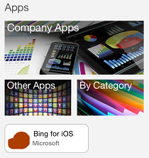
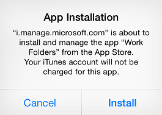
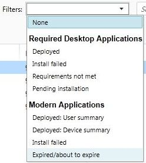

# Nasazen&#237; aplikac&#237; do mobiln&#237;ch zař&#237;zen&#237; v Microsoft Intune
Teď, když jste [se seznámili se základními informace](https://technet.microsoft.com/library/dn646955.aspx) o nasazení aplikace [!INCLUDE[wit_firstref](../Token/wit_firstref_md.md)], je čas naučit se, jak konfigurovat a nasazovat aplikace do zařízení zaregistrovaných pomocí [!INCLUDE[wit_nextref](../Token/wit_nextref_md.md)]. V podstatě jde o tři kroky:

-   [Konfigurace aplikace](#BKMK_Conf)

-   [Nasazení aplikace](#BKMK_Depl)

-   [Sledování aplikace](#BKMK_Monitor)

Informace o aktualizaci a vyřazení aplikací z provozu najdete v tématu [Aktualizace aplikací pomocí služby Microsoft Intune](../Topic/Update_apps_using_Microsoft_Intune.md).

> [!IMPORTANT]
> Informace uvedené v tomto tématu vám pomůžou při nasazování aplikací do [zaregistrovaných počítačů s Windows](https://technet.microsoft.com/library/mt346003.aspx) nebo do jiných mobilních zařízení. Pokud chcete nasazovat aplikace do [počítačů s Windows, které spravujete pomocí klientského softwaru](https://technet.microsoft.com/library/dn646959.aspx), podívejte se na téma [Nasazení aplikací do počítačů s Windows v Microsoft Intune](../Topic/Deploy_apps_to_Windows_PCs_in_Microsoft_Intune.md).

## Konfigurace aplikace
V tomto postupu budete používat Vydavatele softwaru Microsoft Intune ke konfiguraci vlastností aplikace a, tam kde je to potřeba, k jejímu odeslání do cloudového úložiště.

#### Konfigurace aplikace

1.  V [konzole pro správu Microsoft Intune](https://manage.microsoft.com) klikněte na **Aplikace** &gt; **Přidat aplikace**. Spustí se Vydavatel softwaru Microsoft Intune.

    > [!TIP]
    > Před spuštěním vydavatele softwaru možná budete muset zadat svoje uživatelské jméno a heslo k Intune.

2.  Ve vydavateli softwaru nakonfigurujte na stránce **Instalace softwaru** následující údaje:

    **Vyberte, jak bude tento software přístupný pro zařízení** – zvolte ze seznamu:

    -   **Instalační program softwaru** a pak zadejte:

        |Nastavení|Podrobnosti|
        |-------------|---------------|
        |**Vyberte typ souboru instalačního programu softwaru**|Označuje typ softwaru, který chcete nasadit. Pokud chcete instalovat například aplikaci iOS, zvolte **Balíček aplikace pro systém iOS (soubor &#42;.ipa)**.|
        |**Zadejte umístění instalačních souborů softwaru**|Zadejte umístění instalačních souborů nebo klikněte na **Procházet** a vyberte umístění ze seznamu.|
        |**Zahrnout další soubory a podsložky ze stejné složky**|Pouze pro typ souboru **Instalační služby systému Windows**  Software, který používá Instalační službu systému Windows, někdy potřebuje podpůrné soubory. Ty se většinou nacházejí ve stejné složce jako instalační soubory. Tuto možnost vyberte, když chcete tyto soubory i nasadit.|
        U tohoto typu instalace se využívá část prostoru cloudového úložiště.

    -   **Externí odkaz** a pak zadejte:

        |Nastavení|Podrobnosti|
        |-------------|---------------|
        |**Zadejte adresu URL**|Zadejte adresu URL obchodu s aplikacemi s aplikací, kterou chcete nasadit. Například pokud chcete nasadit aplikaci Microsoft Remote Desktop pro Android, zadejte **https://play.google.com/store/apps/details?id=com.microsoft.rdc.android**. **Tip:** Pokud chcete vyhledat adresu URL aplikace, pomocí vyhledávacího webu najděte stránku obchodu obsahující aplikaci. Pokud budete chtít najít například aplikaci Remote Desktop, můžete vyhledat **Microsoft Remote Desktop Android**.|
        U tohoto typu instalace se nepoužívá žádný prostor cloudového úložiště.

    -   **Spravované aplikace pro iOS z obchodu s aplikacemi** a pak zadejte:

        |Nastavení|Podrobnosti|
        |-------------|---------------|
        |**Zadejte adresu URL**|Zadejte adresu URL obchodu s aplikacemi s aplikací, kterou chcete nasadit. Například pokud chcete nasadit aplikaci Microsoft Work Folders pro iOS, zadejte **https://itunes.apple.com/us/app/work-folders/id950878067?mt=8**.|
        U tohoto typu instalace se nepoužívá žádný prostor cloudového úložiště.

3.  Na stránce **Popis softwaru** nakonfigurujte následující nastavení:

    > [!TIP]
    > Některé hodnoty můžou být vyplněné automaticky nebo se nemusí zobrazit. Záleží na používaném typu instalačního programu.

    |Nastavení|Podrobnosti|
    |-------------|---------------|
    |**Vydavatel**|Zadejte název vydavatele aplikace.|
    |**Název**|Zadejte název aplikace, který se zobrazí na portálu společnosti. **Tip:** Ověřte, že názvy všech aplikací jsou jedinečné. Pokud stejný název aplikace existuje dvakrát, zobrazí se na portálu společnosti uživatelům jenom jedna z aplikací.|
    |**Popis**|Zadejte popis aplikace. Zobrazí se uživatelům na portálu společnosti.|
    |**Adresa URL informací o softwaru**|K dispozici jenom v případě, že jste vybrali **Instalační program softwaru**.  (volitelné) Zadejte adresu URL webu, který obsahuje informace o této aplikaci. Adresa URL se zobrazí uživatelům na portálu společnosti.|
    |**Adresa URL zásad ochrany osobních údajů**|K dispozici jenom v případě, že jste vybrali **Instalační program softwaru**.  (volitelné) Zadejte adresu URL webu, který obsahuje informace o ochraně osobních údajů v této aplikaci. Adresa URL se zobrazí uživatelům na portálu společnosti.|
    |**Kategorie**|(volitelné) Vyberte některou kategorii, do které patří integrovaná aplikace. Uživatelé ji budou moct při procházení portálu snáz najít.|
    |**Zobrazit tuto aplikaci jako doporučenou aplikaci a zvýraznit ji na portálu společnosti**|Když uživatelé hledají aplikace, zobrazí se aplikace výrazně na hlavní stránce portálu společnosti.|
    |**Ikona**|(volitelné) Nahrajte ikonu, která bude k aplikaci přidružená. Tato ikona se u aplikace zobrazí, když uživatelé procházejí portál společnosti.|

4.  Na stránce **Požadavky** vyberte požadavky, které musejí být splněné, aby bylo možné aplikaci na zařízení nainstalovat: Například pro balíček aplikace pro iOS můžete vybrat minimální požadovanou verzi iOS a požadovaný typ zařízení, jako je iPhone nebo iPad.

    > [!TIP]
    > Stránka **Požadavky** se nezobrazuje u všech typů aplikací.

5.  Další stránky průvodce se zobrazí, pokud zvolíte typ souboru **Instalační služby systému Windows**. Tento typ souboru se na mobilních zařízeních nepoužívá. Další informace naleznete v části [Nasazení aplikací do počítačů s Windows v Microsoft Intune](../Topic/Deploy_apps_to_Windows_PCs_in_Microsoft_Intune.md).

6.  Na stránce **Shrnutí** zkontrolujte zadané informace. Jakmile budete připraveni, klikněte na **Nahrát**.

7.  Instalaci dokončíte kliknutím na **Zavřít**.

Aplikace se zobrazí v uzlu **Aplikace** v pracovním prostoru **Aplikace**.

## Nasazení aplikace
V tomto postupu aplikaci nasadíte na vybraná zařízení nebo vybraným uživatelům.

#### Nasazení aplikace

1.  V [konzole pro správu Microsoft Intune](https://manage.microsoft.com) klikněte na **Aplikace** &gt; **Aplikace**. Zobrazí se seznam spravovaných aplikací.

2.  Vyberte aplikaci, kterou chcete nasadit, a pak klikněte na **Spravovat nasazení**.

3.  V dialogovém okně *&lt;název aplikace&gt;* na stránce **Vybrat skupiny** vyberte skupiny uživatelů nebo zařízení, kterým chcete aplikaci nasadit.

4.  Na stránce **Akce nasazení** nakonfigurujte následující nastavení:

    |Nastavení|Podrobnosti|
    |-------------|---------------|
    |**Schválení**|Zvolte, jestli je nasazení:  -   **Požadované** (povinná instalace) -   **K dispozici** (uživatelé můžou instalovat aplikaci na vyžádání z portálu společnosti) -   **Nelze použít** (aplikace není nainstalovaná nebo se na portálu společnosti nezobrazuje) -   **Odinstalovat** (aplikace bude z cílových zařízení odinstalovaná)|
    |**Termín**|U povinných instalací vyberte, dokdy má být aplikace nasazená. Můžete si vybrat z předem definovaných hodnot nebo vybrat **Vlastní** a nakonfigurovat vlastní termín.|

5.  Pokud nasazujete aplikaci, která se dá nakonfigurovat pomocí [zásad správy mobilní aplikace](https://technet.microsoft.com/library/dn878026.aspx), zobrazí se stránka **Správa mobilních aplikací**. Na této stránce zvolte zásady správy mobilní aplikace, které chcete přidružit k této aplikaci.

    > [!TIP]
    > [Podívejte se, které aplikace Microsoftu jsou kompatibilní se zásadami správy mobilních aplikací](https://technet.microsoft.com/library/dn708489.aspx).

6.  Pokud je aplikace, kterou nasazujete, kompatibilní s profily sítě VPN služby Intune, zobrazí se stránka **Profil VPN**. Na této stránce můžete nastavit přidružení iOS aplikací k profilu sítě VPN, který jste nasadili. Připojení VPN se automaticky otevře při spuštění aplikace. Pokud chcete zpřístupnit profil VPN, musí mít povolené nastavení profilu **VPN pro aplikaci**. Informace o tom, jak nakonfigurovat profily sítě VPN, včetně podpory pro přidružení profilů k aplikacím, najdete v tématu [Pomoc uživatelům připojit s k práci pomocí profilů VPN v Microsoft Intune](../Topic/Help_users_connect_to_their_work_using_VPN_profiles_with_Microsoft_Intune.md).

|||
|-|-|
||Pokud jste aplikaci nasadili jako **K dispozici**, zobrazí se na portálu společnosti v zařízeních uživatelů, ze kterých můžou aplikaci nainstalovat. Například na tomto snímku obrazovky je aplikace Bing for iOS nasazená pomocí typu instalace **Externí odkaz**, s vlastní ikonou a vybranou možností **Zobrazit tuto aplikaci jako doporučenou aplikaci a zvýraznit ji na portálu společnosti**.|
||Pokud jste aplikaci nasadili požadovaným způsobem, dostane uživatel oznámení, že je aplikace připravená k instalaci. Například na tomto snímku obrazovky je aplikace Work Folders for iOS nasazená pomocí typu instalace **Spravované aplikace pro iOS z obchodu s aplikacemi**.|

## Sledování aplikace
Spravované aplikace a informace o stavu jejich nasazení jsou zobrazené na konzole [!INCLUDE[wit_nextref](../Token/wit_nextref_md.md)].

### Prohlížení spravovaných aplikací a jejich stavu
V pracovním prostoru **Aplikace** klikněte na uzel **Aplikace**.

Zobrazí se seznam spravovaných aplikací. Když kliknete na některou aplikaci, zobrazí se dole v podokně oken konzoly stav instalace. Kliknutím na stav zobrazíte další podrobnosti. Když se třeba ve stavu zobrazuje **Počet uživatelů, kteří mají tento software k dispozici: 1**, můžete na zprávu kliknout a podívat se na jméno uživatele.

> [!TIP]
> K zobrazení aplikací, které splňují zadaná kritéria, můžete použít rozevírací seznam **Filtry**. Můžete třeba zobrazit aplikace, které se nepodařilo nainstalovat, nebo úspěšně nasazené aplikace.
> 
> 

Přehled aplikací a jejich stavu se zobrazuje i v pracovním prostoru **Řídicí panel**. Pokud kliknete na libovolné místo v přehledu, přejdete do seznamu aplikací.

### Zobrazení podrobnějších informací o aplikaci
Ze seznamu aplikací vyberte některou aplikaci a pak klikněte na **Zobrazit vlastnosti**.

Na stránce **Vlastnosti softwaru** s informacemi o aplikaci klikněte na některou kartu:

-   **Obecné** – zobrazuje obecné informace o aplikaci a stavu její instalace.

-   **Zařízení** – zobrazuje zařízení s úspěšně nainstalovanou a nasazenou aplikací.

-   **Uživatelé** – zobrazuje uživatele s úspěšně nainstalovanou a nasazenou aplikací.

I tady můžete použít rozevírací seznam **Filtry** ke konfiguraci hodnot, které se zobrazí na každé kartě.

## Viz také
[Nasazení a konfigurace aplikací v Microsoft Intune](../Topic/Deploy_and_configure_apps_with_Microsoft_Intune.md)

