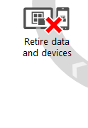
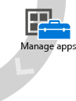

# Dokumentace pro Microsoft Intune &lt;test 1&gt;
Intune může uživatelům pomoct zvládnout větší objem práce a pracovat způsobem, který jim vyhovuje. Současně přitom napomáhá ochraně dat a zařízení, s nimiž pracují. Dokumentace k Intune vám ukáže, jak na to.

Můžete vás ale taky zajímat, jak Intune zapadá do dalších částí vaší práce. Odpovědi můžete najít v těchto materiálech:

-   **Jak mi Intune pomůže podporovat podnikovou mobilitu?** Existuje několik [způsobů využití Intune v rámci podnikové mobility](https://technet.microsoft.com/library/dn957912.aspx), v závislosti na velikosti společnosti, aktuální infrastruktuře pro správu a nutnosti škálování. Intune je jednou ze součástí sady [Enterprise Mobility Suite (EMS)](http://www.microsoft.com/en-us/server-cloud/enterprise-mobility/overview.aspx). Tuto službu můžete používat samostatně nebo v kombinaci se službami Azure Active Directory Premium, Azure Rights Management a Microsoft Advanced Threat Analytics k poskytování komplexní ochrany vašich uživatelů a zařízení.

-   **Co všechno mám naplánovat, když chci zaměstnance nechat, aby si do práce přinesli svá vlastní zařízení?** Jako pomoc pro návrháře a architekty systémů při plánování sítě mobilních pracovníků byla vyvinuta [Průvodce aspekty návrhu funkce BYOD (Přineste si vlastní zařízení)](https://technet.microsoft.com/en-us/library/dn656905.aspx).

-   **Co mám zaměstnancům říct o použití osobních zařízení pro přístup k e-mailům, souborům a interním lokalitám?** Využití vlastních mobilních zařízení může zvýšit produktivitu zaměstnanců, ale je stejně důležité, aby všichni pochopili, že  zodpovídají za ochranu firemních dat. Zaměstnance bude taky zajímat, do jaké míry budou zabezpečené jejich osobní údaje. Materiály, které vám při těchto diskuzích můžou pomoct, najdete v [průvodci registrací pro koncové uživatele](http://aka.ms/b3ml2).

-   **Proč používat Intune s Configuration Managerem?** Pokud už používáte System Center Configuration Managera ke správě podnikových počítačů PC, Mac a UNIX/Linux zařízení, přidání konektoru služby Intune vám umožní [snadno spravovat všechna mobilní zařízení pomocí jedné konzoly](https://technet.microsoft.com/en-US/library/mt243476.aspx).

## Úvod do služby Intune
V části [Úvod do služby Intune](https://technet.microsoft.com/library/dn646960(TechNet.10).aspx) najdete přehled možností, které služba Intune poskytuje. Najdete v ní informace o tom, jak začlenit Intune do své firmy a co je třeba vzít v úvahu před zahájením testovacího provozu služby Intune.

## Začínáme
V části [Začínáme](https://technet.microsoft.com/library/dn646953(TechNet.10).aspx) najdete průvodce, kteří vás seznámí s prostředím Intune a pomohou vám s nastavením vašeho prvního pilotního nasazení. Najdete tu taky šablonu, kterou můžete upravit a rozdat uživatelům, aby věděli, co mají od služby Intune očekávat.

## Registrovat zařízení
Dnešní strategie správy mobilních zařízení (MDM) v sobě zahrnují využívání různých druhů telefonů a tabletů (s iOS, Androidem a Windows). Ať už si uživatelé přináší svá vlastní zařízení (BYOD), která je nutné spravovat, aby je mohli používat pro e-maily a práci s daty, nebo distribuujete zařízení vlastněná společností, je prvním krokem [nastavení registrace zařízení](https://technet.microsoft.com/library/dn646962(TechNet.10).aspx). Můžete také spravovat počítače tak, že je zaregistrujete v rámci služby Intune (MDM), nebo do nich nainstalujete klientský software služby Intune.

## Konfigurace a správa zařízení
Aby mohli uživatelé produktivně pracovat, je nutné připravit jak zařízení, tak i aplikace. V části [Konfigurace a správa zařízení](https://technet.microsoft.com/library/mt313202(TechNet.10).aspx) vytvoříte zásady, které určují, jakým způsobem se uživatelé dostanou k VPN, WiFi a e-mailu.

Měli by uživatelé u zařízení s firemními daty používat hesla? Můžete to vyžadovat. Existují aplikace, které nechcete, aby uživatelé používali? Můžete je zablokovat. Vyzkoušejte si tyto zásady ještě dřív, než zaregistrujete testovací klienty, a jak je budete zavádět u všech uživatelů, postupně je upravujte.

## Nasazení a správa aplikací
V části [Nasazení a správa aplikací](https://technet.microsoft.com/library/dn646965(TechNet.10).aspx) se naučíte, jak uživatelům doručovat různé typy aplikací (aplikace pro Store, webové aplikace, interní aplikace), jak je aktualizovat a taky jak se jich zbavit, když je už nepotřebujete.

## Ochrana dat a zařízení
Všechno se točí kolem dat. Musíte je uživatelům zpřístupnit, ale chcete si být jistí, že přitom nedělají nic špatného, ať už náhodně, nebo cíleně. V části [Ochrana dat a zařízení](https://technet.microsoft.com/library/mt313203(TechNet.10).aspx) zjistíte, že Intune vám dává možnost zabránit uživatelům v přístupu k něčemu, co opravdu chtějí (například k e-mailu), dokud jejich zařízení nesplní nastavené požadavky. Dozvíte se taky, jak vícefaktorové ověřování pomáhá, aby vaše data nikdo neukradl, a jak můžete využívat aplikace k tomu, abyste zabránili úniku dat.

## Vyřazení dat a zařízení
Když dojde ke ztrátě nebo odcizení zařízení, přeřazení zaměstnance na jinou pozici nebo když je nutné vyměnit hardware, budete muset být schopni odebrat aplikace a data ze zařízení, vyřadit zařízení z provozu nebo odvolat oprávnění k přístupu. Tyto scénáře jsou nastíněny v části [Vyřazení dat a zařízení ze správy](https://technet.microsoft.com/library/mt313204(TechNet.10).aspx).

## Technické reference
Žádná technická dokumentace by nebyla úplná bez témat s [technickými referencemi](https://technet.microsoft.com/library/mt282239(TechNet.10).aspx) věnovaných funkcím.

## Další materiály a zdroje informací

-   [Co je nového ve Microsoft Intune](../Topic/What_s_new_in_Microsoft_Intune.md)

-   [Poznámky k verzi Microsoft Intune](../Topic/Release_notes_for_Microsoft_Intune.md)

-   Spojte se s komunitou [!INCLUDE[wit_nextref](../Token/wit_nextref_md.md)]:

    -   [Přečtěte si poslední novinky](http://blogs.technet.com/b/microsoftintune/) v blogu služby Intune.[Sledujte Intune](https://twitter.com/MSIntune) na Twitteru.[Zeptejte se](http://go.microsoft.com/fwlink/?LinkID=232998) ve fórech služby Intune.

-   [Jak získat podporu k Intune](http://technet.microsoft.com/library/dn646963.aspx#OPEN)

