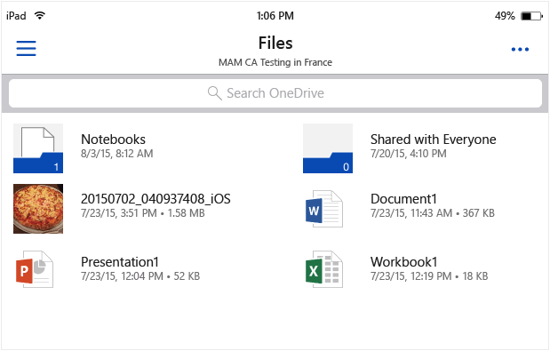
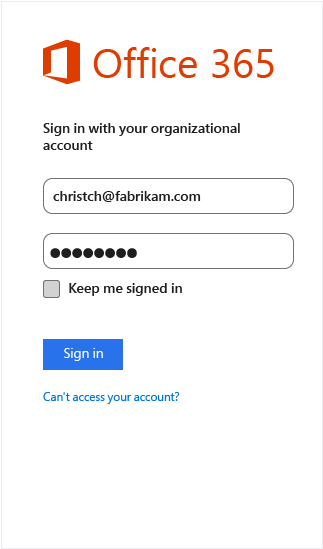
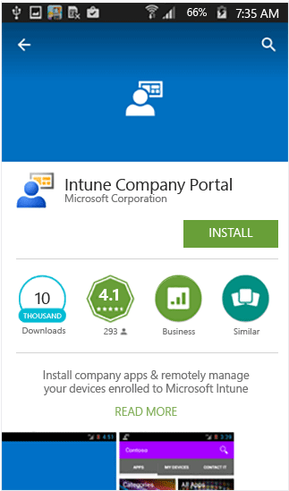
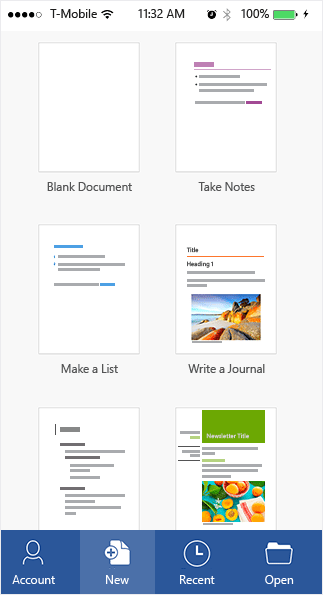
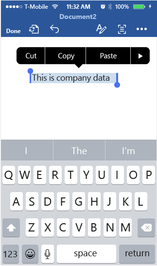
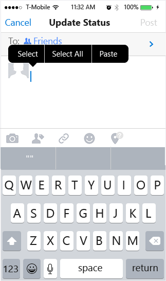
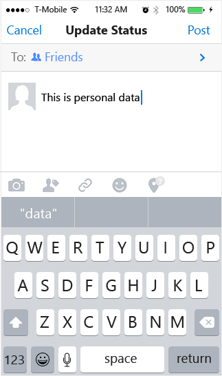
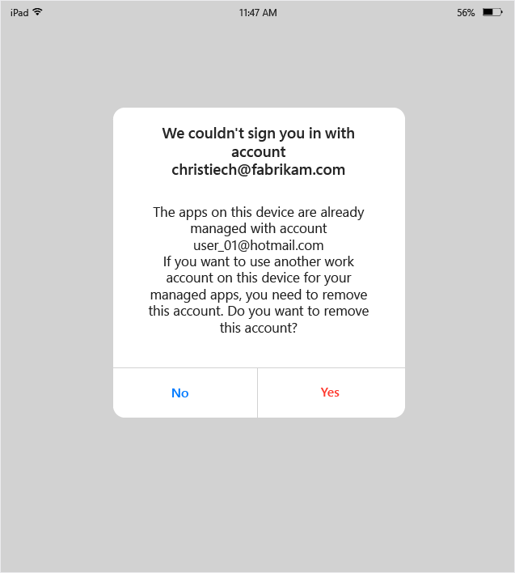
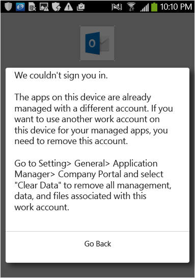

# Činnost koncov&#253;ch uživatelů pro aplikace přidružen&#233; k z&#225;sad&#225;m spr&#225;vy mobiln&#237;ch aplikac&#237; Microsoft Intune
Zásady správy mobilních aplikací (MAM) se použijí jenom v případě, že se aplikace používají k práci.  Následující scénáře vám pomohou naučit vaše uživatele, jak spravované aplikace fungují.

**V tomto tématu**

[Scénář: Přístup k OneDrive na zařízení se systémem iOS](#bkmk_OneDriveiOS)

[Scénář: Přístup k OneDrive na zařízení se systémem Android](#bkmk_OneDriveAndroid)

[Scénář: Používání aplikace Microsoft Word k pracovním a osobním úlohám](#bkmk_wordworkandpersonal)

#### Scénář: Přístup k OneDrive na zařízení se systémem iOS

1.  Spuštěním aplikace **OneDrive** otevřete přihlašovací stránku.

    

    > [!NOTE]
    > Na osobním zařízení by běžně stahoval aplikaci koncový uživatel.  Když je zařízení spravované řešením MDM, můžete aplikaci nasadit do zařízení.

2.  Zadejte uživatelské jméno pracovního účtu. Budete přesměrování na stránku **Ověřování O365**, kde zadáte pracovní přihlašovací údaje.

    

3.  Po úspěšném ověření přihlašovacích údajů Azure AD se použijí zásady MAM a budete požádáni o restartování aplikace **OneDrive**.

    

4.  Při opětovném spuštění aplikace **OneDrive** se aplikace spustí se zapnutými zásadami MAM. Nyní budete vyzváni k nastavení kódu **PIN** pro aplikaci. (Pokud jste tak nakonfigurovali zásady.)

    

5.  Po nastavení a potvrzení kódu PIN získáte přístup k souborům **OneDrive pro firmy**.

    

    > [!NOTE]
    > Při změně nasazených zásad se změny použijí při příštím otevření aplikace.

#### Scénář: Přístup k OneDrive na zařízení se systémem Android

1.  Spuštěním aplikace OneDrive otevřete přihlašovací stránku.

    > [!NOTE]
    > Na osobním zařízení by běžně stahoval aplikaci koncový uživatel.  Když je zařízení spravované řešením MDM, můžete aplikaci nasadit do zařízení.

2.  Zadejte uživatelské jméno pracovního účtu. Budete přesměrování na stránku **Ověřování O365**, kde zadáte pracovní přihlašovací údaje.

    

3.  Po úspěšném ověření přihlašovacích údajů **Azure AD** by se měla zobrazit zpráva s pokyny k instalaci aplikace portálu společnosti, pokud ještě není na zařízení nainstalovaná.  Chcete-li pokračovat, klepněte na volbu **Získat aplikaci**.

    

4.  Nyní jste na webu **Google Play**, kde si můžete stáhnout a nainstalovat aplikaci **portálu společnosti**.

    Aplikace portálu společnosti vám pomůže uchovávat data v bezpečí.

    

5.  Po dokončení instalace přijměte podmínky kliknutím na **Přijmout**.

    

6.  Aplikace **OneDrive** se spustí automaticky.

7.  Při dalším otevření aplikace OneDrive se zobrazí výzva k nastavení kódu **PIN**, pokud jsou nastavení zásad nastavena tak, aby se k přístupu k aplikaci **OneDrive** vyžadoval kód PIN.

    

8.  Po nastavení a potvrzení kódu PIN můžete pokračovat pomocí aplikace **OneDrive**, kterou nyní spravují zásady aplikací.

    

#### Scénář: Používání aplikace Microsoft Word k pracovním a osobním úlohám

1.  Otevřete na svém zařízení aplikaci **Word**. K ilustraci kroků používáme zařízení se systémem iOS.

2.  Klepnutím na volbu **Nový** vytvoříte nový textový dokument aplikace Word.

    

3.  Napište jednu nebo dvě věty.  Při ukládání tohoto dokumentu se jako možnosti k uložení právě vytvořeného dokumentu zobrazí pracovní i osobní umístění.  V této fázi zatím nejsou použité zásady aplikací, protože zatím nebyl určen pracovní/osobní kontext.

4.  Uložte dokument do umístění OneDrive pro firmy. Data se nyní označí jako data společnosti a použijí se omezení zásad.

    

5.  Otevřete dokument, který jste uložili do pracovního umístění.  Zkopírujte text, otevřete osobní účet **Facebook** a pokuste se vložit zkopírovaný text.  Uvidíte, že obsah nemůžete vložit do nového příspěvku na Facebooku. Možnost vložení není šedá, ale při stisknutí volby **Vložit** se nic nestane.

    

    

6.  Nyní zopakujte kroky 2 a 3 a vytvořte další nový dokument. Tentokrát ho ale namísto pracovního umístění uložte do osobního umístění, jako je **OneDrive – osobní**.

    

7.  Otevřete uložený osobní dokument.  Zkopírujte text, otevřete aplikaci **Facebook** a pokuste se vložit zkopírovaný text. Uvidíte, že obsah můžete vložit do příspěvku na Facebooku.

    

### Změna uživatelského účtu na zařízení
U aplikací OneDrive a Outlook můžete na zařízení používat jenom jeden pracovní účet, který má zásady MAM.  Přidávání více pracovních účtů se v těchto aplikacích blokuje.  Na zařízení ale můžete odebrat uživatele a přidat jiného uživatele.

Pokud používáte zařízení se systémem iOS, se při pokusu o přidání druhého pracovního účtu na stejném zařízení zobrazí zpráva o blokování.  Taky se zobrazí možnost odebrat existující účet a přidat nový. To můžete provést kliknutím na volbu **Ano**.

Pokud používáte zařízení se systémem Android, zobrazí se zpráva o blokování s pokyny k odstranění existujícího účtu a přidání nového účtu.  Když chcete na zařízení se systémem Android odebrat existující účet, přejděte na **Nastavení &gt; Obecné &gt; Správce aplikací &gt; Portál společnosti a vyberte volbu Vymazat data**.

## Viz také
[Vytvoření a nasazení zásad správy mobilních aplikací pomocí Microsoft Intune](../Topic/Create_and_deploy_mobile_app_management_policies_with_Microsoft_Intune.md)

