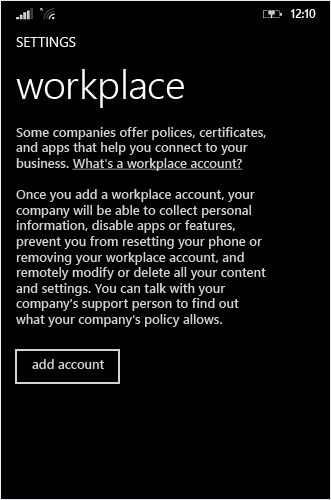
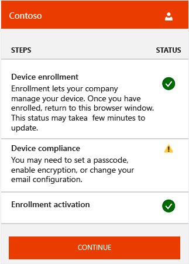
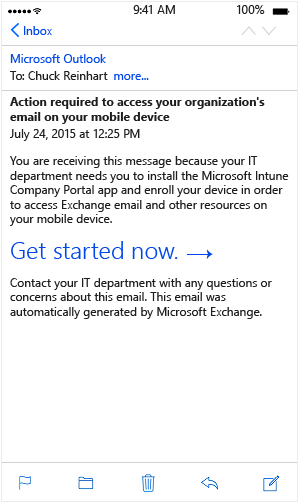
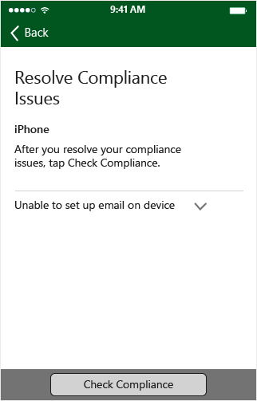
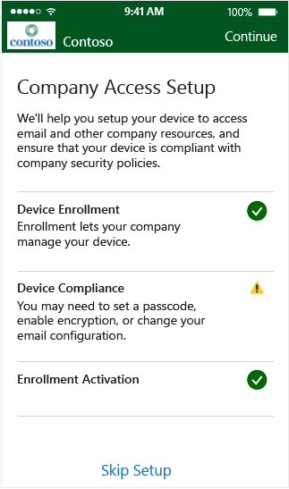
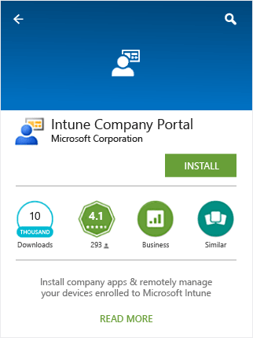
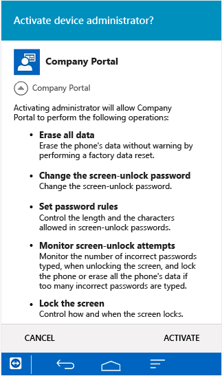
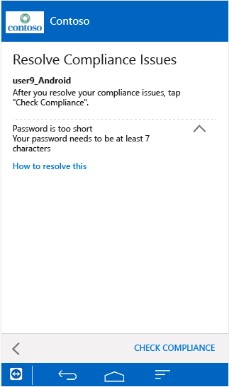

# Činnost koncov&#233;ho uživatele s podm&#237;něn&#253;m př&#237;stupem
Toto téma popisuje činnost koncového uživatele po povolení podmíněného přístupu a pokusu koncového uživatele o přístup k e-mailu na mobilním zařízení.

> [!TIP]
> Kopii celého tohoto tématu ke stažení najdete v [Galerii TechNet](https://gallery.technet.microsoft.com/Deploying-Enterprise-16499404).

## Windows Phone
> [!NOTE]
> Proces registrace a obrazovky, které se uživateli zobrazí, se jemně liší v závislosti na verzi operačního systému spuštěné na zařízení koncového uživatele.

1.  Pokud je uživatel již registrovaný v Intune a dodržuje předpisy, na zařízení Windows neuvidí vidět žádné rozdíly, nadále bude mít přístup k e-mailu. Uživatelé, kteří se dosud neregistrovali v Intune, obdrží e-mail o karanténě podobný této ukázce:

    

    Uživatel kliknutím na **Začít teď** zahájí registraci zařízení.

2.  Uživatel na obrazovce Nastavení firemního přístupu kliknutím na **Zahájit** zahájí nastavování zařízení a kontrolu dodržování předpisů.

    

3.  Na obrazovce Zaregistrovat zařízení uživatel kliknutím na **Potvrdit registraci** zahájí registraci zařízení.

    

    Během registrace se instaluje profil správy mobilních zařízení, abyste mohli vy a správce IT zařízení vzdáleně spravovat. Uživatel může být vyzvání k přijetí certifikátu ověřujícího připojení pracovního místa.

    

4.  Uživatel se přihlásí pomocí e-mailové adresy, kterou používá v sadě Office. Po přihlášení může být pro pokračování v registraci zařízení nutné znovu kliknout na **Potvrdit registraci**.

    

    Zařízení se kontroluje k ověření registrace.

    

5.  Uživatel potom dokončí proces registrace výběrem zařízení a kliknutím na **Vybrat**. Pokud se jejich zařízení nezobrazí, mohou vybrat **Nevidím v seznamu své zařízení** a zkusit to znovu.

    

    Zařízení se kontroluje, aby se ověřilo, že dodržuje zásady společnosti.

    

6.  Pokud nastane problém s dodržováním předpisů, uživatel je vyzván k vyřešení problému (jako je vytvoření platného hesla) a klepnutí na **Zkontrolovat dodržování předpisů**.

    

    Po ověření dodržování předpisů uživatel uvidí, že registrace se aktivuje.

    

7.  Registrace se aktivuje a uživatel kliknutím na **Pokračovat** dokončí proces. Poté uživatel kliknutím na **Dokončit** opustí instalaci.

    

    Po registraci uživatele a ověření dodržování předpisů by měl být e-mail zpřístupněn do několika minut.

Pokud uživatel postupuje podle těchto kroků k registraci a dodržování předpisů a stále nemá přístup k e-mailu na mobilním zařízení, může se pokusit opravit problém pomocí těchto dodatečných kroků:

-   Nejprve ověří, jestli je zařízení registrované. Pokud není, uživatel bude postupovat podle kroků výše.

-   Ověří, jestli zařízení splňuje předpisy kliknutím na **Zkontrolovat dodržování předpisů**. Pokud se najde chyba dodržování předpisů, uživatel může při řešení postupovat podle pokynů specifických pro mobilní zařízení, jako je resetování hesla.

-   Zavolá technickou podporu.

### Pokud zařízení nesplňuje požadavky
Ve výchozím nastavením se zařízení každých 8 hodin kontroluje, zda stále dodržuje předpisy. Pokud se u zařízení, které dřív dodržovalo předpisy, později zjistí, že nedodržuje předpisy (například byly přidány nebo změněny zásady dodržování předpisů), může uživatel pomocí těchto kroků opět zajistit dodržování předpisů zařízení:

1.  Uživatel e-mailem nebo na zařízení obdrží upozornění, že zařízení nedodržuje předpisy. V této chvíli se zařízení v Exchangi umístí do karantény.

2.  Pokud se uživatel pokusí přistoupit k e-mailu, je přesměrován zpět na obrazovku Nastavení firemního přístupu z portálu společnosti Intune, kde se zobrazí, že nejsou dodržovány předpisy.

    

3.  Uživatel klikne na **Pokračovat** a zobrazí se problém dodržování předpisů, který brání v přístupu k e-mailu.

4.  Po opravení problému klepnutím na **Zkontrolovat dodržování předpisů** ověří, že byl problém vyřešen.

5.  Pokud je problém vyřešen, uživatel kliknutím na **Pokračovat** dokončí proces. E-mail by měl být znovu zpřístupněn do několika minut.

## iOS
> [!NOTE]
> Proces registrace a obrazovky, které se uživateli zobrazí, se jemně liší v závislosti na verzi operačního systému spuštěné na zařízení koncového uživatele.

1.  Pokud je uživatel již registrovaný v Intune a dodržuje předpisy, na zařízení se systémem iOS neuvidí žádné rozdíly, nadále bude mít přístup k e-mailu. Pokud uživatel zatím není registrovaný, zobrazí se při spuštění aplikace e-mailu zpráva o karanténě podobná této:

    

    Uživatel kliknutím na **Začít teď** zahájí registraci zařízení.

2.  Uživatel je vyzván k instalaci aplikace portálu společnosti Intune z příslušného App Storu.

    

    Po instalaci uživatel otevře aplikaci a přihlásí se pomocí firemních přihlašovacích údajů.

3.  Uživatel na obrazovce Nastavení firemního přístupu kliknutím na **Zahájit** zahájí nastavování zařízení a kontrolu dodržování předpisů.

    

4.  Na obrazovce Registrace zařízení uživatel kliknutím na **Zaregistrovat** zahájí registraci zařízení.

    

    Během registrace se instaluje profil správy mobilních zařízení, abyste mohli vy a správce IT zařízení vzdáleně spravovat. Pokud je k tomu vyzván, uživatel zadá své heslo.

5.  Na obrazovce Nastavení firemního přístupu uživatel kliknutím na **Pokračovat** zahájí kontrolu dodržování předpisů na zařízení.

    

    Pokud nastane problém s dodržováním předpisů, uživatel je vyzván k vyřešení problému (jako je vytvoření platného hesla) a klepnutí na **Zkontrolovat dodržování předpisů**.

    

6.  Po zajištění úplného dodržování předpisů zařízením uživatel může pokračovat klepnutím na **Pokračovat**.

    

    Po registraci uživatele a ověření dodržování předpisů by měl být e-mail zpřístupněn do několika minut.

Pokud uživatel postupuje podle těchto kroků k registraci a dodržování předpisů a stále nemá přístup k e-mailu na mobilním zařízení, může se pokusit opravit problém pomocí těchto dodatečných kroků:

-   Nejprve ověří, jestli je zařízení registrované. Pokud není, uživatel bude postupovat podle kroků výše.

-   Ověří, jestli zařízení splňuje předpisy kliknutím na **Zkontrolovat dodržování předpisů**. Pokud se najde chyba dodržování předpisů, uživatel může při řešení postupovat podle pokynů specifických pro mobilní zařízení, jako je resetování hesla.

-   Zavolá technickou podporu.

### Pokud zařízení nesplňuje požadavky
Ve výchozím nastavením se zařízení každých 8 hodin kontroluje, zda stále dodržuje předpisy. Pokud se u zařízení, které dřív dodržovalo předpisy, později zjistí, že nedodržuje předpisy (například byly přidány nebo změněny zásady dodržování předpisů), může uživatel pomocí těchto kroků opět zajistit dodržování předpisů zařízení:

1.  Uživatel e-mailem nebo na zařízení obdrží upozornění, že zařízení nedodržuje předpisy. V této chvíli se zařízení v Exchangi umístí do karantény.

2.  Pokud se uživatel pokusí přistoupit k e-mailu, je přesměrován zpět na obrazovku Nastavení firemního přístupu z portálu společnosti Intune, kde se zobrazí, že se nedodržují předpisy.

    

3.  Uživatel klikne na **Pokračovat** a zobrazí se problém dodržování předpisů, který brání v přístupu k e-mailu.

    

4.  Po opravení problému klepnutím na **Zkontrolovat dodržování předpisů** ověří, že byl problém vyřešen.

5.  Pokud je problém vyřešen, uživatel kliknutím na **Pokračovat** dokončí proces.

    

    E-mail by měl být znovu zpřístupněn do několika minut.

## Android
> [!NOTE]
> Proces registrace a obrazovky, které se uživateli zobrazí, se jemně liší v závislosti na verzi operačního systému spuštěné na zařízení koncového uživatele.

1.  Při pokusu o přístup k e-mailu uživatel nejprve obdrží e-mail o karanténě podobný této ukázce:

    

    Uživatel kliknutím na **Začít teď** zahájí registraci zařízení.

    > [!NOTE]
    > Pokud uživatel pro zařízení nenastavil výchozí prohlížeč, bude během registrace zařízení a aktivace registrace vyzván k povolení odkazu k otevření okna prohlížeče. Po vyzvání musí vybrat pokaždé stejný prohlížeč, jinak proces registrace selže.

2.  Uživatel je vyzván k instalaci aplikace portálu společnosti Intune z příslušného App Storu.

    

    Po instalaci uživatel otevře aplikaci a přihlásí se pomocí firemních přihlašovacích údajů.

3.  Uživatel na obrazovce Nastavení firemního přístupu kliknutím na **Zahájit** zahájí nastavování zařízení a kontrolu dodržování předpisů.

    

4.  Na obrazovce Registrace zařízení uživatel kliknutím na **Zaregistrovat** zahájí registraci zařízení.

    

5.  Uživatelé musí při výzvě aktivovat správce zařízení kliknutím na **Aktivovat**, jinak bude procedura registrace zrušena.

    

    Registrace zařízení je zahájena. V závislosti na zařízení se během registrace může zobrazit výzva k instalaci certifikátu nebo výzva k přijetí ochrany osobních údajů Samsung KNOX. To je nezbytné k tomu, aby mohli správci IT vzdáleně spravovat zařízení. Zařízení je registrované v Intune a vytvoří identitu zařízení v Azure Active Directory.

    

6.  Po úspěšném dokončení registrace uživatel kliknutím na **Pokračovat** zahájí kontrolu dodržování předpisů na zařízení.

    

    Pokud nastane problém s dodržováním předpisů, uživatel je vyzván k vyřešení problému (jako je vytvoření platného hesla) a klepnutí na **Zkontrolovat dodržování předpisů**.

    

7.  Po zajištění úplného dodržování předpisů zařízením uživatel kliknutím na **Pokračovat** zahájí aktivaci registrace. To připojí identitu zařízení AAD k ID EAS poskytnutému Exchangem.

    > [!NOTE]
    > V systému Android se během aktivace registrace na několik sekund zobrazí výchozí prohlížeč. Pokud uživatel dosud nevybral výchozí prohlížeč, bude vyzván k výběru prohlížeče. Při dokončování Nastavení firemního přístupu se musí při výzvě vždy vybrat stejný prohlížeč.

    

8.  Aktivace registrace bude dokončena a uživatel kliknutím na **Dokončit** opustí proces registrace a ověření dodržování předpisů.

    

    Po registraci uživatele a ověření dodržování předpisů by měl být e-mail zpřístupněn do několika minut.

Pokud uživatel postupuje podle těchto kroků k registraci a dodržování předpisů a stále nemá přístup k e-mailu na mobilním zařízení, může se pokusit opravit problém pomocí těchto dodatečných kroků:

1.  Nejprve ověří, jestli je zařízení registrované. Pokud není, uživatel bude postupovat podle kroků výše.

2.  Ověří, jestli zařízení splňuje předpisy kliknutím na **Zkontrolovat dodržování předpisů**. Pokud se najde chyba dodržování předpisů, uživatel může při řešení postupovat podle pokynů specifických pro mobilní zařízení, jako je resetování hesla.

3.  Zavolá technickou podporu.

### Pokud zařízení nesplňuje požadavky
Ve výchozím nastavením se zařízení každých 8 hodin kontroluje, zda stále dodržuje předpisy. Pokud se u zařízení, které dřív dodržovalo předpisy, později zjistí, že nedodržuje předpisy (například byly přidány nebo změněny zásady dodržování předpisů), může uživatel pomocí těchto kroků opět zajistit dodržování předpisů zařízení:

1.  Uživatel e-mailem nebo na zařízení obdrží upozornění, že zařízení nedodržuje předpisy. V této chvíli se zařízení v Exchangi umístí do karantény.

2.  Když se uživatel pokusí přistoupit k e-mailu, zobrazí se e-mail o karanténě, který uvádí, že před přístupem musí být vyřešeny problémy dodržování předpisů. Když uživatel klikne na hypertextový odkaz v e-mailu o karanténě, je přesměrován na obrazovku Nastavení firemního přístupu na portálu společnosti Intune (prostřednictvím výchozího prohlížeče a webu Google Play), kde je zobrazeno, že zařízení nedodržuje předpisy.

    

3.  Uživatel klikne na **Pokračovat** a zobrazí se problém dodržování předpisů, který brání v přístupu k e-mailu.

    

4.  Po opravení problému klepnutím na **Zkontrolovat dodržování předpisů** ověří, že byl problém vyřešen.

5.  Pokud je problém vyřešen, uživatel kliknutím na **Pokračovat** dokončí proces. E-mail by měl být znovu zpřístupněn do několika minut.

## Viz také
[Informace o nasazení řešení pro ochranu firemního e-mailu a dokumentů](../Topic/Learn_how_to_deploy_a_solution_for_protecting_company_email_and_documents.md)
[Používání podmíněného přístupu s Intune a Configuration Managerem](../Topic/Use_conditional_access_with_Intune_and_Configuration_Manager.md)

