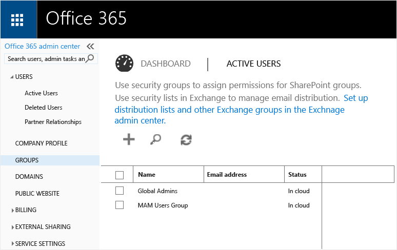
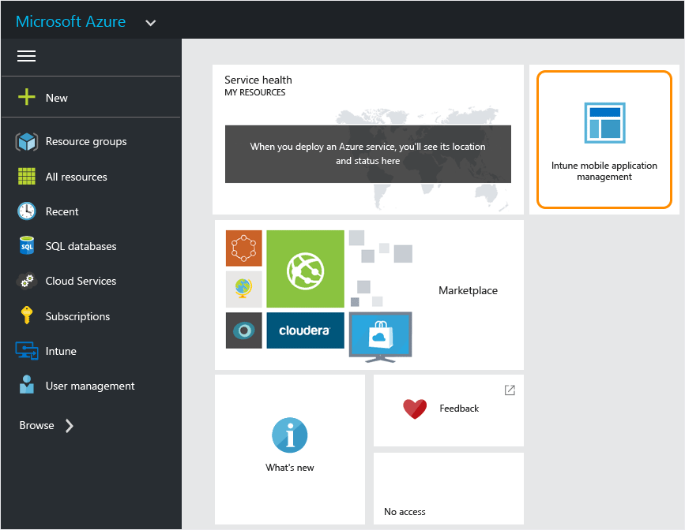

# Zač&#237;n&#225;me se z&#225;sadami spr&#225;vy mobiln&#237;ch aplikac&#237; na port&#225;lu Azure
V tomto tématu naleznete potřebné informace, pokud začínáte s vytvářením zásad správy mobilních aplikací (MAM) na portálu Azure.

**V tomto tématu**

[Podporované aplikace](#bkmk_supportedapps)

[Podporované platformy](#bkmk_supportedplatforms)

[Co potřebujete, abyste mohli začít](#bkmk_Prereqs)

[Nastavení požadavků](#bkmk_prereqshowto)

[Přístup k portálu Azure Preview](#bkmk_azureportal)

[Další kroky](#bkmk_nextsteps)

## Podporované platformy

-   iOS 7.1 nebo novější

-   Android 4 nebo novější

## Podporované aplikace
**iOS:** aplikace Microsoft Word, Excel, PowerPoint a OneDrive

**Android:** OneDrive

## Co potřebujete, abyste mohli začít
Než začnete, budete potřebovat následující:

-   Předplatné služby [!INCLUDE[wit_firstref](../Token/wit_firstref_md.md)].    Koncoví uživatelé potřebují licence [!INCLUDE[wit_nextref](../Token/wit_nextref_md.md)] k získání aplikací se zásadami MAM.

-   Předplatné služby Office 365 (O365) a přístup ke službě Azure Active Directory (Azure AD), chcete-li vytvářet uživatele a přiřazovat licence [!INCLUDE[wit_nextref](../Token/wit_nextref_md.md)].  Služba Azure AD ověřuje uživatele při spuštění aplikace a zadání přihlašovacích údajů.

    > [!NOTE]
    > Pokud nastavujete uživatele pomocí konzoly [!INCLUDE[wit_nextref](../Token/wit_nextref_md.md)], uvědomte si, že konfigurace zásad MAM se od nynějška přesouvá na portál Azure. Chcete-li používat tento portál, je nutné nastavit skupiny uživatelů Azure AD pomocí portálu Office 365.

## Nastavení požadavků
V následující tabulce naleznete přehled rolí a oprávnění, které můžete přiřazovat uživatelům.

|||
|-|-|
|**Role**|**Oprávnění**|
|Globální správce (portál O365)|-   Přístup k portálu O365 -   Přístup k portálu Azure AD -   Přístup k portálu Azure Preview (může provádět úkoly správy rolí i správy mobilních aplikací).|
|Role Vlastník (portál Azure Preview)|-   Přístup k portálu Azure Preview (může provádět úkoly správy rolí i správy mobilních aplikací).|
|Role Přispěvatel (portál Azure Preview)|-   Přístup k portálu Azure Preview (může provádět jenom úkoly správy mobilních aplikací).|

#### Vytváření uživatelů a přiřazování licencí [!INCLUDE[wit_nextref](../Token/wit_nextref_md.md)]

1.  Pokud používáte [!INCLUDE[wit_nextref](../Token/wit_nextref_md.md)] ke správě svých zařízení, již předplatné [!INCLUDE[wit_nextref](../Token/wit_nextref_md.md)] máte.  Pokud jste zakoupili licenci EMS, předplatné [!INCLUDE[wit_nextref](../Token/wit_nextref_md.md)] již také máte. Pokud zkoušíte [!INCLUDE[wit_nextref](../Token/wit_nextref_md.md)], abyste se seznámili s funkcemi MAM, můžete [tady](http://www.microsoft.com/en-us/server-cloud/products/microsoft-intune/) získat zkušební účet.

    Chcete-li ověřit, zda předplatné [!INCLUDE[wit_nextref](../Token/wit_nextref_md.md)] máte, přejděte na portálu Office na stránku Fakturace.  Předplatné služby [!INCLUDE[wit_nextref](../Token/wit_nextref_md.md)] by mělo být označené jako **Aktivní**.

2.  Přihlaste se na [portál Office](http://portal.office.com) pomocí svých přihlašovacích údajů správce.

3.  Chcete-li přidat uživatele a přiřadit licence [!INCLUDE[wit_nextref](../Token/wit_nextref_md.md)], přejděte na stránku **Aktivní uživatelé**.

    

4.  Má-li mít uživatel přístup na portály Office, Azure AD a Azure Preview, přiřaďte mu roli **globálního správce**.

    

5.  Zásady MAM jsou nasazeny na skupiny uživatelů ve službě Azure Active Directory. Chcete-li vytvořit skupiny uživatelů v souladu se zásadami MAM, přejděte na stránku **Skupiny** na **portálu Office** a kliknutím na ikonu **+** vytvořte novou skupinu zabezpečení.  Zadejte název a popis a klikněte na **Vytvořit**. Do vytvořené skupiny můžete přidávat uživatele kliknutím na volbu **Upravit členy** v nově vytvořené skupině zabezpečení. Skupina zabezpečení je vytvořena ve službě Azure Active Directory.

    

## Přístup k portálu Azure Preview
Portál **Azure Preview** umožňuje vytvářet zásady aplikací, nasazovat je na uživatele a monitorovat stav nasazení.

#### Jak začít používat portál

1.  Přejděte na [portál Azure Preview](https://portal.azure.com) a přihlaste se pomocí svých přihlašovacích údajů služby [!INCLUDE[wit_nextref](../Token/wit_nextref_md.md)].

    

2.  Po přihlášeni se vám zobrazí **Uvítací** nebo **Domovská** stránka.**Uvítací** nebo domovská stránka obsahuje sadu výchozích dlaždic. Přidáním nových dlaždic nebo jejich odebráním si stránku můžete přizpůsobit.

    

3.  V nabídce **Procházet** vyberte volbu **Intune**.

4.  Klikněte na **Intune &gt; Správa mobilních aplikací Intune &gt; Nastavení**.

    

    > [!TIP]
    > Chcete-li připnout okno na **Uvítací** stránku, použijte volbu **připnout** v okně.  Kliknutím na ikonu připnutí **v okně správy mobilních aplikací Intune** toto okno připnete na **Uvítací** stránku.

    

    

**Globální správci** mají přístup k portálu Azure.  Chcete-li, aby ostatní správci mohli konfigurovat zásady a provádět i další úkoly správy mobilních aplikací, můžete jim přiřadit **roli přispěvatele** podle pokynů níže:

#### Přiřazení role Přispěvatel uživateli

1.  V okně **Nastavení** klikněte v části **Správa prostředků** na volbu **Uživatelé**.

    

2.  Kliknutím na **Přidat** otevřete okno **Přidat přístup**.

3.  Klikněte na **Vybrat roli** a poté na **role Přispěvatel**.

    

4.  Jakmile vyberete roli, klikněte na volbu **Přidat uživatele** a vyhledejte uživatele pomocí uživatelského jména nebo e-mailové adresy. V tomto seznamu se zobrazí prvních 1000 uživatelů, které jste vytvořili ve službě Azure AD pomocí portálu Office. Kliknutím na **OK** v okně **Přidat přístup** uložíte a přiřadíte uživateli roli.

    

    > [!IMPORTANT]
    > Pokud vyberete uživatele, který nemá přiřazenou licenci[!INCLUDE[wit_nextref](../Token/wit_nextref_md.md)], nebude moci získat přístup k portálu.

## Další kroky
[Vytvoření a nasazení zásad správy mobilních aplikací pomocí Microsoft Intune](../Topic/Create_and_deploy_mobile_app_management_policies_with_Microsoft_Intune.md)

## Viz také
[Nakonfigurujte zásady ochrany před únikem informací pomocí Microsoft Intune.](../Topic/Configure_data_loss_prevention_app_policies_with_Microsoft_Intune.md)

