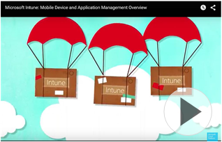

# &#218;vod do Microsoft Intune

[!INCLUDE[wit_nextref](../Token/wit_nextref_md.md)] je cloudová služba, která umožňuje spravovat mobilní zařízení, počítače a aplikace, aby vaši uživatelé mohli být produktivní, a zároveň zabezpečit informace vaší společnosti.

Správa mobilních zařízení (MDM) a správa počítačů s Windows je základním stavebním kamenem moderního oddělení IT. Dnešní pracovníci, zaměstnanci a studenti jsou mobilnější a aktivnější než kdy dřív. Váš úspěch závisí na současném poskytování informací, kde je třeba, a současném zajišťování jejich zabezpečení. Je nutné nasazovat aplikace, chránit zařízení, zajišťovat provádění aktualizací a zřizovat e-mailové služby rychleji než kdy dřív a zároveň je nutné chránit informace společnosti.

## Různé způsoby správy zařízení prostřednictvím služby Microsoft Intune
Máte několik možností, jak službu Intune používat. Následující krátké video ukazuje, jak Intune zapadá do vaší stávající sítě a pomůže vám se správou zařízení a aplikací.

Další informace o tom, co služba Intune nabízí jako:

-   **Samostatné řešení pro správu zařízení**. Jako cloudová služba Intune umožňuje zajišťovat správu zařízení a ochranu dat společnosti bez režijních nákladů síťové infrastruktury.

    Intune dokáže spravovat jako mobilní zařízení zařízení s iOS, Androidem, Macem OS X a Windows Phone i zařízení s Windows RT, Windows 8.1 a Windows 10. Pokud zvažujete [!INCLUDE[wit_nextref](../Token/wit_nextref_md.md)] jako řešení pro správu mobilních zařízení (MDM), projděte si [možnosti a funkce služby Intune pro MDM](https://technet.microsoft.com/library/dn600287.aspx).

    Na počítače s Windows můžete nainstalovat klientský software [!INCLUDE[wit_nextref](../Token/wit_nextref_md.md)], který umožní jejich správu. Jakmile se počítač zařadí do správy, můžete nasazovat aplikace a aktualizace softwaru, spravovat službu Endpoint Protection a brány firewall systému Windows, poskytovat vzdálenou pomoc a mnoho dalšího. Podívejte se na [úplný seznam možností správy počítačů](http://technet.microsoft.com/library/dn646975.aspx).

    Intune taky můžete používat pro [nasazení a správu aplikací](https://technet.microsoft.com/library/dn646965.aspx). Správa aplikací přispívá k ochraně dat před sdílením mimo vaši společnost zamezením operací, jako je kopírování, vyjímání a vkládání nebo ukládání pod jiným názvem či v jiném umístění, mezi aplikacemi spravovanými službou Intune a osobními aplikacemi. Tato ochrana dat je přímo integrovaná v mnoha mobilních aplikacích Microsoftu, ale [pomocí nástroje služby Intune pro zabalení aplikace můžete ochranu dat rozšířit na vaše stávající firemní aplikace](https://technet.microsoft.com/library/dn878026.aspx).[Spravovaný prohlížeč Intune](https://technet.microsoft.com/library/dn878029.aspx) vám taky pomůže zajistit bezpečné zobrazování obsahu. Dalším stupněm ochrany podnikových informací může být [selektivní vymazání spravovaných aplikací a souvisejících dat](https://technet.microsoft.com/library/mt313204.aspx) na zařízeních, která jsou odregistrovaná, ztracená, odcizená, vyřazená nebo už nekompatibilní.

-   **Cloudové rozšíření nástroje Microsoft System Center 2012 Configuration Manager**. Pokud už používáte nástroj Configuration Manager ke správě místních zařízení a hledáte způsob, jak spravovat množství dnešních mobilních zařízení, můžete [Intune používat jako rozšíření nástroje System Center 2012 Configuration Manager](https://technet.microsoft.com/library/dn957912.aspx#BKMK_HybridOfferings). Dvě klíčové výhody této možnosti jsou jednotné prostředí pro správu místních i mobilních zařízení a škálovatelnost. Tato hybridní implementace služby Intune poskytuje kapacitu pro správu více než 50 000 zařízení.

-   **Součást předplatného Microsoft Office 365**. Pokud máte předplatné Office 365 pro komerční použití, můžete použít [funkce služby Intune pro správu mobilních zařízení integrované do Office 365](https://technet.microsoft.com/library/dn957912.aspx#MDMOfferings). Přestože tato možnost není tak komplexní jako samostatná verze Intune nebo kombinace Intune a nástroje Configuration Manager, stále můžete spravovat zařízení iOS, Android a Windows Phone, vytvářet zásady zabezpečení, omezovat přístup k e-mailům a dokumentům Office 365 na spravovaných zařízeních a používat selektivní vymazání k odebrání Office 365 ze spravovaných zařízení.

-   **Součást sady Microsoft Enterprise Mobility**. Mobilita je dnešní realitou a stejně tak i cloud. Intune je základní součástí [Microsoft Enterprise Mobility Suite (EMS)](https://www.microsoft.com/en-us/server-cloud/enterprise-mobility/overview.aspx%20), což je sada cloudových služeb, které zajišťují detekci hrozeb, správu identit jako nadstavbu ochrany dat a správy zařízení poskytovaných samostatnou verzí Intune.

## Požadavky pro nastavení služby Intune
Přestože je Intune služba a ušetří vám tak mnoho nákladů spojených s infrastrukturou, stále může být nutné splnit některé [požadavky nastavení sítě](https://technet.microsoft.com/library/dn646950.aspx). Například brána firewall může ve výchozím nastavení blokovat některé síťové porty vyžadované službou [!INCLUDE[wit_nextref](../Token/wit_nextref_md.md)].  Kromě toho, pokud chcete synchronizovat data z Exchange Serveru, bude taky nejspíš nutné nastavit určité výjimky brány firewall.

K dalším krokům [ přípravy na nasazení služby Intune](https://technet.microsoft.com/library/dn646966.aspx) patří:

-   Nastavení portálu společnosti, aby uživatelé mohli registrovat svá mobilní zařízení do správy službou Intune

-   Porozumění očekávanému využití šířky pásma

-   Rozhodnutí, jestli se má použít výchozí název domény **onmicrosoft.com**, nebo název domény, kterou vlastníte

## Viz také
[Průvodce aspekty návrhu Správy mobilních zařízení](https://technet.microsoft.com/en-us/library/mt143180.aspx)
[Dokumentace pro Microsoft Intune](../Topic/Documentation_for_Microsoft_Intune.md)

