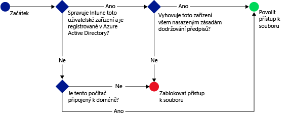

# Spr&#225;va př&#237;stupu na SharePoint Online přes Microsoft Intune
Pomocí zásady podmíněného přístupu pro [!INCLUDE[wit_firstref](../Token/wit_firstref_md.md)]**SharePoint Online** můžete spravovat přístup k souborům OneDrivu pro firmy na SharePointu Online, a to na základě podmínek, které určíte.

Když se cílový uživatel na svém zařízení pokusí připojit k souboru pomocí podporované aplikace, jako je například OneDrive, dojde k následujícímu vyhodnocení:

Aby bylo možné se připojit se k požadovaným souborům, musí pro zařízení, na kterém běží OneDrive, platit následující:

-   Musí být zaregistrované ve službě [!INCLUDE[wit_nextref](../Token/wit_nextref_md.md)] nebo v počítači připojeném k doméně.

-   Zaregistrujte zařízení do Azure Active Directory (k tomu automaticky dojde při registraci zařízení ve [!INCLUDE[wit_nextref](../Token/wit_nextref_md.md)]).

    Pro počítač připojený k doméně ho musíte nastavit na [automatickou registraci](https://msdn.microsoft.com/en-us/library/azure/dn935033.aspx) v rámci Azure Active Directory.

-   Musí splňovat veškeré nasazené zásady dodržování předpisů [!INCLUDE[wit_nextref](../Token/wit_nextref_md.md)].

Stav zařízení je uložený ve službě Azure Active Directory, která uděluje nebo blokuje přístup k souborům na základě podmínek, které zadáte.

Pokud není podmínka splněná, zobrazí se uživateli při přihlášení jedna z následujících zpráv:

-   Pokud není zařízení zaregistrované v [!INCLUDE[wit_nextref](../Token/wit_nextref_md.md)] nebo v Azure Active Directory, zobrazí se zpráva s pokyny pro instalaci aplikace portálu společnosti a registraci.

-   Pokud zařízení není kompatibilní, zobrazí se zpráva, která uživatele přesměruje na webový portál [!INCLUDE[wit_nextref](../Token/wit_nextref_md.md)], kde může najít informace o problému a jeho řešení.

-   Počítač:

    -   Pokud je zásada nastavená tak, aby vyžadovala připojení k doméně, a počítač k doméně připojený není, zobrazí se zpráva, aby uživatel kontaktoval správce IT.

    -   Pokud je zásada nastavená tak, aby vyžadovala připojení k doméně nebo splňování předpisů, a počítač ani jednu z těchto požadavků nesplňuje, zobrazí se zpráva s pokyny, jak nainstalovat aplikaci Portál společnosti a provést registraci.

Přístup k SharePointu Online můžete spravovat z následujících aplikací:

-   Microsoft Office Mobile (Android)

-   Microsoft OneDrive (Android a iOS)

-   Microsoft Word (Android a iOS)

-   Microsoft Excel (Android a iOS)

-   Microsoft PowerPoint (Android a iOS)

-   Microsoft OneNote (Android a iOS)

## Postup konfigurace podmíněného přístupu pro SharePoint Online

### Krok 1: Konfigurace skupin zabezpečení služby Active Directory
Než začnete, nakonfigurujte pro skupiny zabezpečení služby Azure Active Directory zásadu podmíněného přístupu. Tyto skupiny můžete nakonfigurovat v **Centru pro správu Office 365** nebo na **Portálu účtů Intune**. Tyto skupiny obsahují uživatele, na které budou zásady cílit, nebo kteří budou z těchto zásad vyjmutí. Pokud je uživatel cílem zásady, musí každé jím používané zařízení splňovat zásady, aby měl přístup k prostředkům.

V rámci zásad SharePointu Online můžete zadat dva typy skupin:

-   **Cílové skupiny:** Skupiny uživatelů, na které se má zásada aplikovat

-   **Vyloučené skupiny:** Skupiny uživatelů, které jsou ze zásady vyňaty (volitelné)

Pokud je uživatel v obou skupinách, bude ze zásad vyloučený.

### Krok 2: Konfigurace a nasazení zásad dodržování předpisů
Musíte vytvořit a nasadit zásady dodržování předpisů na všechna zařízení, na které bude zásada SharePointu Online cílit.

> [!NOTE]
> Zásady dodržování předpisů se nasadí do skupin [!INCLUDE[wit_nextref](../Token/wit_nextref_md.md)] a zásady podmíněného přístupu cílí na skupiny zabezpečení služby Azure Active Directory.

Podrobnosti o tom, jak nakonfigurovat zásady dodržování předpisů najdete v článku [Správa zásad dodržování předpisů zařízeními pro Microsoft Intune](../Topic/Manage_device_compliance_policies_for_Microsoft_Intune.md).

> [!IMPORTANT]
> Pokud jste zásady dodržování předpisů nenasadili a povolíte zásady pro SharePoint Online, budou mít všechna cílová zařízení přístup povolený.

Až budete připravení, pokračujte **Krokem 3**.

### Krok 3: Konfigurace zásad SharePointu Online
V dalším kroku nakonfigurujte zásadu, která bude vyžadovat, aby měla k SharePointu Online přístup jenom spravovaná zařízení, která jsou v souladu s předpisy. Tato zásada bude uložená v Azure Active Directory.

#### 

1.  V [konzole pro správu Microsoft Intune](https://manage.microsoft.com) klikněte na **Zásady** &gt; **Podmíněný přístup** &gt; **Zásady pro SharePoint Online**.

2.  Vyberte možnost **Zapnout zásady podmíněného přístupu pro SharePoint Online**.

3.  V části **Platformy zařízení** můžete použít zásady podmíněného přístupu na:

    -   **Všechny platformy**

        To vyžaduje, aby každé zařízení používané k přístupu k **SharePointu Online** bylo registrované v Intune a dodržovalo tyto zásady.  Každá klientská aplikace používající **moderní ověřování** je předmětem zásad podmíněného přístupu a pokud platforma není aktuálně podporovaná Intune, přístup k **SharePointu Online** je blokovaný.

    -   **Specifické platformy**

        Pokud vyberete volbu **Specifické platformy** zobrazí se seznam platforem, které můžete vybrat jednotlivě.   Zásady podmíněného přístupu se použijí na každou klientskou aplikaci, která používá moderní ověřování, ale jenom na vybraných platformách.

    > [!TIP]
    > **Moderní ověřování** integruje do klientů Office přihlašování založené na knihovně ADAL (Active Directory Authentication Library).
    > 
    > -   Ověřování na základě knihovny ADAL umožňuje pro klienty Office používat ověřování založené na prohlížeči (označuje se také jako pasivní ověřování).  Aby bylo možné uživatele ověřit, uživatel se přesměruje na přihlašovací webovou stránku.
    > -   Tato nová metoda přihlašování umožňuje nové scénáře, jako je například podmíněný přístup, na základě **souladu zařízení s předpisy** a na základě toho, jestli bylo provedeno **vícefaktorové ověření**.
    > 
    > Tento [článek](https://blogs.office.com/2014/11/12/office-2013-updated-authentication-enabling-multi-factor-authentication-saml-identity-providers/) obsahuje podrobnější informace o tom, jak moderní ověřování funguje.

    Pro počítače s Windows musí být počítač buď připojený k doméně, nebo zaregistrovaný v rámci [!INCLUDE[wit_nextref](../Token/wit_nextref_md.md)] a v souladu s předpisy. Můžete nastavit následující požadavky:

    -   **Zařízení musí být připojené k doméně nebo splňovat předpisy.** To znamená, že počítače musí být buď připojené k doméně, nebo musí splňovat zásady nastavené v rámci [!INCLUDE[wit_nextref](../Token/wit_nextref_md.md)]. Pokud počítač některý z těchto požadavků nesplňuje, bude uživatel vyzván k zápisu zařízení v rámci [!INCLUDE[wit_nextref](../Token/wit_nextref_md.md)].

    -   **Zařízení musí být připojené k doméně.** To znamená, že počítače musí být připojené k doméně, aby měly přístup k Exchangi Online. Pokud počítač není připojený k doméně, je přístup k e-mailu blokovaný a uživatel je vyzván, aby se obrátil na správce IT.

    -   **Zařízení musí splňovat předpisy.** To znamená, že počítače musí být zaregistrované v [!INCLUDE[wit_nextref](../Token/wit_nextref_md.md)] a musí splňovat předpisy. Pokud počítač není zaregistrovaný, zobrazí se zpráva s pokyny, jak registraci provést.

4.  V části **Cílové skupiny** klikněte na **Upravit** a vyberte skupiny zabezpečení Active Directory, na které se zásady vztahují. Můžete cílit na všechny uživatele nebo vybrané skupiny uživatelů.

5.  V případě potřeby v části **Vyloučené skupiny** klikněte na **Upravit** a vyberte skupiny zabezpečení Azure Active Directory, na které se tyto zásady nevztahují.

6.  Po dokončení klikněte na **Uložit**.

Zásady podmíněného přístupu není potřeba nasazovat, projeví se okamžitě.

### Krok 4: Sledování dodržování předpisů a zásad podmíněného přístupu
V pracovním prostoru **Skupiny** se můžete podívat na stav podmíněného přístupu svých zařízení.

Vyberte libovolnou skupinu mobilních zařízení a pak na kartě **Zařízení** vyberte jeden z následujících **filtrů**:

-   **Zařízení nezaregistrovaná v AAD:** Tato zařízení jsou na SharePointu Online blokovaná.

-   **Zařízení nevyhovující předpisům:** Tato zařízení jsou na SharePointu Online blokovaná.

-   **Zařízení zaregistrovaná v AAD a vyhovující předpisům:** Tato zařízení mají přístup k SharePointu Online.

## Viz také
[Správa přístupu k e-mail a SharePointu pomocí Microsoft Intune](../Topic/Manage_access_to_email_and_SharePoint_with_Microsoft_Intune.md)

