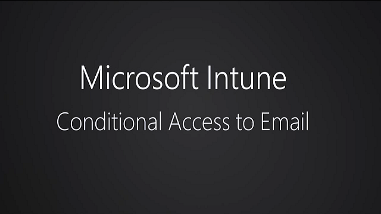

# Spr&#225;va př&#237;stupu k e-mail a SharePointu pomoc&#237; Microsoft Intune
Použití **podmíněného přístupu** v [!INCLUDE[wit_firstref](../Token/wit_firstref_md.md)] k zabezpečení e-mailu a dalších služeb v závislosti na zadaných podmínkách

Podívejte se na toto čtyřminutové video, které ukazuje, jak můžete tuto funkci používat ve vaší organizaci.

Typický tok podmíněného přístupu může vypadat takto:

Pro správu přístupu k **místnímu systému Microsoft Exchange**, **systému Exchange Online**, **systému Exchange Online Dedicated** a **SharePointu Online** použijte podmíněný přístup.

Přístup do Exchange Online a místnímu Exchange můžete řídit z následujících e-mailových aplikací:

-   Integrovaná aplikace pro Android 4.0 a novější, Samsung Knox 4.0 Standard a novější

-   Integrovaná aplikace pro iOS 7.1 a novější

-   Integrovaná aplikace pro Windows Phone 8.1 a novější

-   Aplikace Mail v systému Windows 8.1 a novějším

-   Aplikace Microsoft Outlook pro Android a iOS (týká se jenom Exchange Online)

Můžete řídit přístup k SharePointu Online z následujících aplikací v uvedených platformách:

-   Microsoft Office Mobile (Android)

-   Microsoft OneDrive (Android a iOS)

-   Microsoft Word (iOS)

-   Microsoft Excel (iOS)

-   Microsoft PowerPoint (iOS)

-   Microsoft OneNote (iOS)

Desktopové aplikace Office mají přístup k systému Exchange Online a SharePointu online v počítačích, ve kterých se spustí:

-   Desktopový systém Office 2013 a novější s povoleným [moderním ověřováním](https://blogs.office.com/2015/03/23/office-2013-modern-authentication-public-preview-announced/).

-   Windows 7.0 nebo novější

> [!NOTE]
> Počítače by měly být připojené k doméně nebo kompatibilní se zásadami nastavenými v [!INCLUDE[wit_nextref](../Token/wit_nextref_md.md)].

Pokud chcete implementovat podmíněný přístup, nakonfigurujte v [!INCLUDE[wit_nextref](../Token/wit_nextref_md.md)] dva typy zásad:

-   **Zásady dodržování předpisů** jsou nepovinné zásady, které můžete nasadit u uživatelů nebo na zařízeních a vyhodnocovat u nich třeba následující nastavení:

    -   Heslo

    -   Šifrování

    -   Jestli je zařízení s jailbreakem nebo rootem

    -   Jestli je e-mail na zařízení spravovaný zásadami služby [!INCLUDE[wit_nextref](../Token/wit_nextref_md.md)]

    Pokud na zařízení nejsou nasazené žádné zásady dodržování předpisů, pak všechny použitelné zásady podmíněného přístupu budou zařízení považovat za zařízení, které dodržuje předpisy.

-   **Zásady podmíněného přístupu** jsou nakonfigurované pro konkrétní službu a definují pravidla (třeba které skupiny uživatelů zabezpečení služby Azure Active Directory nebo skupiny uživatelů [!INCLUDE[wit_nextref](../Token/wit_nextref_md.md)] budou cílem nebo jak spravovat zařízení, která se nedají zapsat do služby [!INCLUDE[wit_nextref](../Token/wit_nextref_md.md)]).

    Na rozdíl od jiných zásad služby [!INCLUDE[wit_nextref](../Token/wit_nextref_md.md)] nenasazujete zásady podmíněného přístupu. Nakonfigurujete je jenom jednou a tím je nakonfigurujete pro všechny cílové uživatele.

Pokud zařízení nakonfigurované podmínky nesplňuje, může uživatel v průvodci procesem jeho zapsání opravit problém, který tomuto zařízení brání v dodržení předpisů.

## Začínáme s podmíněným přístupem
Abyste mohli začít používat podmíněný přístup, ujistěte se, že máte nastavené správné požadavky:

> [!IMPORTANT]
> Podmíněný přístup nefunguje pro zařízení zaregistrovaná pomocí [správce registrace zařízení](https://technet.microsoft.com/en-us/library/dn764961.aspx), protože nejsou propojená k uživateli v Azure Active Directory.

-   [Exchange Online (se sdíleným víceklientským prostředím)](#Exo)

-   [Exchange Online Dedicated](#ExoDedicated)

-   [Místní Exchange](#ExOnPrem)

-   [SharePoint Online](#Spo)

-   [Podmíněný přístup pro osobní počítače](#PC)

### Exchange Online (se sdíleným víceklientským prostředím)
Podmíněný přístup k Exchangi Online podporuje zařízení, na kterých běží:

-   Windows 8.1 nebo novější (při zapsání ve službě [!INCLUDE[wit_nextref](../Token/wit_nextref_md.md)])

-   Windows 7.0 nebo novější (při připojení k doméně)

-   Windows Phone 8.1 nebo novější

-   iOS 7.1 nebo novější

-   Android 4.0 nebo novější, Samsung Knox Standard 4.0 nebo novější

A dále:

-   Zařízení musí být zaregistrovaná ve službě Azure Active Directory Device Registration Service (AAD DRS).

    Počítače připojené k doméně se musí automaticky registrovat v Azure Active Directory pomocí zásad skupiny nebo MSI. Část [Podmíněný přístup pro osobní počítače](#PC) v tomto tématu popisuje všechny požadavky nutné k povolení podmíněného přístupu pro počítač.

    Pro zákazníky Intune a Office 365 je služba AAD DRS aktivovaná automaticky. Zákazníci, kteří už mají nasazenou službu AD FS Device Registration Service, registrovaná zařízení ve svojí místní službě Active Directory neuvidí.

-   Je potřeba použít předplatné Office 365, které zahrnuje Exchange Online (třeba E3), a uživatelé musí mít licenci Exchange Online.

-   Nepovinný **konektor Service to Service Connector Microsoft Intune** připojí [!INCLUDE[wit_nextref](../Token/wit_nextref_md.md)] k Microsoft Exchangi Online a prostřednictvím konzoly [!INCLUDE[wit_nextref](../Token/wit_nextref_md.md)] vám pomůže se správou informací o zařízení (viz [Správa mobilních zařízení pomocí protokolu Exchange ActiveSync a služby Microsoft Intune](../Topic/Mobile_device_management_with_Exchange_ActiveSync_and_Microsoft_Intune.md)). K používání zásad dodržování předpisů nebo zásad podmíněného přístupu tento konektor potřeba není, vyžaduje se ale ke spouštění sestav, které pomáhají hodnotit dopad podmíněného přístupu.

    Pokud nakonfigurujete tento konektor, můžou být v konzole Office viditelné některé zásady Exchange ActiveSync ze služby [!INCLUDE[wit_nextref](../Token/wit_nextref_md.md)], nebudou ale nastavené jako výchozí a zařízení neovlivní.

    > [!NOTE]
    > Pokud chcete používat podmíněný přístup pro Exchange Online i místní Exchange, pak konektor Service to Service Connector nekonfigurujte.

### Exchange Online Dedicated
Podmíněný přístup k Exchangi Online Dedicated podporuje zařízení, na kterých běží:

-   Windows 8 a novější (při zaregistrování ve službě [!INCLUDE[wit_nextref](../Token/wit_nextref_md.md)])

-   Windows 7.0 nebo novější (při připojení k doméně)

    Podmíněný přístup k počítačům připojeným k doméně mají jenom klienti v novém vyhrazeném prostředí Exchange Online.

-   Windows Phone 8 nebo novější

-   Jakékoli zařízení s iOS, které používá e-mailového klienta Exchange ActiveSync (EAS)

-   Android 4 nebo novější

-   Pro klienty ve starší verzi prostředí Exchange Online Dedicated:

    Musíte použít **konektor místního Exchange**, který připojí [!INCLUDE[wit_nextref](../Token/wit_nextref_md.md)] k místnímu Microsoft Exchangi. To vám umožní spravovat zařízení přes konzolu [!INCLUDE[wit_nextref](../Token/wit_nextref_md.md)] (viz [Správa mobilních zařízení pomocí protokolu Exchange ActiveSync a služby Microsoft Intune](../Topic/Mobile_device_management_with_Exchange_ActiveSync_and_Microsoft_Intune.md)).

-   Pro klienty v nové verzi prostředí Exchange Online Dedicated:

    Nepovinný **konektor Service to Service Connector Microsoft Intune** připojí [!INCLUDE[wit_nextref](../Token/wit_nextref_md.md)] k Microsoft Exchangi Online a prostřednictvím konzoly [!INCLUDE[wit_nextref](../Token/wit_nextref_md.md)] vám pomůže se správou informací o zařízení (viz [Správa mobilních zařízení pomocí protokolu Exchange ActiveSync a služby Microsoft Intune](../Topic/Mobile_device_management_with_Exchange_ActiveSync_and_Microsoft_Intune.md)). K používání zásad dodržování předpisů nebo zásad podmíněného přístupu tento konektor potřeba není, vyžaduje se ale ke spouštění sestav, které pomáhají hodnotit dopad podmíněného přístupu.

> [!IMPORTANT]
> Zkontrolujte si, že používáte nejnovější verzi **konektoru místního Exchange**.

### Místní Exchange
Podmíněný přístup k místnímu Exchangi podporuje:

-   Windows 8 a novější (při zaregistrování ve službě [!INCLUDE[wit_nextref](../Token/wit_nextref_md.md)])

-   Windows Phone 8 a novější

-   Jakékoli zařízení s iOS, které používá e-mailového klienta Exchange ActiveSync (EAS)

-   Android 4 nebo novější

A dále:

-   Musíte mít Exchange 2010 nebo novější. Podporuje se pole serveru pro klientský přístup (CAS) serveru Exchange.

    > [!TIP]
    > Pokud je prostředí serveru Exchange v konfiguraci serveru CAS, je nutné na některý ze serverů CAS nainstalovat místní konektor Exchange.

-   Exchange ActiveSync se dá nakonfigurovat s ověřováním na základě certifikátů nebo zadáváním přihlašovacích údajů uživateli.

-   Musíte použít **konektor místního Exchange**, který připojí [!INCLUDE[wit_nextref](../Token/wit_nextref_md.md)] k místnímu Microsoft Exchangi. To vám umožní spravovat zařízení přes konzolu [!INCLUDE[wit_nextref](../Token/wit_nextref_md.md)] (viz [Správa mobilních zařízení pomocí protokolu Exchange ActiveSync a služby Microsoft Intune](../Topic/Mobile_device_management_with_Exchange_ActiveSync_and_Microsoft_Intune.md)).

    > [!IMPORTANT]
    > Ujistěte se, že používáte nejnovější verzi **místního konektoru Exchange**. Místní konektor Exchange dostupný v konzole Intune je určený výhradně pro vašeho klienta Intune a nedá se použít s žádným jiným klientem. Také se ujistěte, že je konektor Exchange pro vašeho klienta nainstalovaný jenom v jednom počítači, ne ve více počítačích.

### SharePoint Online
Podmíněný přístup k SharePointu Online podporuje zařízení, na kterých běží:

-   Windows 8.1 nebo novější (při zapsání ve službě [!INCLUDE[wit_nextref](../Token/wit_nextref_md.md)])

-   Windows 7.0 nebo novější (při připojení k doméně)

-   Windows Phone 8.1 nebo novější

-   iOS 7.1 nebo novější

-   Android 4.0 nebo novější, Samsung Knox Standard 4.0 nebo novější

A dále:

-   Zařízení musí být zaregistrovaná ve službě Azure Active Directory Device Registration Service (AAD DRS).

    Pro zákazníky Intune a Office 365 je služba AAD DRS aktivovaná automaticky. Zákazníci, kteří už mají nasazenou službu AD FS Device Registration Service, registrovaná zařízení ve svojí místní službě Active Directory neuvidí.

    Počítače připojené k doméně se musí automaticky registrovat v Azure Active Directory pomocí zásad skupiny nebo MSI. Část [Podmíněný přístup pro osobní počítače](#PC) v tomto tématu popisuje všechny požadavky nutné k povolení podmíněného přístupu pro počítač.

-   Je potřeba předplatné SharePointu Online a uživatelé musí mít licenci SharePointu Online.

## Podmíněný přístup pro osobní počítače
Podmíněný přístup se dá nastavit pro počítače, které používají desktopové aplikace Office pro přístup k **Exchangi Online** a **SharePointu Online** a splňují následující požadavky:

-   V počítači je spuštěný systém Windows 7.0 nebo novější.

-   Počítač musí být buď připojený k doméně, nebo splňovat požadavky.

    Aby splňoval požadavky, že musí být zaregistrovaný v [!INCLUDE[wit_nextref](../Token/wit_nextref_md.md)] a vyhovovat zásadám.

    V případě počítačů připojených k doméně musíte zařízení nastavit tak, aby se [zařízení automaticky zaregistrovalo](https://azure.microsoft.com/en-us/documentation/articles/active-directory-conditional-access-automatic-device-registration-windows7/) do služby Azure Active Directory.

-   [Musí být povolené moderní ověřování Office 365 ](https://blogs.office.com/2015/03/23/office-2013-modern-authentication-public-preview-announced/) a musí být dostupné nejnovější aktualizace Office.

    Moderní ověřování poskytuje klientům Office 2013 Windows přihlašování založené na ADAL (Active Directory Authentication Library) a umožňuje lepší zabezpečení, jako je **vícefaktorové ověřování** a **ověřování prostřednictvím certifikátu**.

-   Instalační ADFS nastavuje pravidla pro blokování jiných než moderních ověřovacích protokolů. Podrobné pokyny jsou uvedené ve scénáři 3 – [blokování veškerého přístupu k O365 kromě aplikací využívajících prohlížeč](https://technet.microsoft.com/en-us/library/dn592182.aspx).

## Další kroky
Přečtěte si následující témata, ve kterých se dozvíte, jak nakonfigurovat zásady dodržování předpisů a zásady podmíněného přístupu v případě vámi požadovaného scénáře:

-   [Správa zásad dodržování předpisů zařízeními pro Microsoft Intune](../Topic/Manage_device_compliance_policies_for_Microsoft_Intune.md)

-   [Správa přístupu k e-mailu s Microsoft Intune](../Topic/Manage_email_access_with_Microsoft_Intune.md)

-   [Správa přístupu na SharePoint Online přes Microsoft Intune](../Topic/Manage_SharePoint_Online_access_with_Microsoft_Intune.md)

## Viz také
[Ochrana dat a zařízení v Microsoft Intune](../Topic/Protect_data_and_devices_with_Microsoft_Intune.md)

