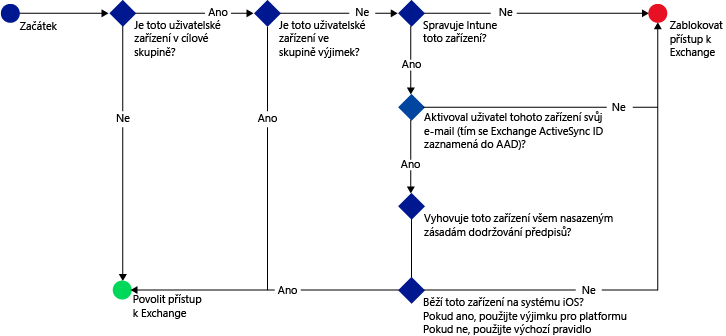

# Spr&#225;va př&#237;stupu k&#160;e-mailu s&#160;Microsoft Intune
Pomocí [!INCLUDE[wit_firstref](../Token/wit_firstref_md.md)] **zásad podmíněného přístupu** pro Exchange můžete spravovat přístup k e-mailu systému Exchange na základě vámi určených podmínek.

Můžete spravovat přístup k:

-   Místní Microsoft Exchange

-   Microsoft Exchange Online

-   Exchange Online Dedicated

Pokud nakonfigurujete podmíněný přístup, musí nejdřív zařízení uživatele, který se chce připojit k e-mailu, splňovat toto:

-   Musí být zaregistrované ve službě [!INCLUDE[wit_nextref](../Token/wit_nextref_md.md)] nebo v počítači připojeném k doméně.

-   Zaregistrujte zařízení do Azure Active Directory (k tomu automaticky dojde při registraci zařízení ve [!INCLUDE[wit_nextref](../Token/wit_nextref_md.md)]) (týká se jenom Exchange Online). Kromě toho musí být ID protokolu Exchange ActiveSync klienta zaregistrované v Azure Active Directory (nevztahuje se na zařízení Windows a Windows Phone připojující se k systému Exchange místně).

    Pro počítač připojený k doméně ho musíte nastavit na automatickou registraci v rámci Azure Active Directory.  V části **Podmíněný přístup pro počítače** v tématu [Správa přístupu k e-mail a SharePointu pomocí Microsoft Intune](../Topic/Manage_access_to_email_and_SharePoint_with_Microsoft_Intune.md) jsou uvedené kompletní požadavky na povolení podmíněného přístupu pro počítače.

-   Musí splňovat veškeré zásady dodržování předpisů [!INCLUDE[wit_nextref](../Token/wit_nextref_md.md)] nasazené na toto zařízení.

Pokud není podmínka podmíněného přístupu splněná, zobrazí se uživateli při přihlášení jedna z následujících zpráv.

**Pro mobilní zařízení:**

-   Pokud zařízení není zaregistrované ve [!INCLUDE[wit_nextref](../Token/wit_nextref_md.md)] nebo v Azure Active Directory, zobrazí se zpráva s pokyny pro instalaci aplikace portálu společnosti, zápis zařízení, aktivaci e-mailu, který přidruží k ID protokolu Exchange ActiveSync zařízení záznam zařízení v Azure Active Directory.

-   Pokud zařízení není kompatibilní, zobrazí se zpráva, která uživatele přesměruje na webový portál [!INCLUDE[wit_nextref](../Token/wit_nextref_md.md)], nebo na aplikaci Portál společnosti, kde může najít informace o problému a jeho řešení.

**Pro počítače:**

-   Pokud je požadavkem zásady podmíněného přístupu, aby byl počítač **připojený k doméně** nebo **splňoval konkrétní předpisy**, zobrazí se zpráva s pokyny k registraci zařízení. Pokud počítač některý z těchto požadavků nesplňuje, bude uživatel požádán o zápis zařízení v rámci [!INCLUDE[wit_nextref](../Token/wit_nextref_md.md)].

-   Pokud je požadavek zásady podmíněného přístupu nastavený tak, aby se povolovala jenom zařízení s Windows připojená k doméně, bude se zařízení blokovat a zobrazí se zpráva, aby uživatel kontaktoval správce IT.

Přístup k  e-mailu systému Exchange můžete blokovat z integrovaného e-mailového klienta Exchange ActiveSync zařízení na následujících platformách:

-   Android 4.0 nebo novější, Samsung Knox Standard 4.0 nebo novější

-   iOS 7.1 nebo novější

-   Windows Phone 8.1 nebo novější

-   Aplikace **Mail** v systému Windows 8.1 nebo novějším

-   Aplikace Outlook pro iOS a Android

-   Desktopová verze aplikace Outlook 2013

## Krok 1: Vyhodnocení účinku zásad podmíněného přístupu
Pokud jste nakonfigurovali připojení mezi [!INCLUDE[wit_nextref](../Token/wit_nextref_md.md)] a Exchangem pomocí **konektoru Microsoft Intune Service to Service Connector** nebo **místního konektoru Exchange**, můžete k identifikaci poštovních klientů EAS, kterým se bude po konfiguraci zásad podmíněného přístupu blokovat přístup k Exchangi, použít **Sestavy inventáře mobilních zařízení**.

V parametrech sestavy vyberte skupinu [!INCLUDE[wit_nextref](../Token/wit_nextref_md.md)], kterou chcete vyhodnotit, a v případě potřeby platformy zařízení, na které se zásady budou vztahovat.

Další informace o spouštění sestav naleznete v tématu [Pochopení operací Microsoft Intune pomocí sestav](../Topic/Understand_Microsoft_Intune_operations_by_using_reports.md).

Po spuštění sestavy zkontrolujte tyto čtyři sloupce, abyste zjistili, jestli bude uživatel blokovaný:

-   **Kanál pro správu** – Určuje, jestli se zařízení spravuje ve službě Intune, Exchange ActiveSync, nebo v obou.

-   **Zaregistrováno v AAD** – Určuje, jestli je zařízení zaregistrované v Azure Active Directory (označuje se jako připojení pracovního místa).

-   **Vyhovuje** – Určuje, jestli zařízení splňuje vámi nasazené zásady dodržování předpisů.

-   **ID protokolu Exchange ActiveSync** – U zařízení s iOS a Androidem se vyžaduje, aby měla ID protokolu Exchange ActiveSync přidružené záznamy registrace zařízení v Azure Active Directory. K tomuto dojde, když uživatel klikne na odkaz Aktivovat e-mail v e-mailu v karanténě.

    > [!NOTE]
    > Zařízení Windows Phone v tomto sloupci vždycky zobrazí hodnotu.

Zařízením, která jsou součástí cílové skupiny, se bude blokovat přístup k Exchangi, pokud se hodnoty ve sloupcích nebudou shodovat s hodnotami uvedenými v této tabulce:

|Kanál pro správu|Zaregistrováno v AAD|Vyhovuje|ID protokolu Exchange ActiveSync|Výsledná akce|
|--------------------|------------------------|------------|------------------------------------|-----------------|
|**Spravuje se v Microsoft Intune a Exchange ActiveSync**|Ano|Ano|Je zobrazená hodnota|Přístup k e-mailu je povolený|
|Jakákoli jiná hodnota|Ne|Ne|Není zobrazená žádná hodnota|Přístup k e-mailu je blokovaný|
Obsah sestavy můžete vyexportovat a použít sloupec **E-mailová adresa** k informování uživatelů, že budou blokovaní.

## Krok 2: Konfigurace skupin uživatelů pro zásady podmíněného přístupu
Zásady podmíněného přístupu můžete zacílit na různé skupiny uživatelů v závislosti na typech zásad. Tyto skupiny obsahují uživatele, na které budou zásady cílit, nebo kteří budou z těchto zásad vyjmutí. Pokud je uživatel cílem zásady, musí každé jím používané zařízení splňovat zásady, aby měl přístup k e-mailu.

-   **Pro zásady Exchange Online** – na skupiny uživatelů zabezpečení služby Azure Active Directory. Tyto skupiny můžete nakonfigurovat v **Centru pro správu Office 365** nebo na **Portálu účtů Intune**.

-   **Pro zásady místního systému Exchange** – na skupiny uživatelů [!INCLUDE[wit_nextref](../Token/wit_nextref_md.md)]. Toto můžete nakonfigurovat v pracovním prostoru **Skupiny** konzoly [!INCLUDE[wit_nextref](../Token/wit_nextref_md.md)].

V každé zásadě můžete určit dva typy skupin:

-   **Cílové skupiny** – skupiny uživatelů, pro které zásady platí

-   **Vyloučené skupiny** – skupiny uživatelů, kteří jsou ze zásad vyloučení (volitelné)

Pokud je uživatel v obou skupinách, bude ze zásad vyloučený.

Pro přístup k Exchangi se vyhodnocují jenom skupiny, které jsou cílem zásad podmíněného přístupu.

## Krok 3: Konfigurace a nasazení zásad dodržování předpisů
Ujistěte se, že jste vytvořili a nasadily zásady dodržování předpisů na všechna zařízení, která budou cílem zásad podmíněného přístupu Exchange.

Podrobnosti o tom, jak nakonfigurovat zásady dodržování předpisů najdete v článku [Správa zásad dodržování předpisů zařízeními pro Microsoft Intune](../Topic/Manage_device_compliance_policies_for_Microsoft_Intune.md).

> [!IMPORTANT]
> Pokud jste zásady dodržování předpisů nenasadili a povolíte zásady podmíněného přístupu Exchange, budou mít všechna cílová zařízení přístup povolený.

Až budete připravení, pokračujte **Krokem 4**.

## Krok 4: Konfigurace zásad podmíněného přístupu

### Pro Exchange Online (a klienty v nové verzi prostředí Exchange Online Dedicated)
Následující postup se používá v rámci zásad podmíněného přístupu pro Exchange Online k vyhodnocení toho, jestli se mají zařízení povolit nebo blokovat.

Pro přístup k e-mailu musí zařízení splňovat toto:

-   Musí být zaregistrované ve službě [!INCLUDE[wit_nextref](../Token/wit_nextref_md.md)]

-   Počítače musí být buď připojené k doméně, nebo musí být zaregistrované a musí splňovat zásady nastavené v rámci [!INCLUDE[wit_nextref](../Token/wit_nextref_md.md)].

-   Zaregistrujte zařízení do Azure Active Directory (k tomu automaticky dojde při registraci zařízení ve [!INCLUDE[wit_nextref](../Token/wit_nextref_md.md)]).

    V případě počítačů připojených k doméně musíte zařízení nastavit tak, aby se [zařízení automaticky zaregistrovalo](https://msdn.microsoft.com/en-us/library/azure/dn935033.aspx) v rámci Azure Active Directory.

-   Musí mít aktivovaný e-mail, kterým se k ID protokolu Exchange ActiveSync zařízení přidružuje záznam zařízení v Azure Active Directory (týká se jenom zařízení s iOS a Androidem).

-   Musí splňovat veškeré nasazené zásady dodržování předpisů [!INCLUDE[wit_nextref](../Token/wit_nextref_md.md)].

Stav zařízení je uložený ve službě Azure Active Directory, která uděluje nebo blokuje přístup k e-mailu na základě vyhodnocených podmínek.

Pokud není podmínka splněná, zobrazí se uživateli při přihlašování jedna z následujících zpráv:

-   Pokud není zařízení zapsané (zaregistrované) v Azure Active Directory, zobrazí se zpráva s pokyny pro instalaci aplikace portálu společnosti a registraci.

-   Pokud zařízení není kompatibilní, zobrazí se zpráva, která uživatele přesměruje na webový portál [!INCLUDE[wit_nextref](../Token/wit_nextref_md.md)], kde může najít informace o problému a jeho řešení.

-   Počítač:

    -   Pokud je zásada nastavená tak, aby vyžadovala připojení k doméně, a počítač k doméně připojený není, zobrazí se zpráva, aby uživatel kontaktoval správce IT.

    -   Pokud je zásada nastavená tak, aby vyžadovala připojení k doméně nebo splňování předpisů, a počítač ani jednu z těchto požadavků nesplňuje, zobrazí se zpráva s pokyny, jak nainstalovat aplikaci Portál společnosti a provést registraci.

Zpráva se zobrazí na zařízení pro uživatele Exchange Online a klienty v novém prostředí Exchange Online Dedicated a doručí se do složky doručená pošta e-mailové schránky uživatelů pro místní Exchange a zařízení se starší verzí Exchange Online Dedicated.

> [!NOTE]
> Pravidla podmíněného přístupu [!INCLUDE[wit_nextref](../Token/wit_nextref_md.md)] přepíší, povolí, blokují a umístí do karantény pravidla definovaná v konzole pro správu Exchange Online.

#### Povolení zásad Exchange Online

1.  V [konzole pro správu Microsoft Intune](https://manage.microsoft.com) klikněte na **Zásady** &gt; **Podmíněný přístup** &gt; **Zásady pro Exchange Online**.

2.  Na stránce **Zásady Exchange Online** vyberte možnost **Zapnout zásady podmíněného přístupu pro Exchange Online**. Pokud zaškrtněte toto políčko, musí být zařízení v souladu s předpisy. Pokud toto políčko zaškrtnuté není, nepoužije se podmíněný přístup.

    > [!NOTE]
    > Pokud jste zásady dodržování předpisů nenasadili a pak povolíte zásady pro Exchange Online, budou se všechna cílová zařízení hlásit jako dodržující předpisy.
    > 
    > Bez ohledu na stav dodržování předpisů se u všech uživatelů, na které jsou zásady zacílené, bude vyžadovat, aby svá zařízení zaregistrovali ve službě [!INCLUDE[wit_nextref](../Token/wit_nextref_md.md)].

3.  V části **Aplikace používající moderní ověřování** se můžete rozhodnout omezit přístup také jenom na zařízení, která pro každou platformu splňují předpisy.

    > [!TIP]
    > **Moderní ověřování** integruje do klientů Office přihlašování založené na knihovně ADAL (Active Directory Authentication Library).
    > 
    > -   Ověřování na základě knihovny ADAL umožňuje pro klienty Office používat ověřování založené na prohlížeči (označuje se také jako pasivní ověřování).  Aby bylo možné uživatele ověřit, uživatel se přesměruje na přihlašovací webovou stránku.
    > -   Tato nová metoda přihlašování umožňuje nové scénáře, jako je například podmíněný přístup, na základě **souladu zařízení s předpisy** a na základě toho, jestli bylo provedeno **vícefaktorové ověření**.
    > 
    > Tento [článek](https://blogs.office.com/2014/11/12/office-2013-updated-authentication-enabling-multi-factor-authentication-saml-identity-providers/) obsahuje podrobnější informace o tom, jak moderní ověřování funguje.

    Počítače musí být připojené k doméně nebo zaregistrované v Intune a splňovat předpisy. Můžete nastavit následující požadavky:

    -   **Zařízení musí být připojené k doméně nebo splňovat předpisy.** To znamená, že počítače musí být buď připojené k doméně, nebo musí splňovat zásady nastavené v rámci [!INCLUDE[wit_nextref](../Token/wit_nextref_md.md)]. Pokud počítač některý z těchto požadavků nesplňuje, bude uživatel vyzván k zápisu zařízení v rámci [!INCLUDE[wit_nextref](../Token/wit_nextref_md.md)].

    -   **Zařízení musí být připojené k doméně.** To znamená, že počítače musí být připojené k doméně, aby měly přístup k Exchangi Online. Pokud počítač není připojený k doméně, je přístup k e-mailu blokovaný a uživatel je vyzván, aby se obrátil na správce IT.

    -   **Zařízení musí splňovat předpisy.** To znamená, že počítače musí být zaregistrované v [!INCLUDE[wit_nextref](../Token/wit_nextref_md.md)] a musí splňovat předpisy. Pokud počítač není zaregistrovaný, zobrazí se zpráva s pokyny, jak registraci provést.

4.  V části **E-mailové aplikace s protokolem Exchange ActiveSync** se můžete rozhodnout blokovat e-mailům přístup k Exchangi Online, pokud zařízení nesplňuje předpisy, a můžete tam také vybrat, jestli se má povolit nebo blokovat přístup k e-mailu, když Microsoft Intune nemůže zařízení spravovat.

5.  V části **Cílové skupiny** vyberte skupiny zabezpečení Active Directory uživatelů, na které se zásady vztahují.

    > [!NOTE]
    > Pro uživatele, kteří jsou v cílových skupinách, nahradí zásady Intune pravidla a zásady Exchange.
    > 
    > Exchange bude vynucovat pravidla Exchange pro povolování, blokování a karanténu a zásady Exchange jenom v těchto případech:
    > 
    > -   Uživatel nemá licenci na službu Intune.
    > -   Uživatel má licenci na službu Intune, ale nepatří do žádné skupiny zabezpečení, na kterou cílí zásady podmíněného přístupu.

6.  V části **Vyloučené skupiny** vyberte skupiny zabezpečení Active Directory uživatelů, kteří jsou z těchto zásad vyloučení. Pokud je uživatel v cílových skupinách i ve vyloučených skupinách, bude ze zásady vyloučený.

7.  V části **Nepodporované platformy** vyberte, jestli chcete povolit nebo blokovat přístup k e-mailu, když [!INCLUDE[wit_firstref](../Token/wit_firstref_md.md)] zařízení nemůže spravovat a spravuje ho Exchange ActiveSync.

8.  Po dokončení klikněte na **Uložit**.

-   Zásady podmíněného přístupu není potřeba nasazovat, projeví se okamžitě.

-   Jakmile uživatel vytvoří e-mailový účet, zařízení se okamžitě zablokuje.

-   Pokud blokovaný uživatel zařízení zapíše ve [!INCLUDE[wit_nextref](../Token/wit_nextref_md.md)] (nebo opraví nedodržování předpisů), odblokuje se přístup k e-mailu během 2 minut.

-   Pokud uživatel zruší registraci svého zařízení, e-mail se zablokuje zhruba po 24 hodinách.

### Pro místní Exchange (a klienty ve starší verzi prostředí Exchange Online Dedicated)
Následující postup se používá v rámci zásad podmíněného přístupu pro místní Exchange Online a klienty ve starší verzi prostředí Exchange Online Dedicated k vyhodnocení toho, jestli se mají zařízení povolit nebo blokovat.

##### Povolení zásad pro místní Exchange

1.  V [konzole pro správu Microsoft Intune](https://manage.microsoft.com) klikněte na **Zásady** &gt; **Podmíněný přístup** &gt; **Zásady pro místní Exchange**.

2.  Nakonfigurujte zásady pomocí vámi požadovaných nastavení:

    |Nastavení|Další informace|
    |-------------|-------------------|
    |**Blokovat e-mailovým aplikacím přístup k místnímu systému Exchange, pokud zařízení není kompatibilní nebo není zaregistrované v Microsoft Intune**|Když vyberete tuto možnost, zařízení, která se nespravují ve [!INCLUDE[wit_nextref](../Token/wit_nextref_md.md)] nebo nesplňují zásady dodržování předpisů na ně nasazené, mají blokovaný přístup ke službám Exchange, pokud ovšem nejsou definovaná jako vyloučená.|
    |**Přepsat výchozí pravidlo – vždy povolit zaregistrovaným zařízením splňujícím předpisy přístup k Exchangi**|Pokud zaškrtnete tuto možnost, zařízení zaregistrovaná v Intune a splňující předpisy budou moct získat přístup k Exchangi.  Toto pravidlo přepíše **Výchozí pravidlo**. To znamená, že i když nastavíte **Výchozí pravidlo** na umístění do karantény nebo blokování přístupu, zaregistrovaná zařízení splňující předpisy budou mít pořád povolený přístup k Exchangi.|
    |**Cílové skupiny**|Vyberte skupiny uživatelů [!INCLUDE[wit_nextref](../Token/wit_nextref_md.md)], kteří musí zaregistrovat svá zařízení ve službě [!INCLUDE[wit_nextref](../Token/wit_nextref_md.md)] předtím, než získají přístup k Exchangi.|
    |**Vyloučené skupiny**|Vyberte skupiny uživatelů [!INCLUDE[wit_nextref](../Token/wit_nextref_md.md)], které jsou ze zásad podmíněného přístupu vyloučené.  Nastavení v tomto seznamu přepíšou nastavení v seznamu **Cílové skupiny**.|
    |**Výjimky platformy**|Klikněte na **Přidat pravidlo** a nakonfigurujte pravidlo, které bude definovat úrovně přístupu pro zadané řady a modely mobilních zařízení.  Vzhledem k tomu, že tato zařízení můžou být jakéhokoli typu, můžete taky nakonfigurovat typy zařízení, které [!INCLUDE[wit_nextref](../Token/wit_nextref_md.md)] nepodporuje.|
    |**Výchozí pravidlo**|U zařízení, pro které neplatí žádné z ostatních pravidel, můžete zvolit, aby mělo přístup k Exchangi, můžete ho blokovat nebo umístit do karantény.  Pokud nastavíte pravidlo, kterým povolíte přístup pro zaregistrovaná zařízení splňující předpisy, automaticky se udělí přístup k e-mailům pro zařízení se systémy iOS, Windows a řešením Samsung Knox. Koncový uživatel získá přístup k e-mailům a nemusí kvůli tomu provádět žádné kroky.  U zařízení se systémem Android nezaložených na řešení Knox dostanou koncoví uživatelé e-mail s informací o karanténě, který bude obsahovat návod k ověření registrace a dodržování předpisů. K e-mailům získají přístup až po tomto ověření.  Pokud nastavíte pravidlo na blokování přístupu nebo umístění do karantény, všechna zařízení budou mít zablokovaný přístup k Exchangi bez ohledu na to, jestli jsou už zaregistrovaná ve službě Intune. Pokud nechcete, aby toto pravidlo platilo pro zaregistrovaná zařízení splňující předpisy, zaškrtněte možnost **Přepsat výchozí pravidlo**. **Tip:** Pokud chcete před udělením přístupu k e-mailům nejdřív zablokovat všechna zařízení, může být užitečné zaškrtnout možnosti Blokovat přístup nebo Umístit do karantény. Výchozí pravidlo se použije pro všechny typy zařízení. To znamená, že se použije i pro typy zařízení, které jste nakonfigurovali jako výjimky platformy a které [!INCLUDE[wit_nextref](../Token/wit_nextref_md.md)] nepodporuje.|
    |**Oznámení uživatele**|Kromě e-mailu s oznámením odeslaného z Exchange odešle Intune e-mail, který můžete konfigurovat a který obsahuje postup odblokování zařízení.  Výchozí zprávu můžete upravit a k naformátování vzhledu textu můžete použít značky HTML. **Note:** Vzhledem k tomu, že se e-mail s oznámením Intune obsahující pokyny k nápravě doručuje do poštovní schránky Exchange uživatele, může uživatel v případě, že se jeho zařízení před obdržením této e-mailové zprávy zablokuje, použít pro přístup k Exchangi a zobrazení zprávy odblokované zařízení nebo jinou metodu.To platí hlavně v případě, že je **Výchozí pravidlo** nastavené na blokování nebo umístění do karantény.  V takovém případě bude muset koncový uživatel přejít na web App Store, stáhnout aplikaci Portál společnosti Microsoft a zaregistrovat své zařízení. To se vztahuje na zařízení se systémy iOS, Windows a řešením Samsung Knox.  U zařízení Android nezaložených na řešení Knox bude muset správce IT odeslat e-mail o karanténě na alternativní e-mailový účet, který pak bude muset koncový uživatel zkopírovat do svého zablokovaného zařízení, aby se mohl dokončit proces registrace a dodržování předpisů.|
    > [!NOTE]
    > Aby systém Exchange mohl e-mail s oznámením odeslat, musíte nakonfigurovat účet, který se pro odeslání e-mailu s oznámením použije.
    > 
    > Podrobnosti najdete v tématu [Konfigurace konektoru Microsoft Intune On-premises Connector pro místní nebo hostovaný Exchange](../Topic/Mobile_device_management_with_Exchange_ActiveSync_and_Microsoft_Intune.md#bkmk_EX_OP).

3.  Po dokončení klikněte na **Uložit**.

-   Zásady podmíněného přístupu není potřeba nasazovat, projeví se okamžitě.

-   Jakmile uživatel nastaví profil Exchange ActiveSync, může trvat 1 až 3 hodiny, než se zařízení zablokuje (pokud ho nespravuje [!INCLUDE[wit_nextref](../Token/wit_nextref_md.md)]).

-   Pokud pak blokovaný uživatel zařízení zapíše ve [!INCLUDE[wit_nextref](../Token/wit_nextref_md.md)] (nebo opraví nedodržování předpisů), odblokuje se přístup k e-mailu během 2 minut.

-   Pokud uživatel zruší zápis ve [!INCLUDE[wit_nextref](../Token/wit_nextref_md.md)], může trvat 1 až 3 hodiny, než se zařízení zablokuje.

## Krok 5: Sledování dodržování předpisů a zásad podmíněného přístupu

#### Zobrazení zařízení, která jsou blokovaná systémem Exchange

1.  Na řídicím panelu [!INCLUDE[wit_nextref](../Token/wit_nextref_md.md)] klikněte na dlaždici **Zařízení blokovaná systémem Exchange** a zobrazte počet blokovaných zařízení a odkazy na další informace.

## Příklady scénářů

### Veškerá zařízení s iOS, která přistupují k místnímu systému Exchange, musí spravovat Intune
V tomto příkladu používá organizace jenom zařízení s iOS a vyžaduje, aby všechna tato zařízení spravovala služba [!INCLUDE[wit_nextref](../Token/wit_nextref_md.md)] předtím, než získají přístup k systému Exchange.

K tomu je potřeba nakonfigurovat v zásadách podmíněného přístupu tyto položky:

-   Vyberte možnost **Zapnout zásady podmíněného přístupu pro Exchange Online**.

-   U aplikací využívajících moderní ověřování vyberte platformu **iOS**.

-   U aplikací Exchange ActiveSync vyberte možnost **Vyžaduje mobilní zařízení, aby vyhovoval předpisům** a blokujte přístup k e-mailu na zařízeních, která [!INCLUDE[wit_nextref](../Token/wit_nextref_md.md)] nepodporuje.

-   Výjimka platformy umožňující zařízením s iOS přistupovat k systému Exchange.

-   Výchozí pravidlo, které určuje, že pokud se na zařízení nevztahují ostatní pravidla, mělo by se zablokovat.

Následující postup se používá k určení zařízení, která můžou k systému Exchange přistupovat:

### Žádná zařízení s Androidem nemůžou přistupovat k místnímu systému Exchange. Veškerá ostatní zařízení přistupující k Exchangi musí spravovat Intune
Organizace v tomto příkladu nechce povolit přístup k Exchangi pro zařízení s Androidem. Všechna ostatní podporovaná zařízení můžou k Exchangi přistupovat, pokud je spravuje [!INCLUDE[wit_nextref](../Token/wit_nextref_md.md)].

K tomu je potřeba nakonfigurovat v zásadách podmíněného přístupu tyto položky:

-   Vyberte možnost **Zapnout zásady podmíněného přístupu pro Exchange Online**.

-   Výjimka platformy blokující přístup k Exchangi pro zařízení s Androidem.

-   Výchozí pravidlo, které určuje, že pokud se na zařízení nevztahují ostatní pravidla, mělo by se povolit.

Následující postup se používá k určení zařízení, která můžou k systému Exchange přistupovat:

### Blokujte přístup k Exchangi Online pro uživatele zařízení, která nedodržují předpisy, pomocí konkrétní skupiny zabezpečení Active Directory. Vyloučená zařízení v jiné skupině zabezpečení
V tomto scénáři je potřeba blokovat přístup k Exchangi Online pro všechny uživatele ve skupině zabezpečení Active Directory **Účetní oddělení**, pokud jejich zařízení nedodržují předpisy v nasazených zásadách dodržování předpisů. Dál je potřeba vyloučit ze zásad všechny uživatele ve skupině zabezpečení Active Directory **Finanční oddělení**, i když jsou i ve skupině zabezpečení **Účetní oddělení**. Pokud je v této skupině uživatel se zařízením, které [!INCLUDE[wit_nextref](../Token/wit_nextref_md.md)] nepodporuje, musí se mu na tomto zařízení zablokovat přístup k Exchangi Online.

K tomu je potřeba nakonfigurovat v zásadách podmíněného přístupu tyto položky:

-   Vyberte možnost **Zapnout zásady podmíněného přístupu pro Exchange Online**.

-   V části **Cílové skupiny** vyberte **Účetní oddělení**.

-   V části **Vyloučené skupiny** vyberte **Finanční oddělení**.

-   V části **E-mailové aplikace s protokolem Exchange ActiveSync** vyberte možnost **Vyžaduje mobilní zařízení, aby vyhovoval předpisům**.

Následující postup se používá k určení zařízení, která můžou k systému Exchange přistupovat:

## Viz také
[Správa přístupu k e-mail a SharePointu pomocí Microsoft Intune](../Topic/Manage_access_to_email_and_SharePoint_with_Microsoft_Intune.md)

