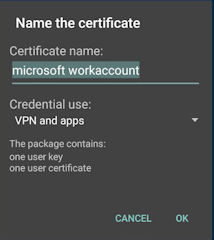
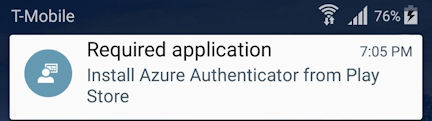

# Nasazen&#237; aplikace Microsoft Azure Authenticator
Microsoft Azure Authenticator je součástí sady aplikací Microsoft Enterprise Mobility Suite (EMS). Pomocí této aplikace můžete uživatelům a jejich zařízením umožnit bezpečně se připojovat ke službám společnosti Microsoft, např. Office 365. Tuto aplikaci vyžadují funkce řízení přístupu, ochrany dat a souladu s předpisy služby Microsoft Intune.

Zjednodušuje také uživatelům registraci, a to díky tomu, že pro aplikace na vašich zařízeních nabízí jednotné přihlašování a vícefaktorové ověřování (prostřednictvím služby Multi-Factor Authentication).

Nejvhodnější je nasadit tuto aplikaci při registraci zařízení v rámci služby Intune. Od září začne hybridní řešení služby Intune a nástroje Configuration Manager automaticky nasazovat aplikaci Azure Authenticator pro zařízení s Androidem z Google Play jako požadovanou instalaci.

[Kliknutím sem](https://msdn.microsoft.com/en-us/library/azure/dn858223.aspx) můžete o aplikaci Azure Authenticator získat další informace.

## Proč služba Intune tuto aplikaci nasazuje?
Do konce roku společnost Microsoft vydá aktualizaci aplikace Portál společnosti služby Microsoft Intune ke zjednodušení registrace, což zahrnuje také zrušení výzev pro pracovní účet společnosti Microsoft a název certifikátu, které se musí zadávat při registraci v rámci služby Intune na zařízeních s Androidem.

Při aktualizaci aplikace Portál společnosti dojde na zařízeních s Androidem bez nainstalované aplikace Azure Authenticator k tomuto:

-   Přijdou o jednotné přihlašování pro službu Intune.

-   Přijdou o jednotné přihlašování pro aplikace Office.

-   Umístí se do karantény, pokud je povolený podmíněný přístup.

### Doporučení pro správce IT
Abyste se těmto problémům vyhnuli, měli byste před aktualizací aplikace Portál společnosti nasadit na zařízení s Androidem aplikaci Azure Authenticator jako požadovanou instalaci. To můžete provést dvěma způsoby:

-   Řekněte koncovým uživatelům, aby si nainstalovali aplikaci Microsoft Azure Authenticator z [Google Play](https://play.google.com/store/apps/details?id=com.azure.authenticator).

-   Ručně nasaďte aplikaci Azure Authenticator z Google Play jako požadovanou instalace pro všechny uživatele.

Další možností je říct koncovým uživatelům, aby podle pokynů v oznámení o požadované aplikaci po vydání zářijových aktualizací Microsoft Intune a Microsoft System Center Configuration Managera nainstalovali aplikaci Azure Authenticator z Google Play.

Přestože doporučujeme, aby tato funkce zůstala povolená, můžete v případě, že vaše organizace funkce jednotného přihlašování ani podmíněného přístupu nepoužívá, zakázat automatické nasazení aplikace Azure Authenticator z konzoly služby Intune, a to takto:

**Intune:** Přejděte v konzole služby Intune do uzlu **Správa mobilních zařízení** &gt; **Android**.

**Hybridní prostředí Configuration Managera:** Přejděte na stránku **vlastností předplatných služby Microsoft Intune** v konzole Configuration Managera.

## Postup pro případ, že jsou vaši uživatelé umístěni do karantény
Pokud si uživatelé se zařízeními s Androidem, na které jsou cíleny zásady podmíněného přístupu, aplikaci Azure Authenticator nenainstalují, budou po aktualizaci aplikace Portál společnosti na zařízeních umístěni do karantény a nebudou mít povoleno stahovat e-maily z Exchange.

Aby se uživateli přístup obnovil, musí kliknout na odkaz v e-mailu s oznámením o karanténě (aby tak získal přístup k aplikaci Portál společnosti) a pak musí podle pokynů dokončit aktualizaci a aktivaci registrace.

## Viz také
[Dokumentace pro Microsoft Intune](../Topic/Documentation_for_Microsoft_Intune.md)

