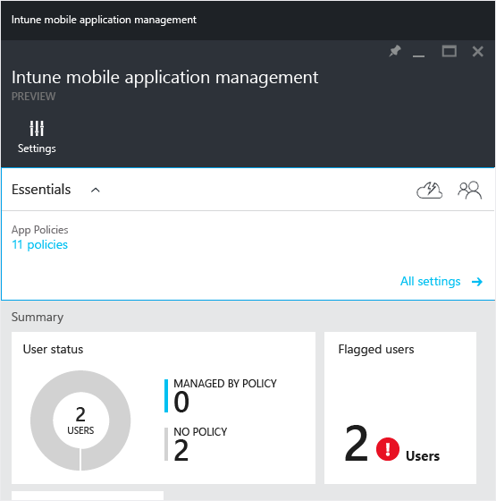

# Monitorov&#225;n&#237; z&#225;sad spr&#225;vy mobiln&#237;ch aplikac&#237; s Microsoft Intune
Informace v tomto tématu vám pomohou monitorovat zásady správy mobilních aplikací na portálu Azure Preview.

### Monitorování dodržování zásad správy mobilních aplikací
Dlaždice **Stav uživatele** v okně **Správa mobilních aplikací Intune**  zobrazuje stav dodržování zásad aplikací, jak je popsané dál:

-   **Uživatelé** – Celkový počet uživatelů ve vaší společnost, kteří na zařízení používají  pracovní aplikace.

-   **ZÁSADA** – Počet uživatelů, kteří použili aspoň jednu aplikaci přidruženou k zásadám.

-   **BEZ ZÁSAD** – Počet uživatelů používajících pracovní aplikace, kteří nejsou chránění zásadami správy mobilních aplikací.

    Dlaždice **Označení uživatelé** nabízí souhrnné informace o počtu uživatelů, kteří mají problémy. Aktuálně jsou označení jenom uživatelé se zařízením s jailbreakem.

    

-   Dlaždice **Žádosti o vymazání** zobrazuje souhrnnou sestavu stavu vámi provedených žádostí o vymazání. Kliknutím na tuto dlaždici otevřete nové okno s podrobnějšími informacemi. Podrobný popis informací o žádostech o vymazání zobrazených v tomto okně najdete v tématu [Vymazání data spravovaných aplikací společnosti s Microsoft Intune](../Topic/Wipe_managed_company_app_data_with_Microsoft_Intune.md).

    

## Viz také
[Vytvoření a nasazení zásad správy mobilních aplikací pomocí Microsoft Intune](../Topic/Create_and_deploy_mobile_app_management_policies_with_Microsoft_Intune.md)
[Nakonfigurujte zásady ochrany před únikem informací pomocí Microsoft Intune.](../Topic/Configure_data_loss_prevention_app_policies_with_Microsoft_Intune.md)

