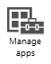

# Ochrana dat a zař&#237;zen&#237; v Microsoft Intune

Po zřízení a nakonfigurování zařízení bude potřeba zajistit, aby byla tato zařízení *chráněná před únikem informací* a dalšími hrozbami. Tady uvádíme běžné uživatelské scénáře, které mohou představovat nebezpečí pro vaši síť a data, a informace o tom, jak se proti tomuto nebezpečí chránit.

## Ochrana dat v e-mailech a na SharePointu
E-maily jsou tím prvním, co si zaměstnanci chtějí do svých zařízení stáhnout.  Vzhledem k tomu, že e-maily často obsahují důležitá data společnosti, bude nutné zajistit, aby bylo zařízení zabezpečené. Pokud například zařízení není zabezpečené heslem a dojde k jeho odcizení, bude moci zloděj na zařízení číst všechny firemní e-maily.

[Správa přístupu k e-mailu a ochrana podnikových dat v SharePointu Online ](https://technet.microsoft.com/library/dn818907.aspx) pomocí možností služby Intune nastavovat zásady přístupu, jako je vyžadování *hesla* nebo *šifrování dat*.   Můžete také odepřít přístup v případě, že má zařízení *jailbreak nebo root*.

Microsoft nabízí komplexní řešení pro ochranu dat a správu identit, mobilních zařízení a aplikací – Enterprise Mobility Suite (EMS). EMS zajišťuje vrstvený model zabezpečení, který umožňuje vašemu oddělení IT spravovat přístup k e-mailům, datům a firemním aplikacím z takřka všech zařízení. Téma [Doporučení ohledně architektury pro ochranu firemních e-mailů a dokumentů](../Topic/Architecture_guidance_for_protecting_company_email_and_documents.md) se věnuje celkovému řešení a podrobně popisuje možnosti [!INCLUDE[wit_nextref](../Token/wit_nextref_md.md)]. Téma [Informace o nasazení řešení pro ochranu firemního e-mailu a dokumentů](../Topic/Learn_how_to_deploy_a_solution_for_protecting_company_email_and_documents.md) obsahuje podrobné pokyny k nasazení řešení.

## Další úroveň ochrany pomocí služby Multi-Factor Authentication
[Multi-Factor Authentication (MFA)](https://technet.microsoft.com/library/dn889751.aspx) představuje bezpečnější způsob ověřování uživatelů zařízení s Windows a zařízení Windows Phone v síti.  Pokud se používá tato služba, uživatelé musí potvrdit svou identitu ještě i jinak než jen pomocí svého uživatelského jména a hesla – prostřednictvím telefonního hovoru nebo SMS zprávy.

## Viz také
[Dokumentace pro Microsoft Intune](../Topic/Documentation_for_Microsoft_Intune.md)

