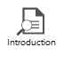
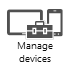
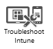

# Vyřazen&#237; dat a zař&#237;zen&#237; ze spr&#225;vy službou Microsoft Intune

V určitém okamžiku dojde k tomu, že zaměstnanec buď přestane ve společnosti pracovat, nebo přestane používat aktuální zařízení. V takovém případě musíte být schopní zajistit, aby ani zaměstnanec, ani nikdo jiný, nemohl pomocí jeho zařízení získat přístup k prostředkům společnosti. Můžete taky chtít zajistit, aby se ze zařízení odebraly všechny informace společnosti.

## Ochrana dat společnosti na ztracených nebo odcizených zařízeních
Když zaměstnanec mobilní zařízení ztratí nebo pokud mu bude odcizeno, je nejdůležitější zajistit, aby na daném zařízení nebylo možné číst žádné informace společnosti. Také je potřeba zajistit, aby zařízení nebylo možné používat pro přihlášení k prostředkům společnosti. Máte několik možností:

-   Je možné [selektivně vymazat aplikace a data společnosti](https://technet.microsoft.com/library/jj676679.aspx) ze zařízení. Tento způsob by se měl upřednostňovat u zaměstnanců, kteří mají v Intune zaregistrované své vlastní zařízení, protože vymazání dat se v tomto případě nedotkne osobních údajů uložených na zařízení. Selektivní vymazání také odebere zařízení z Intune, což znamená, že už zařízení nebude mít přihlašovací údaje nezbytné pro přihlášení k prostředkům společnosti, například na Microsoft SharePoint, k e-mailu nebo k Office 365.

-   Můžete taky provést úplné vymazání, kterým [ zařízení obnovíte do továrního nastavení](https://technet.microsoft.com/library/jj676679.aspx). Tím zajistíte, že žádná data, osobní ani podniková, nepadnou do nesprávných rukou, a je to upřednostňovaný způsob pro zařízení vlastněná společností. Zároveň se tím zařízení odebere ze služby Intune.

**Obnovení hesel v případě, že se uživatelé nemůžou přihlásit k zařízení**
Vzhledem k tomu, že prvním krokem při ochraně firemních dat na mobilních zařízeních je vyžadování hesla pro použití zařízení, někdy je nutné [resetovat heslo](https://technet.microsoft.com/library/jj676679.aspx#BKMK_passcode) nebo s tím zaměstnanci pomoct odebráním hesla nebo nastavením dočasného hesla vzdáleně.

**Vyřazení zámku aktivace na zařízeních iOS**
Pokud jsou společností vlastněná zařízení se systémem iOS chráněná zámkem aktivace a dojde k jejich ztrátě nebo odcizení, zámek aktivace může zabránit zneužití zařízení a dat nesprávnými osobami. Pokud ale zařízení získáte zpět nebo zaměstnanec zařízení vrátí, ale zapomene zámek aktivace vypnout, je nutné zařízení odemknout. Pokud nemáte Apple ID a heslo uživatele, abyste zařízení odemkli, můžete použít [funkci Intune Vynechat zámek aktivace](https://technet.microsoft.com/library/mt414176.aspx).

## Odvolání přístupu k síti společnosti
Když zaměstnanec odejde z vaší společnosti, budete chtít také zajistit, aby si nevzal žádná data společnosti s sebou, ať už používá své vlastní zařízení, nebo zapomene vrátit hardware, který je majetkem společnosti.  V prvním případě bude stačit [selektivní vymazání obsahu osobního zařízení zaměstnance](https://technet.microsoft.com/library/jj676679.aspx). V druhém případě je možné zařízení [vzdáleně zamknout](https://technet.microsoft.com/library/jj676679.aspx). Tím se zajistí, že budou jak informace společnosti, tak i její hardware chráněny před zneužitím, i když může být nutné zařízení odepsat jako ztrátu.

Také můžete chtít odvolat licenci pro uživatelský účet Intune zaměstnance. Tím se licence uvolní a je možné ji přiřadit novému uživatelskému účtu.

## Vyřazení zařízení
V některých případech zařízení samotné dosáhne konce své životnosti. V takových případech [obnovením zařízení do továrního nastavení](https://technet.microsoft.com/library/jj676679.aspx) odeberete všechna data a také odebere zařízení ze služby Intune. Pak můžete hardware vyřadit z evidence podle zásad vaší společnosti.

**Audit inventáře a využití licencí**
Změny inventáře a licencí můžete sledovat prostřednictvím integrovaných [sestav inventáře](https://technet.microsoft.com/library/dn646977.aspx).

## Viz také
[Dokumentace pro Microsoft Intune](../Topic/Documentation_for_Microsoft_Intune.md)

