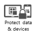

# Zač&#237;t použ&#237;vat Microsoft Intune

## Začněte s bezplatnou zkušební verzí
Když využijete pokyny [Začněte s 30denní zkušební verzí](https://technet.microsoft.com/library/dn646967.aspx%20), budete si moct rychle zkušební verzi Intune nainstalovat. Bezplatná zkušební verze umožňuje otestovat až 100 uživatelských licencí a dodává se s bezplatnou podporou.

> [!NOTE]
> Pokud registrujete nový účet, nebudete moct později použít stávající pracovní nebo školní účet ke správě tohoto účtu, nebo ho spojovat se stávajícími multilicenčními smlouvami.

Proto si [zaregistrujte nový účet](https://account.manage.microsoft.com/Signup/MainSignUp.aspx?OfferId=40BE278A-DFD1-470a-9EF7-9F2596EA7FF9&ali=1), pokud:

-   Vaše organizace ještě nemá smlouvu Enterprise Agreement, multilicenční smlouvu se společností Microsoft, nebo předplatné služeb Office 365.

    NEBO

-   Po vyhodnocení bezplatné zkušební verze Intune zrušíte svoji bezplatnou zkušební verzi. Tato možnost se doporučuje, když chcete používat Intune se System Center Configuration Managerem 2012.

## Začněte s placeným předplatným
Pokud máte pracovní nebo školní účet v rámci smlouvy Enterprise Agreement nebo jinou rovnocennou multilicenční smlouvu nebo předplatné služeb Office 365, [přihlaste se pomocí pracovního nebo školního účtu](https://manage.microsoft.com/) a použijte pokyny [Začněte s placeným předplatným](https://technet.microsoft.com/library/dn646983.aspx), kterými rychle nainstalujete nasazení malého rozsahu, abyste mohli začít testovat scénáře správy zařízení.

> [!NOTE]
> Pokud nastavujete Intune pro existující účet, doporučujeme, abyste se seznámili s článkem [Úvod k Intune](https://technet.microsoft.com/library/dn646960.aspx).

## Co říct o Intune zaměstnancům
Sestavili jsme [seznam témat](https://technet.microsoft.com/library/dn948527(TechNet.10).aspx), která vám pomůžou odpovědět na otázky koncových uživatelů a odstranit problémy s jejich zařízeními spravovanými přes Intune. Zároveň si můžete stáhnout [průvodce registrací pro koncové uživatele](http://aka.ms/bm3ml2), přizpůsobit ho a rozdat zaměstnancům.

## Co je nového
Intune se pravidelně aktualizuje a významné změny se uvádí v tématu [Co je nového](https://technet.microsoft.com/library/dn292747.aspx), které můžete vyhledat taky z řídicího panelu Intune.

## Získání nápovědy pro Intune
S každým předplatným Microsoft Intune poskytuje Microsoft Support globální technickou a předprodejní podporu a podporu k fakturaci a správě předplatného.[Podpora je k dispozici online a po telefonu pro placené i zkušební předplatné](https://technet.microsoft.com/library/dn646963.aspx).

Pokud má vaše společnost víc než 150 Intune licencí a hledáte pomoc s nasazením služby Intune, zvažte využití [Registračního benefitu Intune](https://technet.microsoft.com/library/mt228265.aspx).

## Viz také
[Dokumentace pro Microsoft Intune](../Topic/Documentation_for_Microsoft_Intune.md)

