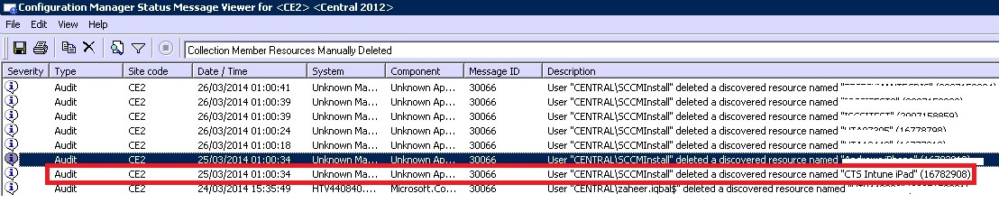

# Řešen&#237; pot&#237;ž&#237; s registrac&#237; do služby Intune

## Problémy s registrací zařízení
Tady najdete některé problémy s registrací zařízení a způsoby, jak je vyřešit.

> [!NOTE]
> Uživatelé spravovaných zařízení můžou pro vaši potřebu shromažďovat protokoly registrace. Pokyny pro shromažďování protokolů najdete v tématu [Fix issues with mobile device enrollment](../Topic/Fix_issues_with_mobile_device_enrollment.md).

### Dosažení limitu zařízení
**Problém:** Při registraci se na zařízení zobrazí chyba, třeba chyba **Portál společnosti není dočasně k dispozici** na zařízení se systémem iOS, a protokol DMPdownloader.log v Configuration Manageru obsahuje chybu **DeviceCapReached**.

**Řešení:** Návrh řešení neumožňuje uživatelům registrovat víc než 5 zařízení.

##### Kontrola počtu zaregistrovaných a povolených zařízení

1.  Na portálu správy služby Intune zkontrolujte, jestli nemá uživatel víc než 5 přiřazených zařízení.

2.  Na portálu správy služby Intune v části Správce\Správa mobilních zařízení\Pravidla registrace zkontrolujte, jestli je u položky Limit pro registraci zařízení nastavená hodnota 5.

Uživatelé mobilních zařízení můžou zařízení odstraňovat na této adrese URL: [https://byodtestservice.azurewebsites.net/](https://byodtestservice.azurewebsites.net/).

Správci můžou zařízení odstraňovat na portálu služby Azure Active Directory:

##### Odstranění zařízení na portálu služby Azure Active Directory

1.  Přejděte na adresu [http://aka.ms/accessaad](http://aka.ms/accessaad) nebo klikněte na **Správce** &gt; **Azure AD** na webu [https://portal.office.com](https://portal.office.com).

2.  Použijte odkaz v levé části stránky a přihlaste se pod svým ID organizace.

3.  Pokud nemáte předplatné Azure, vytvořte ho. Pokud máte placený účet, neměli byste potřebovat platební kartu ani zadání platby (klikněte na odkaz pro předplatné **Zdarma zaregistrovat službu Azure Active Directory**).

4.  Vyberte možnost **Active Directory** a potom vyberte svoji organizaci.

5.  Vyberte kartu **Uživatelé**.

6.  Vyberte uživatele, jehož zařízení chcete odstranit.

7.  Klikněte na **Zařízení**.

8.  Odeberte zařízení podle potřeby, třeba zařízení, která už se nepoužívají, nebo zařízení s nesprávnými definicemi.

> [!NOTE]
> Dosažení limitu zaregistrovaných zařízení se můžete vyhnout tím, že budete používat správce registrace zařízení. Jejich popis najdete v tématu [Přihlášení firemních zařízení pomocí manažera registrace zařízení v Microsoft Intune](../Topic/Enroll_corporate-owned_devices_with_the_Device_Enrollment_Manager_in_Microsoft_Intune.md).
> 
> Pokud se pro přihlašovací jméno uživatele, jehož účet přidáte do skupiny správců registrace zařízení, vynucuje zásada podmíněného přístupu, nebude možné dokončit registraci.

### Neúspěch instalace profilu
**Problém:** V zařízení se systémem iOS nebo Android se zobrazí chyba **Instalace profilu se nezdařila**.

##### Postup řešení potíží při neúspěšné instalaci profilu

1.  Zkontrolujte, jestli má uživatel přiřazenou příslušnou licenci pro verzi služby Intune, kterou používáte.

2.  Zkontrolujte, jestli už není zařízení zaregistrované pomocí jiného poskytovatele správy mobilních zařízení (MDM) a jestli už v něm není nainstalovaný profil správy.

3.  U zařízení se systémem iOS přejděte na adresu [https://portal.manage.microsoft.com](https://portal.manage.microsoft.com) a po zobrazení výzvy se pokuste profil nainstalovat.

4.  Potvrďte nastavení výchozích prohlížečů Safari (pro iOS) a Chrome (pro Android) a povolení souborů cookie.

### Portál společnosti není dočasně k dispozici
**Problém:** V zařízení se zobrazí chyba **Portál společnosti není dočasně k dispozici**.

##### Řešení potíží s chybou Portál společnosti není dočasně k dispozici

1.  Odeberte ze zařízení aplikaci Portál společnosti Intune.

2.  Otevřete v zařízení prohlížeč, přejděte na adresu [https://portal.manage.microsoft.com](https://portal.manage.microsoft.com) a pokuste se přihlásit uživatele.

3.  Pokud se uživateli nepodaří přihlásit, požádejte ho, ať vyzkouší jinou síť.

4.  Pokud to nepomůže, zkontrolujte, jestli správně proběhla synchronizace přihlašovacích údajů uživatele se službou Azure Active Directory.

5.  Pokud se uživatel úspěšně přihlásí, zařízení se systémem iOS zobrazí výzvu k instalaci aplikace Portál společnosti Intune a k registraci. V zařízení se systémem Android budete muset aplikaci Portál společnosti Intune nainstalovat ručně. Potom se můžete znovu zkusit přihlásit.

### Není definována autorita MDM
**Problém:** Zobrazí se chyba **Není definována autorita MDM**.

##### Řešení potíží s chybou Není definována autorita MDM

1.  Zkontrolujte, jestli je nastavená správná autorita pro správu mobilních zařízení (MDM) pro verzi služby Intune, kterou používáte, tedy pro Intune, O365 MDM, nebo System Center Configuration Manager se službou Intune. V případě služby [!INCLUDE[wit_nextref](../Token/wit_nextref_md.md)] se autorita MDM nastavujte v části **Správce** &gt; **Správa mobilních zařízení**. V případě nástroje [!INCLUDE[cmshort](../Token/cmshort_md.md)] se službou [!INCLUDE[wit_nextref](../Token/wit_nextref_md.md)] se nastavuje během konfigurace konektoru [!INCLUDE[wit_nextref](../Token/wit_nextref_md.md)] a u služeb O365 se jedná o nastavení **Mobilní zařízení**.

    > [!NOTE]
    > Jakmile jednou nastavíte autoritu MDM, můžete ji změnit jedině tak, že se obrátíte na podporu, jak se píše v tématu [Jak získat podporu pro Microsoft Intune](../Topic/How_to_get_support_for_Microsoft_Intune.md).

2.  Ověřte správnou synchronizaci přihlašovacích údajů uživatele se službou Azure Active Directory tím, že zkontrolujete, jestli hlavní název uživatele (UPN) odpovídá údajům služby Active Directory na portálu účtů. Pokud hlavní název uživatele neodpovídá údajům služby Active Directory:

    1.  Vypněte na místním serveru službu DirSync.

    2.  Odstraňte neodpovídajícího uživatele ze seznamu uživatelů na **portálu účtů Intune**.

    3.  Počkejte zhruba hodinu, aby měla služba Azure dost času odebrat nesprávná data.

    4.  Znovu zapněte službu DirSync a zkontrolujte, jestli je teď uživatel správně synchronizovaný.

3.  Pokud používáte nástroj System Center Configuration Manager se službou Intune, zkontrolujte, jestli má uživatel platné ID uživatele cloudu:

    1.  Otevřete nástroj SQL Management Studio.

    2.  Připojte se k příslušné databázi.

    3.  Otevřete složku databází a vyberte a otevřete složku **CM_název_db** složky, kde položka název_db odpovídá názvu databáze zákazníka.

    4.  Nahoře klikněte na Nový dotaz… a spusťte tyto dotazy:

        -   Zobrazení všech uživatelů: `select * from [CM_ DBName].[dbo].[User_DISC]`

        -   Pokud chcete zobrazit konkrétní uživatele, použijte tento dotaz, kde %testuser1% představuje adresu jmeno_uzivatele@domena.com pro uživatele, kterého chcete vyhledat: `select * from [CM_ DBName].[dbo].[User_DISC] where User_Principal_Name0 like '%testuser1%'`

        Po napsání dotazu klikněte na **!Spustit**. Když se vrátí výsledky, vyhledejte ID uživatele cloudu.  Pokud se žádné ID nenajde, nemá daný uživatel licenci pro používání služby Intune.

### Při použití nástroje System Center Configuration Manager se službou Intune zmizí mobilní zařízení
**Problém:** Po úspěšné registraci mobilního zařízení do Configuration Manageru dané zařízení zmizí z kolekce mobilních zařízení, ale pořád má profil pro správu a je uvedené v bráně CSS.

**Řešení:** K této situaci může dojít, protože máte vlastní proces, který odebírá zařízení nepřipojená k doméně, nebo protože uživatel vyřadil zařízení z předplatného. Pokud chcete ověřit a zkontrolovat, který proces nebo uživatelský účet odebral zařízení z konzoly nástroje Configuration Manager, postupujte takto:

##### Zjištění způsobu odebrání zařízení

1.  V konzole pro správu nástroje Configuration Manager vyberte **Monitorování** &gt; **Stav systému** &gt; **Dotazy stavových zpráv**.

2.  Klikněte pravým tlačítkem na **Manuálně odstraněné prostředky členů kolekce** a vyberte **Zobrazit zprávy**.

3.  Vyberte příslušný čas/datum nebo období posledních 12 hodin.

4.  Najděte příslušné zařízení a podívejte se, jak došlo k jeho odebrání. Následující příklad ukazuje, že zařízení odebral účet SCCMInstall prostřednictvím neznámé aplikace.

    

5.  Zkontrolujte, jestli nemá Configuration Manager naplánovanou úlohu, skript nebo jiný proces, který by mohl automaticky odstraňovat zařízení nepřipojená k doméně, mobilní zařízení nebo související zařízení.

