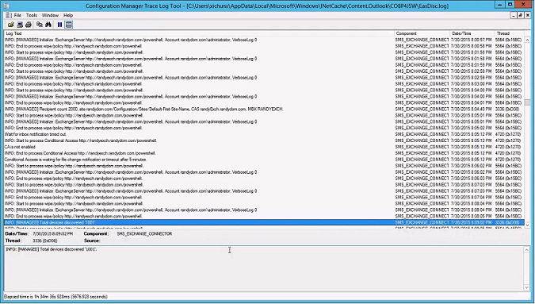

# Použ&#237;v&#225;n&#237; podm&#237;něn&#233;ho př&#237;stupu s Intune a Configuration Managerem
V tomto řešení již ve společnosti používáte ke správě přístupu k e-mailu používáte System Center Configuration Managera a Microsoft Exchange Server – místní, Exchange Online nebo hybridní nasazení obou. Toto řešení kombinuje existující prostředí Configuration Manageru s Intune pro bezpečnou správu přístupu k e-mailu na všech typech zařízení bez ohledu na jejich polohu.

> [!TIP]
> Kopii celého tohoto tématu ke stažení najdete v [Galerii TechNet](https://gallery.technet.microsoft.com/Deploying-Enterprise-16499404).

## Místní Exchange Server
Pokud už v místní infrastruktuře používáte System Center Configuration Managera a Exchange, můžete začlenit Intune pro správu přístupu k e-mailu a ochranu e-mailových dat na mobilních zařízeních. Proces vysoké úrovně pro implementaci tohoto řešení:

-   Nakonfigurujte místní konektor Intune Exchange Connector prostřednictvím konzoly nástroje Configuration Manager, která Configuration Manageru umožňuje komunikovat se systémem Exchange Server, který hostuje poštovní schránky mobilních zařízení.

-   Spuštěním úplné synchronizace konektoru systému Exchange Server objevíte uživatele a zinventarizujete všechna ID Exchange ActiveSync (EASID) mobilních zařízení, která jsou připojena k místnímu systému Exchange Server.

-   Vytvořte kolekce uživatelů pro skupiny uživatelů, na které budou zásady podmíněného přístupu cílit nebo kteří jsou z nich vyloučení. Pak vytvořte zásady dodržování předpisů definující pravidla a nastavení, které zařízení musí dodržovat, aby se dalo považovat za zařízení, které dodržuje zásady podmíněného přístupu.

-   Začněte s vynucováním podmíněného přístupu.

### Tok řízení podmíněného přístupu pro místní Exchange Server
Tento diagram zobrazuje tok řízení pro klienty pokoušející se o přístup k e-mailu v místním Exchangi.

-   Microsoft Intune: Spravuje zásady dodržování předpisů a podmíněného přístupu pro zařízení

-   Microsoft Azure Active Directory: Ověřuje uživatele a poskytuje stav dodržování předpisů zařízení

-   Configuration Manager: Spravuje registraci zařízení a poskytuje hlášení

-   Místní Exchange: Vynucuje přístup k e-mailu v závislosti na stavu zařízení

### Požadavky
Před dalším postupem se ujistěte, že vaše prostředí zahrnuje tyto požadavky pro implementaci řešení.

> [!NOTE]
> Pokud jste již nakonfigurovali Configuration Manager pro správu mobilních zařízení prostřednictvím služby, můžete přejít k části [Kroky nasazení](#DeploySteps).

-   Ověřte, že splňujete [požadavky na hardware pro místní konektor](https://technet.microsoft.com/en-us/library/dn646950.aspx#BKMK_ExchanceConnectorReqs).

-   Ověřte, že používáte System Center 2012 R2 Configuration Manager SP1 s kumulativní aktualizací 1 nebo novější.

-   Ujistěte se, že je [koncový bod webových služeb systému Exchange (EWS)](https://technet.microsoft.com/library/hh529912(v=exchg.150).aspx) správně nakonfigurován pro zjišťování. V případě potřeby kontaktujte tým podpory Configuration Manageru ohledně nástroje, který vám pomůže zjistit problémy připojení EWS. EWS umožňuje vývojářům pracovat s poštovními schránkami a obsahem Exchange s použitím standardního protokolu HTTP.

-   Nainstalujte a přiřaďte služby Exchange k [platnému digitálnímu certifikátu](https://technet.microsoft.com/library/dd351044(v=exchg.150).aspx) zakoupenému od důvěryhodné veřejné certifikační autority.

-   Nakonfigurujte účet (místní správce nebo správce domény) s povolením spouštět následující rutiny Exchange Server:

    **Clear-ActiveSyncDevice**

    **Get-ActiveSyncDevice**

    **Get-ActiveSyncDeviceAccessRule**

    **Get-ActiveSyncDeviceStatistics**

    **Get-ActiveSyncMailboxPolicy**

    **Get-ActiveSyncOrganizationSettings**

    **Get-ExchangeServer**

    **Get-Recipient**

    **Set-ADServerSettings**

    **Set-ActiveSyncDeviceAccessRule**

    **Set-ActiveSyncMailboxPolicy**

    **Set-CASMailbox**

    **New-ActiveSyncDeviceAccessRule**

    **New-ActiveSyncMailboxPolicy**

    **Remove-ActiveSyncDevice**

> [!IMPORTANT]
> Pokud se pokusíte nainstalovat nebo použít konektor systému Exchange Server bez požadovaných rutin, zobrazí se v souboru protokolu EasDisc.log na počítači serveru lokality zaprotokolovaná chyba se zprávou Vyvolání rutiny &lt;rutina&gt; se nezdařilo.

### Kroky nasazení
Pomocí těchto kroků nasadíte řešení místního Exchange:

#### Krok 1: Ujistěte se, že je nainstalovaná role konektoru Intune.
Ujistěte se, že je nainstalovaná role konektoru Intune, aby mohl Configuration Manager spolupracovat s Intune. Další informace najdete v tématu [Správa mobilních zařízení s Configuration Managerem a Intune](https://technet.microsoft.com/en-us/library/JJ884158.aspx).

#### Krok 2: Nainstalujte konektor Exchange Serveru a nakonfigurujte ho.
Configuration Manager podporuje jenom jeden konektor v organizaci Exchange.

> [!IMPORTANT]
> Před instalací konektoru serveru Exchange Server zkontrolujte, zda Configuration Manager podporuje verzi serveru Microsoft Exchange, kterou používáte. Další informace najdete v článku [Podporované konfigurace pro Configuration Manager](https://technet.microsoft.com/en-us/library/gg682077.aspx).

Pokud chcete nainstalovat a nakonfigurovat konektor Exchange Serveru, postupujte podle pokynů v článku [Správa mobilních zařízení pomocí nástroje Configuration Manager a serveru Exchange](https://technet.microsoft.com/en-us/library/gg682001.aspx).

#### Krok 3: Spusťte úplnou synchronizaci za účelem zjišťování uživatelů.

1.  V konzole nástroje Configuration Manager klikněte na **Správa**, rozbalte **Konfigurace hierarchie** a potom vyberte **Konektory systému Exchange Server**.

2.  Vyberte konektor systému Exchange Server, který jste nainstalovali v kroku 2.

3.  Klikněte na **Synchronizovat**.

    

Tato úplná synchronizace může v závislosti na počtu zařízení trvat několik hodin. Ve výchozím nastavení je úplná synchronizace spuštěná každých 24 hodin. Rozdílová synchronizace zjistí připojení zařízení od poslední úplné synchronizace a je prováděna v intervalech nastavených během instalace konektoru systému Exchange Server. To zajišťuje, že noví uživatelé a noví uživatelé Exchange se rychle zjistí, takže se může použít podmíněný přístup.

Pomocí nástroje Protokol trasování Configuration Manageru můžete otevřít soubor EasDisc.log (umístěný ve složce **Microsoft Configuration Manager/Logs**, kam jste nainstalovali Configuration Manager) a ověřit, že konektor je spuštěný a dotazuje se na připojení zařízení. Po dokončení úplné synchronizace provede inventuru identifikátorů ID Exchange ActiveSync všech mobilních zařízení (EASID), které jsou připojené k místnímu Exchangi.

#### Krok 4: Vytvořte kolekce uživatelů.
Určete skupiny uživatelů Intune, na které budou cílit zásady podmíněného přístupu. Pak vytvořte kolekce uživatelů pro skupiny uživatelů, na které budou zásady podmíněného přístupu cílit nebo kteří jsou z nich vyloučení. Tyto skupiny zadáte, až později vynutíte podmíněný přístup.

Při vytváření kolekcí uživatelů použijte postup v tématu [Postup vytvoření kolekce v nástroji Configuration Manager](https://technet.microsoft.com/en-us/library/gg712295.aspx).

#### Krok 5: Vytvořte zásady dodržování předpisů a nasaďte je uživatelům.
Zásady dodržování předpisů definují pravidla a nastavení, které zařízení musí dodržovat, aby se dalo považovat za zařízení, které dodržuje zásady podmíněného přístupu. Při vytváření zásad dodržování předpisů použijte postup v tématu [Zásady dodržování předpisů v Configuration Manageru](https://technet.microsoft.com/en-us/library/mt131417.aspx).

> [!NOTE]
> Pokud chcete mít možnost ze zařízení s iOS, které už není součástí vaší společnosti, odstranit všechny podnikové e-maily, musíte vytvořit a nasadit e-mailový profil a potom nastavit zásady dodržování předpisů, které určují, že e-mailové profily se spravují přes Intune. E-mailový profil musíte nasadit pro stejnou skupinu uživatelů, na které tyto zásady dodržování předpisů cílí.
> 
> 
> 
> Pokud zadáte tyto zásady dodržování předpisů, uživatelé, který už mají nastavený e-mailový účet, musí tento účet ručně odebrat. Intune ho pak přidá zpátky prostřednictvím procesu registrace popsaného v tématu [Činnost koncového uživatele s podmíněným přístupem](../Topic/End-user_experience_of_conditional_access.md).

Když jsou zásady dodržování předpisů vytvořené, vyberte název požadované zásady v seznamu a klikněte na **Nasadit**.

#### Krok 6: Nakonfigurujte zásady podmíněného přístupu.
Nejdřív se rozhodněte, kdy a jak chcete vynutit podmíněný přístup a kterých zaměstnanců se to bude týkat. Pak použijte postup popsaný v tématu [Podmíněný přístup pro e-mail Exchange v Configuration Manageru](https://technet.microsoft.com/en-us/library/mt131421.aspx) a nakonfigurujte zásady podmíněného přístupu pro místní Exchange.

#### Krok 7: Monitorujte registrace a vynuťte podmíněný přístup.
Pokud již máte v Intune zaregistrovaný velký počet kompatibilních uživatelů, můžete začít vynucovat podmíněný přístup přibližně 500 uživatelům za den. V případě 70 000 uživatelů to potrvá 4 až 5 měsíců. Budete tak mít možnost vyřešit případné potíže a neomezit přitom přístup k e-mailu pro příliš mnoho uživatelů současně.

Pokud nemáte v Intune zaregistrovaný velký počet uživatelů, podmíněný přístup jim poskytne návodné pokyny pro registraci, jak popisuje téma [Činnost koncového uživatele s podmíněným přístupem](../Topic/End-user_experience_of_conditional_access.md).

### Ověřovací kroky
Pomocí nástroje Protokol trasování Configuration Manageru otevřete soubor EasDisc.log (umístěný ve složce Microsoft Configuration Manager/Logs, kam jste nainstalovali Configuration Manager). V souboru protokolu vyhledejte text Exchange Connector a zjistěte, jestli je konektor Exchange spuštěný a kolik zařízení je připojených.

Nástroj Protokol trasování Configuration Manageru je součástí [System Center 2012 R2 Configuration Manager Toolkitu](http://www.microsoft.com/en-us/download/details.aspx?id=36213).

### Generování sestav
Pokud chcete zobrazit konkrétní informace o zařízení, které zjistil konektor Exchange, můžete použít konzolu Configuration Manageru. Pro zařízení, u kterých je vynucený podmíněný přístup, můžete zobrazit aktuální stav, čas posledního připojení k serveru Exchange server a tak dále.

V konzole Configuration Manageru klikněte na **Prostředky a kompatibilita** a pak klikněte na **Zařízení**. Aktuální stav jednotlivých zařízení (blokované nebo povolené) se zobrazí ve sloupci **Stav přístupu systému Exchange**. Pokud se tento sloupec nezobrazuje, můžete ho přidat kliknutím pravým tlačítkem myši do oblasti záhlaví sloupců. Pro jednotlivá zařízení můžete zobrazit taky čas poslední úspěšné synchronizace hlášený Exchangem, a to přidáním sloupce **Čas poslední úspěšné synchronizace Exchange Serveru**.

Pokud používáte službu SQL Server Reporting Services (SSRS), můžete zobrazit sestavu podmíněného přístupu, která ukazuje stav kompatibility zařízení, to, jestli je nainstalovaný a spuštěný konektor Exchange, a taky stav přístupu EAS. Dál uvádí informace o registraci Active Directory a aktivaci EAS a taky vlastníka zařízení.

Pokud chcete zobrazit sestavy SSRS, musíte mít na primárním serveru nainstalovanou roli pro sestavy:

1.  V Configuration Manageru klikněte postupně na **Správa**, **Konfigurace hierarchie** a **Konfigurace lokality** a pak klikněte na **Servery a role serveru**.

2.  Vyberte server a kliknutím na **Přidat role serveru** otevřete průvodce přidáním role serveru.

3.  Na stránce Výběr systémové role zaškrtněte políčko **Bod služby Reporting Services**. Bod služby Reporting Services zobrazí sestavy související se správou klientů.

4.  Klikněte na **Další**.

Na obrázku je uvedený stav nasazení zásad konfigurace:

#### Čekací doba
Zařízení se blokuje, jakmile ho konektor Exchange rozpozná. Latence blokování závisí na nakonfigurovaných intervalech pro úplnou a rozdílovou synchronizaci a času mezi těmito intervaly při připojení zařízení k serveru Exchange. Ve výchozím nastavení se úplná synchronizace provádí každých 24 hodin a rozdílová synchronizace každých 240 minut. Během této doby latence se zařízení může považovat za kompatibilní.

## Exchange Online
Pokud už používáte System Center Configuration Managera a Exchange Online, můžete začlenit Intune pro správu přístupu k e-mailu a ochranu e-mailových dat na mobilních zařízeních. Proces vysoké úrovně pro implementaci tohoto řešení:

-   Vytvořte zásady dodržování předpisů definující pravidla a nastavení, které zařízení musí dodržovat, aby se dalo považovat za zařízení, které dodržuje zásady podmíněného přístupu.

-   Začněte s vynucováním podmíněného přístupu.

-   Volitelně nakonfigurujte konektor systému Exchange Server pro Exchange. Tento konektor se vyžaduje jenom pro účely vytváření sestav. K povolení podmíněného přístupu není potřeba.

### Tok řízení podmíněného přístupu pro Exchange Online
Tento diagram zobrazuje tok řízení pro klienty pokoušející se o přístup k e-mailu v Exchangi Online. Před vynucením podmíněného přístupu se může provést A a B.

-   Microsoft Intune: Spravuje zásady dodržování předpisů a podmíněného přístupu pro zařízení

-   Microsoft Azure Active Directory: Ověřuje uživatele a poskytuje stav dodržování předpisů zařízení

-   Configuration Manager: Spravuje registraci zařízení a poskytuje vytváření sestav, pokud je povolené

-   Exchange Online: Vynucuje přístup k e-mailu v závislosti na stavu zařízení

### Požadavky
Před dalším postupem se ujistěte, že vaše prostředí zahrnuje tyto požadavky pro implementaci řešení.

-   Nainstalujte a přiřaďte služby Exchange k [platnému digitálnímu certifikátu](https://technet.microsoft.com/library/dd351044(v=exchg.150).aspx) zakoupenému od důvěryhodné veřejné certifikační autority.

-   Ověřte, že používáte System Center 2012 R2 Configuration Manager SP1 s kumulativní aktualizací 1 nebo novější.

-   Nakonfigurujte účet (místní správce nebo správce domény) s povolením spouštět následující rutiny Exchange Server:

    **Clear-ActiveSyncDevice**

    **Get-ActiveSyncDevice**

    **Get-ActiveSyncDeviceAccessRule**

    **Get-ActiveSyncDeviceStatistics**

    **Get-ActiveSyncMailboxPolicy**

    **Get-ActiveSyncOrganizationSettings**

    **Get-ExchangeServer**

    **Get-Recipient**

    **Set-ADServerSettings**

    **Set-ActiveSyncDeviceAccessRule**

    **Set-ActiveSyncMailboxPolicy**

    **Set-CASMailbox**

    **New-ActiveSyncDeviceAccessRule**

    **New-ActiveSyncMailboxPolicy**

    **Remove-ActiveSyncDevice**

### Kroky nasazení
Pomocí těchto kroků nasadíte řešení Exchange Online:

#### Krok 1: Vytvořte zásady dodržování předpisů a nasaďte je uživatelům.
Zásady dodržování předpisů definují pravidla a nastavení, které zařízení musí dodržovat, aby se dalo považovat za zařízení, které dodržuje zásady podmíněného přístupu. Při vytváření zásad dodržování předpisů použijte postup v tématu [Zásady dodržování předpisů v Configuration Manageru](https://technet.microsoft.com/en-us/library/mt131417.aspx).

> [!NOTE]
> Pokud chcete mít možnost ze zařízení s iOS, které už není součástí vaší společnosti, odstranit všechny podnikové e-maily, musíte vytvořit a nasadit e-mailový profil a potom nastavit zásady dodržování předpisů, které určují, že e-mailové profily se spravují přes Intune. E-mailový profil musíte nasadit pro stejnou skupinu uživatelů, na které tyto zásady dodržování předpisů cílí.
> 
> 
> 
> Pokud zadáte tyto zásady dodržování předpisů, uživatelé, který už mají nastavený e-mailový účet, musí tento účet ručně odebrat. Intune ho pak přidá zpátky prostřednictvím procesu registrace popsaného v tématu [Činnost koncového uživatele s podmíněným přístupem](../Topic/End-user_experience_of_conditional_access.md).

Když jsou zásady dodržování předpisů vytvořené, vyberte název požadované zásady v seznamu a klikněte na **Nasadit**.

#### Krok 2: Nakonfigurujte zásady podmíněného přístupu.
Nejdřív se rozhodněte, kdy a jak chcete vynutit podmíněný přístup a kterých zaměstnanců se to bude týkat. Pak použijte postup popsaný v tématu [Podmíněný přístup pro e-mail Exchange v Configuration Manageru](https://technet.microsoft.com/en-us/library/mt131421.aspx) a povolte zásady podmíněného přístupu pro Exchange Online.

> [!NOTE]
> Zásady podmíněného přístupu musí být konfigurované v konzole pro Intune. Následující kroky začínají přístupem ke konzole pro Intune prostřednictvím Configuration Manageru. Po vyzvání se přihlaste se pomocí stejných přihlašovacích údajů, které jste použili k nastavení konektoru mezi Configuration Managerem a Intune.

#### Krok 3: (*Volitelný*) Nainstalujte a nakonfigurujte konektor Exchange Serveru.
Configuration Manager podporuje jenom jeden konektor v organizaci Exchange.

> [!IMPORTANT]
> Před instalací konektoru serveru Exchange Server zkontrolujte, zda Configuration Manager podporuje verzi serveru Microsoft Exchange, kterou používáte. Další informace najdete v článku [Podporované konfigurace pro Configuration Manager](https://technet.microsoft.com/en-us/library/gg682077.aspx).

Pokud chcete nainstalovat a nakonfigurovat konektor Exchange Serveru, postupujte podle pokynů v článku [Správa mobilních zařízení pomocí nástroje Configuration Manager a serveru Exchange](https://technet.microsoft.com/en-us/library/gg682001.aspx).

### Ověřovací kroky
Pokud jste pro toto řešení nakonfigurovali volitelný konektor Exchange Serveru, můžete pomocí nástroje Protokol trasování Configuration Manageru otevřít soubor EasDisc.log (umístěný ve složce Microsoft Configuration Manager/Logs, kam jste nainstalovali Configuration Manager). V souboru protokolu vyhledejte text Exchange Connector a zjistěte, jestli je konektor Exchange spuštěný a kolik zařízení je připojených.

Nástroj Protokol trasování Configuration Manageru je součástí [System Center 2012 R2 Configuration Manager Toolkitu](http://www.microsoft.com/en-us/download/details.aspx?id=36213).

### Generování sestav
Pokud jste nakonfigurovali volitelný konektor Exchange Serveru a chcete zobrazit konkrétní informace o zařízení, které zjistil konektor Exchange, můžete použít konzolu Configuration Manageru. Pro zařízení, u kterých je vynucený podmíněný přístup, můžete zobrazit aktuální stav, čas posledního připojení k serveru Exchange server a tak dále.

V konzole Configuration Manageru klikněte na **Prostředky a kompatibilita** a pak klikněte na **Zařízení**. Aktuální stav jednotlivých zařízení (v karanténě nebo povolené) se zobrazí ve sloupci **Stav přístupu systému Exchange**. Pokud se tento sloupec nezobrazuje, můžete ho přidat kliknutím pravým tlačítkem myši do oblasti záhlaví sloupců. Pro jednotlivá zařízení můžete zobrazit taky čas poslední úspěšné synchronizace hlášený Exchangem, a to přidáním sloupce **Čas poslední úspěšné synchronizace Exchange Serveru**.

Pokud používáte službu SQL Server Reporting Services (SSRS), můžete zobrazit sestavu podmíněného přístupu, která ukazuje stav kompatibility zařízení, to, jestli je nainstalovaný a spuštěný konektor Exchange, a taky stav přístupu EAS. Dál uvádí informace o registraci Active Directory a aktivaci EAS a taky vlastníka zařízení.

Pokud chcete zobrazit sestavy SSRS, musíte mít na primárním serveru nainstalovanou roli pro sestavy:

1.  V Configuration Manageru klikněte na **Správa &gt; Konfigurace hierarchie &gt; Konfigurace lokality  &gt; Servery a role serveru**.

2.  Vyberte server a kliknutím na **Přidat role serveru** otevřete průvodce přidáním role serveru.

3.  Na stránce Výběr systémové role zaškrtněte políčko **Bod služby Reporting Services**. Bod služby Reporting Services zobrazí sestavy související se správou klientů.

4.  Klikněte na **Další**.

Na obrázku je uvedený stav nasazení zásad konfigurace:

#### Čekací doba
U zařízení, která používají moderní ověřování, se podmíněný přístup použije okamžitě. U zařízení, která se připojují pomocí protokolu EAS, může před vynucením podmíněného přístupu být prodleva až šest hodin, v závislosti na výchozím nastavení. Během této doby se zařízení může považovat za kompatibilní.

## Koexistence místního Exchange Serveru a Exchange Online
Prostředí, ve kterých se ke správě e-mailových profilů používá místní Exchange i Exchange Online, nabízí společnostem možnost rozšířit bohaté funkce a administrativní řízení, které poskytuje stávající organizace místního Microsoft Exchange, do cloudu. Tento „hybridní“ typ nasazení poskytuje bezproblémový jednotný vzhled a chování Exchange pro místní Exchange Server 2013 a Exchange Online v Microsoft Office 365. Tento typ nasazení může navíc sloužit jako přechodný krok při kompletním přechodu na Exchange Online.

Pokud už používáte Configuration Managera v prostředí, kde koexistuje místní Exchnage a Exchange Online, můžete začlenit Intune pro správu přístupu k e-mailu a ochranu e-mailových dat na mobilních zařízeních. Toto řešení můžete implementovat podle pokynů uvedených výš. Každé řešení přitom implementujte samostatně.

### Požadavky
Pokud chcete konfigurovat typ koexistence v prostředí, které implementuje místní Exchange i Exchange Online, musí vaše stávající organizace Exchange splňovat určité požadavky. Pokud tyto požadavky nesplňujete, nebudete moc dokončit kroky nutné ke konfiguraci hybridního nasazení mezi organizací místního Exchange a organizací Exchange Online v Microsoft Office 365.

Požadavky pro vytváření a konfiguraci tohoto typu prostředí si můžete projít v tématu [Požadavky hybridního nasazení](https://technet.microsoft.com/en-us/library/hh534377.aspx).

### Kroky nasazení
Pokud chcete nasadit řešení koexistence, použijte k nasazení řešení [Místní Exchange Server](#ExchangeOnPrem) i [Exchange Online](#ExchangeOnline) postup uvedený výš.

## Viz také
[Informace o nasazení řešení pro ochranu firemního e-mailu a dokumentů](../Topic/Learn_how_to_deploy_a_solution_for_protecting_company_email_and_documents.md)
[Činnost koncového uživatele s podmíněným přístupem](../Topic/End-user_experience_of_conditional_access.md)

