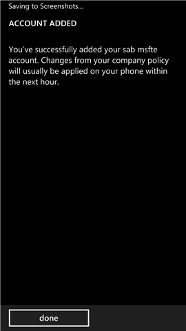

# Použit&#237; zař&#237;zen&#237; Windows s&#160;Intune
Tyto kroky použijte pro úlohy, které musíte udělat v počítači nebo na zařízení s Windows, když vaše společnost používá Microsoft Intune:

|Kategorie úloh|Úlohy, které můžete provést|
|------------------|-------------------------------|
|Instalace aplikace Portál společnosti a registrace ve službě Intune|-   [Registrace zařízení v Intune](#BKMK_windows_enroll_instrucs) -   [Co se stane, když nainstaluji aplikaci Portál společnosti a zaregistruji zařízení do služby Intune?](#BKMK_what_happns_enroll_all) -   [Co všechno uvidí správce IT, když zaregistruji své zařízení do služby Intune?](#BKMK_win_what_IT_can_see)|
|Kroky, které můžete provést po registraci zařízení do služby Intune|-   [Co je to web portálu společnosti?](#BKMK_win_whatis_cp_website) -   [Instalace firemních aplikací](#BKMK_win_install_comp_apps) -   [Zašifrování zařízení](#BKMK_win_encrypt_device) -   [Reset (vymazání) ztraceného nebo odcizeného zařízení](#BKMK_win_erase_lost_device) -   [Zrušení registrace zařízení v Intune](#BKMK_win_unenroll_device)|

## Registrace zařízení v Intune
Pro registraci použijte odkaz odpovídající zařízení, které používáte:

-   [Windows 10](#BKMK_enrollment_w10)

-   [Windows 8.1 nebo Windows RT 8.1](#BKMK_enrollment_w81orwrt81)

-   [Windows RT](#BKMK_enrollment_rt)

-   [Windows Phone 8.1](#BKMK_enrollment_81)

-   [Windows Phone 8](#BKMK_enrollment_wp8)

### Windows 10
Registrace zařízení:

1.  Ve Windows přejděte do **Nastavení** a klepněte na **Účty**.

    

2.  Klepněte na **Váš účet**.

    

3.  Klepněte na **Přidat pracovní nebo školní účet**.

    

4.  Přihlaste se pomocí přihlašovacích údajů svého pracovního nebo školního účtu.

    

Pokud jste použili tento postup, ale pořád nemáte přístup k pracovnímu nebo školnímu e-mailu, souborům a dalším datům, přejděte zpátky k položce **Účty** a klepněte na**Přístup do práce**.

-   Pokud vidíte svůj pracovní nebo školní účet, gratulujeme. Jste připojení.

-   Pokud ho nevidíte, klepněte na **Připojit** a přihlaste se pomocí přihlašovacích údajů svého pracovního nebo školního účtu.

Doporučujeme také nainstalovat aplikaci Portál společnosti, která vám umožní snadno identifikovat a instalovat podnikové aplikace, které jsou relevantní pro vás i vaši roli. V závislosti na tom, jak vaše společnost službu Intune nakonfigurovala, už aplikace Portál společnosti může být nainstalovaná jako součást procesu registrace. Pokud chcete zjistit, jestli aplikaci máte, hledejte v seznamu aplikací aplikaci **Portál společnosti**. Pokud aplikaci Portál společnosti v seznamu nenajdete, nainstalujte ji podle následujícího postupu.

1.  Klepněte na **Start** &gt; **Store**.

2.  Klepněte na **vyhledávání** a napište **portál společnosti**.

3.  V seznamu výsledků klepněte na **Portál společnosti** &gt; **Instalovat**.

4.  Klepněte buď na **Instalovat**, nebo na **Zdarma**. To, která z možností se zobrazuje, závisí na tom, jak vaše společnost aplikaci nakonfigurovala.

### Windows 8.1 nebo Windows RT 8.1
Registrace zařízení:

1.  V zařízení klepněte na **Nastavení** &gt; **Nastavení počítače** &gt; **Síť** &gt; **Pracoviště**.

    

2.  Zadejte e-mailovou adresu svého pracovního nebo školního účtu pro dané ID uživatele, pokud je to potřeba, a klepněte na **Připojit se**.

    Pokud není potřeba zadat ID uživatele, použije se e-mailová adresa, kterou jste zadali při přihlašování k tomuto zařízení.

3.  Zadejte heslo pracovního nebo školního e-mailového účtu.

    

4.  V části **Zapnout správu zařízení** klepněte na **Zapnout**.

    

5.  V dialogu **Povolit aplikace a služby od správce IT** zaškrtněte políčko **Souhlasím** a pak klepněte na **Zapnout**.

    

    Po úspěšné registraci uvidíte následující obrazovku.

    

Doporučujeme také nainstalovat aplikaci Portál společnosti, která vám umožní snadno identifikovat a instalovat podnikové aplikace, které jsou relevantní pro vás i vaši roli. V závislosti na tom, jak vaše společnost službu Intune nakonfigurovala, už aplikace Portál společnosti může být nainstalovaná jako součást procesu registrace. Pokud chcete zjistit, jestli aplikaci máte, hledejte v seznamu aplikací aplikaci **Portál společnosti**. Pokud aplikaci Portál společnosti v seznamu nenajdete, nainstalujte ji podle následujícího postupu.

1.  Klepněte na **Start** &gt; **Store**.

2.  Klepněte na **vyhledávání** a napište **portál společnosti**.

3.  V seznamu výsledků klepněte na **Portál společnosti**.

4.  Klepněte buď na **Instalovat**, nebo na **Zdarma**. To, která z možností se zobrazuje, závisí na tom, jak vaše společnost aplikaci nakonfigurovala.

### Windows RT
Registrace zařízení:

1.  Klepněte na **Start** a pak zadejte **Konfigurace systému**.

2.  Klepnutím na dialogové okno otevřete seznam **Aplikace společnosti**. Můžete být vyzváni, abyste přijali podmínky a ujednání vaší společnosti.

3.  Přihlaste se pomocí svých přihlašovacích údajů.

Doporučujeme také nainstalovat aplikaci Portál společnosti, která vám umožní snadno identifikovat a instalovat podnikové aplikace, které jsou relevantní pro vás i vaši roli. V závislosti na tom, jak vaše společnost službu Intune nakonfigurovala, už aplikace Portál společnosti může být nainstalovaná jako součást procesu registrace. Pokud chcete zjistit, jestli aplikaci máte, hledejte v seznamu aplikací aplikaci **Portál společnosti**. Pokud aplikaci Portál společnosti v seznamu nenajdete, nainstalujte ji podle následujícího postupu.

1.  Klepněte na **Start** &gt; **Store**.

2.  Klepněte na **vyhledávání** a napište **portál společnosti**.

3.  V seznamu výsledků klepněte na **Portál společnosti**.

4.  Klepněte na **Portál společnosti** &gt; **Instalovat**.

### Windows Phone 8.1
Pokud chcete své zařízení zaregistrovat v rámci služby Intune, postupujte podle pokynů, které se vztahují na vaši společnost:

-   [Pokud vám vaše společnost umožňuje používat Portál společnosti z Windows Storu](#BKMK_comp_allows_cp)

-   [Pokud nemáte oprávnění k přístupu do Windows Storu z Windows Phonu nebo pokud ještě nemáte účet Microsoft](#BKMK_comp_doesnt_allow_cp)

#### Pokud vám vaše společnost umožňuje používat Portál společnosti z Windows Storu
Nainstalujte si do zařízení aplikaci Portál společnosti:

1.  Klepněte na **Start** &gt; **Store**.

2.  Klepněte na **vyhledávání** a napište **portál společnosti**.

3.  V seznamu výsledků klepněte na **Portál společnosti**.

    

4.  Klepněte na **Portál společnosti** &gt; **Instalovat**.

    

Zaregistrujte své zařízení:

1.  V zařízení otevřete aplikaci **Portál společnosti Microsoft Intune**.

2.  Zadejte svoje přihlašovací údaje. V odpovídajících případech můžete být vyzváni, abyste přijali podmínky a ujednání vaší společnosti.

3.  Potažením prstem přejděte na **Moje zařízení**.

4.  Klepněte na **Klepněte sem a můžete pak toto zařízení zaregistrovat nebo identifikovat**.

    

5.  Klepněte na **Zaregistrovat toto zařízení**.

    

6.  Klepněte na **Přidat účet**.

    

7.  Zadejte další požadované informace a pak klepnutím na **přihlásit se** dokončete registraci. Teď byste měli vidět účet pracoviště na stránce **Nastavení** &gt; **Pracoviště**.

    

#### Pokud nemáte oprávnění k přístupu do Windows Storu z Windows Phonu nebo pokud ještě nemáte účet Microsoft

1.  Klepněte na **Nastavení** &gt; **Pracoviště**.

2.  Klikněte na **Přidat účet** a pak se přihlaste pomocí svého pracovního účtu.

3.  Zadejte další požadované informace a pak klepnutím na **přihlásit se** dokončete registraci.

4.  Pokud budete vyzváni k instalaci aplikace společnosti nebo centra, zaškrtněte odpovídající políčko a pak klepněte na **Hotovo**.

Pokud váš správce IT nakonfiguroval aplikaci Portál společnosti tak, aby se nainstalovala při registraci, zobrazí se vám aplikace Portál společnosti v seznamu aplikací.

### Windows Phone 8
Zaregistrujte své zařízení:

1.  V zařízení klepněte na **Nastavení** &gt; **Aplikace společnosti**.

2.  Klikněte na **Přidat účet** a pak se přihlaste pomocí svého pracovního účtu.

3.  Po úspěšném přidání účtu by se vám měla zobrazit výzva k instalaci aplikace společnosti nebo centra. Zkontrolujte, že je zaškrtnuté příslušné políčko, a pak klepněte na **Hotovo**.

Portál společnosti se vám po instalaci zobrazí v seznamu aplikací.

## Instalace firemních aplikací

1.  Vyberte aplikaci v seznamu **Aplikace**.

2.  Klepněte na **Store** &gt; **Instalovat**.

## Co je to web portálu společnosti?
Web portálu společnosti je webové rozhraní vaší společnosti, které můžete použít ke správě pracovních počítačů a zařízení a také osobních počítačů a zařízení, které chcete použít v práci.

Jakmile počítač nebo zařízení přidáte na portál společnosti, můžete:

-   Vyhledat a stáhnout firemní aplikace

-   Spravovat zařízení přidaná na portál společnosti

-   Vyhledat kontaktní informace pro správce IT

Když na portál společnosti přidáte počítač nebo zařízení, může se nainstalovat určitý software nebo stáhnout aplikace (podle zařízení). Udělujete tím také správci IT oprávnění ke správě vašich zařízení, aby bylo možné lépe chránit informace společnosti na daném zařízení.

## Zašifrování zařízení
Zařízení můžete zašifrovat přidáním účtu Microsoft nebo povolením nástroje BitLocker.

**Možnost 1: Přidání účtu Microsoft**

1.  Vyhledejte a pak spusťte aplikaci **Nastavení počítače**.

2.  Klikněte na **Účty** &gt; **Váš účet** a pak klikněte na **Připojit k účtu Microsoft**.

3.  Postupujte podle zobrazených pokynů.

4.  Podle pokynů v části [Registrace zařízení pro použití v práci](http://go.microsoft.com/fwlink/?LinkId=519071) zkontrolujte, že je zařízení zaregistrováno pomocí [!INCLUDE[wit_firstref](../Token/wit_firstref_md.md)].

**Možnost 2: Povolení nástroje BitLocker**

1.  Vyhledejte a pak spusťte aplikaci **Správa nástroje BitLocker**.

2.  Klikněte na **Zapnout nástroj BitLocker** a pak podle zobrazených pokynů zašifrujte jednotlivé jednotky.

3.  Podle pokynů v části [Registrace zařízení pro použití v práci](http://go.microsoft.com/fwlink/?LinkId=519071) zkontrolujte, že je zařízení zaregistrováno pomocí [!INCLUDE[wit_firstref](../Token/wit_firstref_md.md)].

## Zrušení registrace zařízení v Intune
Jestli jste se zaregistrovali v Intune, ale zařízení už nechcete v práci nebo ve škole využívat a nepotřebujete přístup k pracovním nebo školním e-mailům, aplikacím nebo jiným prostředkům, musíte zrušit registraci zařízení.   Jakmile zrušíte registraci zařízení v Intune, tyto prostředky už pro vás nebudou přístupné.

-   V seznamu aplikací klepněte na aplikaci **Company Portal**.

-   Přihlaste se pomocí přihlašovacích údajů svého pracovního nebo školního účtu.

-   V části **Moje zařízení** vyberte zařízení, jehož registraci chcete zrušit.

-   Klepněte na **Odebrat** &gt; **Odebrat**.

## Reset (vymazání) ztraceného nebo odcizeného zařízení
Pokud telefon ztratíte nebo vám ho někdo ukradne, můžete ho resetovat do výchozího stavu od výrobce.

> [!WARNING]
> Když zařízení resetujete do výchozího stavu od výrobce, odeberete z něho jak svoje osobní, tak i pracovní informace.

1.  V prohlížeči otevřete portálu společnosti a přihlaste se ke svému pracovnímu účtu.

2.  V části **Moje zařízení** klikněte na ztracené nebo odcizené zařízení.

3.  Klikněte na **Resetovat** &gt; **Resetovat**.

> [!NOTE]
> Pokud se vám ztracené nebo ukradené zařízení nedaří resetovat, požádejte správce IT, aby to udělal za vás.

## Co se stane, když nainstaluji aplikaci Portál společnosti a zaregistruji zařízení do služby Intune?

### Co se stane, když nainstaluji aplikaci Portál společnosti a zaregistruji zařízení s Windows 10 do služby Intune?
Když nainstalujete aplikaci Portál společnosti a potom v ní zaregistrujete své zařízení se systémem Windows 10 Enterprise nebo Professional do služby Intune, můžete v aplikaci Portál společnosti provádět tyto kroky:

-   Přístup k podnikové síti, e-mailu a dalším pracovním souborům

-   Získání aplikací společnosti z Portálu společnosti

-   Automatická konfigurace e-mailového účtu vaší společnosti

-   Obnovení továrního nastavení telefonu v případě ztráty nebo odcizení

Návod k registraci najdete v tématu [Windows 10](#BKMK_enrollment_w10). Informace o tom, co správce IT uvidí nebo neuvidí ve vašem zařízení, najdete v tématu [Co všechno uvidí správce IT, když zaregistruji své zařízení do služby Intune?](#BKMK_win_what_IT_can_see).

Když přidáte počítač:

-   Budete mít v počítači nainstalován speciální software, prostřednictvím kterého bude moci správce IT počítač spravovat a díky kterému budete mít přístup k prostředkům společnosti, jako jsou aplikace a informace o podpoře. Tento software může být automaticky aktualizován správcem IT.

-   [!INCLUDE[wit_firstref](../Token/wit_firstref_md.md)] V počítači může být nainstalovaná taky služba Endpoint Protection. Tento software v počítači zjišťuje přítomnost virů a malwaru. Další informace naleznete v tématu [Endpoint Protection Privacy Statement (Prohlášení o zásadách ochrany osobních údajů ve službě Endpoint Protection)](http://go.microsoft.com/fwlink/?LinkID=247324).

-   Správce IT může inventarizovat veškerý software nainstalovaný v počítači, včetně softwaru, který jste doinstalovali vy.

-   Vyžadovat, abyste přijali smluvní podmínky.

-   Správce IT může shromažďovat nebo odstraňovat data z pevného disku vašeho počítače. Může dokonce odstranit celý obsah vašeho pevného disku.

-   Může do vašeho počítače instalovat aplikace a aktualizace.

-   Může ve vašem počítači vynutit dodržování určitých zásad. Například může vyžadovat, abyste si v počítači nastavili heslo nebo PIN kód, přičemž v případě příliš velkého počtu chybných pokusů o zadání hesla může dojít k zablokování počítače nebo odstranění všech dat z pevného disku počítače.

### Co se stane, když nainstaluji aplikaci Portál společnosti a zaregistruji zařízení se systémem Windows 8.1 nebo Windows RT do služby Intune?
Když nainstalujete aplikaci portálu společnosti a pak v ní zaregistrujete své zařízení se systémem Windows 8.1 Enterprise nebo Professional nebo Windows RT do služby Intune, můžete v aplikaci Portál společnosti provádět tyto kroky:

-   Přístup k podnikové síti, e-mailu a dalším pracovním souborům

-   Získání aplikací společnosti z Portálu společnosti

-   Automatická konfigurace e-mailového účtu vaší společnosti

-   Obnovení továrního nastavení telefonu v případě ztráty nebo odcizení

Návod k registraci najdete v tématu [Windows 8.1 nebo Windows RT 8.1](#BKMK_enrollment_w81orwrt81). Informace o tom, co správce IT uvidí nebo neuvidí ve vašem zařízení, najdete v tématu [Co všechno uvidí správce IT, když zaregistruji své zařízení do služby Intune?](#BKMK_win_what_IT_can_see).

Když přidáte počítač:

-   Budete mít v počítači nainstalován speciální software, prostřednictvím kterého bude moci správce IT počítač spravovat a díky kterému budete mít přístup k prostředkům společnosti, jako jsou aplikace a informace o podpoře. Tento software může být automaticky aktualizován správcem IT.

-   [!INCLUDE[wit_firstref](../Token/wit_firstref_md.md)] V počítači může být nainstalovaná taky služba Endpoint Protection. Tento software v počítači zjišťuje přítomnost virů a malwaru. Další informace naleznete v tématu [Endpoint Protection Privacy Statement (Prohlášení o zásadách ochrany osobních údajů ve službě Endpoint Protection)](http://go.microsoft.com/fwlink/?LinkID=247324).

-   Správce IT může inventarizovat veškerý software nainstalovaný v počítači, včetně softwaru, který jste doinstalovali vy.

-   Vyžadovat, abyste přijali smluvní podmínky.

-   Správce IT může shromažďovat nebo odstraňovat data z pevného disku vašeho počítače. Může dokonce odstranit celý obsah vašeho pevného disku.

-   Může do vašeho počítače instalovat aplikace a aktualizace.

-   Může ve vašem počítači vynutit dodržování určitých zásad. Například může vyžadovat, abyste si v počítači nastavili heslo nebo PIN kód, přičemž v případě příliš velkého počtu chybných pokusů o zadání hesla může dojít k zablokování počítače nebo odstranění všech dat z pevného disku počítače.

### Co se stane, když nainstaluji aplikaci Portál společnosti a zaregistruji zařízení se systémem Windows Phone 8.1 nebo Windows Phone 8 do služby Intune?
Když nainstalujete aplikaci Portál společnosti a potom v ní zaregistrujete své zařízení se systémem Windows Phone 8.1 nebo Windows Phone 8 do služby Intune, můžete v aplikaci Portál společnosti provádět tyto kroky:

-   Přístup k podnikové síti, e-mailu a dalším pracovním souborům

-   Získání aplikací společnosti z Portálu společnosti

-   Automatická konfigurace e-mailového účtu vaší společnosti

-   Obnovení továrního nastavení telefonu v případě ztráty nebo odcizení

Návod k registraci najdete v tématu [Windows Phone 8.1](#BKMK_enrollment_81) nebo [Windows Phone 8](#BKMK_enrollment_wp8).  Informace o tom, co správce IT uvidí nebo neuvidí ve vašem zařízení, najdete v tématu [Co všechno uvidí správce IT, když zaregistruji své zařízení do služby Intune?](#BKMK_win_what_IT_can_see).

Když přidáte zařízení Windows Phone, udělujete správci IT oprávnění k přístupu k zařízení. Může provádět například následující akce:

-   Obnovit v zařízení výchozí tovární nastavení. To je užitečné v případě ztráty nebo odcizení zařízení.

-   Odebrat veškerá firemní data a všechny nainstalované firemní aplikace. Vaše osobní údaje a nastavení se při tom neodeberou.

-   Požadovat, abyste si v zařízení nastavili heslo nebo PIN kód, přičemž v případě příliš velkého počtu chybných pokusů o zadání hesla může dojít k zablokování zařízení nebo obnovení zařízení do výchozího továrního nastavení.

-   Vynutit šifrování všech dat v zařízení. Tím jsou data chráněna v případě ztráty nebo odcizení zařízení.

-   Vyžadovat, abyste přijali smluvní podmínky.

-   Zakázat používání SD karet.

-   Instalovat do zařízení aktualizace aplikací. Platí pouze pro aktualizace. Správce IT nemůže vynutit instalace nových aplikací do vašeho zařízení, můžete si však podle vlastního výběru nainstalovat aplikace, které vidíte na portálu společnosti.

-   Jakmile je zařízení přidáno na portál společnosti, pak přibližně každých 8 hodin proběhne následující:

    -   Stažení všech zásad nebo aktualizací aplikací, které vám správce IT zpřístupnil.

    -   Odeslání všech aktualizací inventáře hardwaru.

    -   Odeslání všech aktualizací inventáře aplikací společnosti.

### Co se stane, když nainstaluji aplikaci Portál společnosti a zaregistruji zařízení se systémem Windows 7 nebo Windows Vista do služby Intune?
Když nainstalujete aplikaci Portál společnosti a potom v ní zaregistrujete své zařízení se systémem Windows 7 nebo Vista do služby Intune, můžete v aplikaci Portál společnosti provádět tyto kroky:

-   Přístup k podnikové síti, e-mailu a dalším pracovním souborům

-   Získání aplikací společnosti z Portálu společnosti

-   Automatická konfigurace e-mailového účtu vaší společnosti

-   Obnovení továrního nastavení telefonu v případě ztráty nebo odcizení

Informace o tom, co správce IT uvidí nebo neuvidí ve vašem zařízení, najdete v tématu [Co všechno uvidí správce IT, když zaregistruji své zařízení do služby Intune?](#BKMK_win_what_IT_can_see).

Když přidáte počítač:

-   Budete mít v počítači nainstalován speciální software, prostřednictvím kterého bude moci správce IT počítač spravovat a díky kterému budete mít přístup k prostředkům společnosti, jako jsou aplikace a informace o podpoře. Tento software může být automaticky aktualizován správcem IT.

-   [!INCLUDE[wit_firstref](../Token/wit_firstref_md.md)] V počítači může být nainstalovaná taky služba Endpoint Protection. Tento software v počítači zjišťuje přítomnost virů a malwaru. Další informace naleznete v tématu [Endpoint Protection Privacy Statement (Prohlášení o zásadách ochrany osobních údajů ve službě Endpoint Protection)](http://go.microsoft.com/fwlink/?LinkID=247324).

-   Správce IT může inventarizovat veškerý software nainstalovaný v počítači, včetně softwaru, který jste doinstalovali vy.

-   Vyžadovat, abyste přijali smluvní podmínky.

-   Správce IT může shromažďovat nebo odstraňovat data z pevného disku vašeho počítače. Může dokonce odstranit celý obsah vašeho pevného disku.

-   Může do vašeho počítače instalovat aplikace a aktualizace.

-   Může ve vašem počítači vynutit dodržování určitých zásad. Například může vyžadovat, abyste si v počítači nastavili heslo nebo PIN kód, přičemž v případě příliš velkého počtu chybných pokusů o zadání hesla může dojít k zablokování počítače nebo odstranění všech dat z pevného disku počítače.

## Co všechno uvidí správce IT, když zaregistruji své zařízení do služby Intune?
Když své zařízení zaregistrujete do služby Intune, správci IT tím udělíte oprávnění ke správě vašich zařízení, aby bylo možné lépe chránit informace společnosti na daném zařízení.

|IT neuvidí|IT uvidí|
|--------------|------------|
|-   Historie volání -   Textové zprávy -   Osobní e-maily, kontakty a kalendář -   Webová historie -   Umístění -   Z fotoaparátu -   Osobní data|-   Vlastník -   Název zařízení -   Sériové číslo -   Výrobce -   Model -   Operační systém -   Firemní aplikace -   Osobní aplikace|
