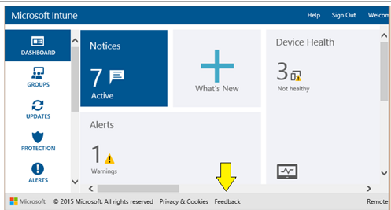

# Co je nov&#233;ho ve Microsoft Intune

## Listopadové novinky
**Oznámení!** Od listopadu budou všichni globální správci (označovaní také jako správci klientů) potřebovat k přístupu na portál společnosti Intune přiřazenou licenci pro Intune nebo Enterprise Mobility Suite (EMS). Abyste měli jistotu, že vaši správci nepřijdou o přístup na portál společnosti, přejděte na [portál Office 365](http://portal.office.com/) a přiřaďte svým globálním správcům licence pro Intune nebo EMS. Licence se dají přiřazovat jednotlivě nebo hromadně. Začněte už dnes, abyste se na listopad připravili včas!

Postup pro přiřazení licence ke stávajícímu uživatelskému účtu:

1.  Přihlaste se na [portál Office 365](http://portal.office.com/) pomocí přihlašovacích údajů globálního správce (správce klientů). Upozorňujeme, portál účtů Intune se postupně vyřazuje z provozu a přesouvá na portál účtů Office 365, jak se dozvíte z [tohoto příspěvku na blogu](http://blogs.technet.com/b/microsoftintune/archive/2015/09/01/intune-and-ems-subscriptions-now-available-in-the-office-365-portal.aspx) a z informací ve službě Intune.

2.  Klikněte na **Uživatelé** &gt; **Aktivní uživatelé**.

    -   Vyberte filtrované zobrazení pro každou z rolí globálního správce.

    -   Případně můžou globální správci také vyhledat uživatele bez přiřazených licencí.

3.  Vyberte uživatele, který potřebuje novou licenci. Zaškrtnutím políčka konkrétního uživatele zobrazíte v pravém panelu nastavení daného uživatele.

4.  Pokud chcete přiřadit určitou licenci, klikněte na odkaz **Upravit** v části **Přiřazená licence**.

5.  Zaškrtněte políčko vedle služby Intune nebo sady EMS a potom klikněte na **Uložit**.

Licence můžete přiřadit také hromadně prostřednictvím služeb O365:

1.  Přihlaste se na [portál Office 365](http://portal.office.com/) pomocí přihlašovacích údajů globálního správce (správce klientů). Upozorňujeme, portál účtů Intune se postupně vyřazuje z provozu a přesouvá na portál účtů Office 365, jak se dozvíte z [tohoto příspěvku na blogu](http://blogs.technet.com/b/microsoftintune/archive/2015/09/01/intune-and-ems-subscriptions-now-available-in-the-office-365-portal.aspx) a z informací ve službě Intune.

2.  Klikněte na **Uživatelé** &gt; **Aktivní uživatelé**.

3.  Vyberte všechny uživatele, kteří potřebují novou licenci.

4.  Na pravém panelu vyberte možnost **Upravit**. Otevře se průvodce, který vás ve čtyřech krocích provede procesem nastavení uživatelů. Pokud u těchto uživatelé nechcete provést žádné další změny, můžete přejít do části 3.

Pokud používáte nástroj System Center 2012 Configuration Manager i službu Intune (hybridní scénář), můžete přiřadit licence prostřednictvím kolekce Intune v konzole pro správu nástroje Configuration Manager. Přidejte globální správce do kolekce uživatelé určené v [předplatném Intune](https://technet.microsoft.com/en-us/library/jj884158.aspx#bkmk_witsub).

## Co je nového v Intune – říjen 2015

### Aktualizace podmíněného přístupu pro místní Exchange

-   **Teď můžete vyhovujícím zařízením zaregistrovaným v Intune povolit přístup k e-mailu Exchange Active Sync, pokud je globální pravidlo Exchange nastavené na blokování nebo umístění do karantény**

    Pokud jste až doteď chtěli povolit v zaregistrovaných a vyhovujících zařízeních přístup k e-mailu, museli jste nastavit výchozí globální pravidlo Exchange na hodnotu **Povolit**.

    Po této aktualizaci služby už toto nastavení není k podmíněnému přístupu nezbytné.  Pokud vaše prostředí Exchange vyžaduje, abyste výchozí globální pravidlo nastavili na **Blokovat / Umístit do karantény**, stačí na stránce zásad podmíněného přístupu do místního prostředí Exchange zaškrtnout políčko **Přepsat výchozí pravidlo**.  Další informace o pravidlech a výsledných oznámeních pro koncové uživatele najdete v tématu [Správa přístupu k e-mailu s Microsoft Intune](../Topic/Manage_email_access_with_Microsoft_Intune.md).

-   **Nové prostředí karantény jedním kliknutím**

    Zjednodušili jsme prostředí e-mailu o umístění do karantény, takže teď umožňuje registraci jedním kliknutím. Po této aktualizaci služby můžou koncoví uživatelé v e-mailu o umístění do karantény dokončit proces registrace v aplikaci Portál společnosti kliknutím na jeden odkaz.

### Aktualizace správy mobilních zařízení a aplikací

-   **Android**

    Všechny funkce pro správu služby [!INCLUDE[wit_nextref](../Token/wit_nextref_md.md)] teď podporují Android 6.0 (Marshmallow), jak se píše v tomto příspěvku na blogu: [Microsoft Intune nabízí podporu systému Android Marshmallow od nultého dne](http://blogs.technet.com/b/microsoftintune/archive/2015/10/09/microsoft-intune-to-provide-day-0-support-for-android-marshmallow.aspx).

-   **iOS**

    Už nemůžete vytvářet nová nasazení aplikací do zařízení iOS se starší verzí operačního systému než iOS 7.1. Všechna stávající nasazení aplikací do zařízení se starší verzí operačního systému než iOS 7.1 budou dál fungovat a bude je spravovat [!INCLUDE[wit_nextref](../Token/wit_nextref_md.md)].

-   **Windows 10**

    [!INCLUDE[wit_nextref](../Token/wit_nextref_md.md)] teď podporuje nasazení univerzálních aplikací pro Windows 10 pomocí instalačního softwaru typu **balíček aplikací systému Windows**. Podrobnosti a požadavky najdete v tématu [Začínáme s nasazováním aplikací v Microsoft Intune](../Topic/Plan_for_app_deployment_in_Microsoft_Intune.md).

### Změny a aktualizace aplikací portálů společnosti Microsoft
V této verzi se provedly následující změny aplikací portálu společnosti:

**iOS**

-   V aplikaci Portál společnosti přibyla nová tlačítka, která uživatelům usnadňují odesílání diagnostických protokolů správcům IT:

    |Název tlačítka|Místo zobrazení|
    |------------------|-------------------|
    |**Zpráva**|Zprávy s výstrahami na chyby|
    |**Odeslat diagnostickou sestavu**|Obrazovka O aplikaci v aplikaci Portál společnosti|

## Co připravujeme
Sledujte nadcházející vylepšení služby Intune pomocí [přehledu cloudové platformy](http://www.microsoft.com/en-us/server-cloud/roadmap/Indevelopment.aspx?TabIndex=0&dropValue=Intune).

### Chraňte svá firemní data pomocí funkce Ochrana podnikových dat (EDP)
Při správě zařízení s Windows 10 bude služba Intune schopná vytvořit a nasadit zásady konfigurace pro funkci ochrana podnikových dat (EDP) pro Windows 10. Funkce EDP vám může pomoct omezit sdílení podnikových dat nebo vám zobrazovat výstrahy. Zásady EDP v Intune budou spravovat seznam aplikací chráněných funkcí EDP, umístění v podnikové síti, úroveň ochrany a nastavení šifrování.

## Archivovat

-   [September 2015](../Topic/What_s_new_in_Microsoft_Intune.md#BKMK_Sep2015)

-   [August 2015](../Topic/What_s_new_in_Microsoft_Intune.md#BKMK_August2015)

-   [July 2015](../Topic/What_s_new_in_Microsoft_Intune.md#BKMK_Jul15)

-   [June 2015](../Topic/What_s_new_in_Microsoft_Intune.md#BKMK_Jun15)

-   [Květen 2015](../Topic/What_s_new_in_Microsoft_Intune.md#BKMK_May15)

-   [Duben 2015](../Topic/What_s_new_in_Microsoft_Intune.md#BKMK_Apr15)

-   [Březen 2015](../Topic/What_s_new_in_Microsoft_Intune.md#BKMK_Mar15)

-   [Únor 2015](../Topic/What_s_new_in_Microsoft_Intune.md#BKMK_Feb15)

-   [Prosinec 2014](../Topic/What_s_new_in_Microsoft_Intune.md#BKMK_Dec14)

-   [Listopad 2014](../Topic/What_s_new_in_Microsoft_Intune.md#BKMK_Nov14)

-   [Září 2014](../Topic/What_s_new_in_Microsoft_Intune.md#BKMK_Sep14)

-   [Duben 2014](../Topic/What_s_new_in_Microsoft_Intune.md#bkmk_ape)

-   [Leden 2014](../Topic/What_s_new_in_Microsoft_Intune.md#bkmk_Jan2014)

-   [Říjen 2013](../Topic/What_s_new_in_Microsoft_Intune.md#bkmk_Oct2013)

-   [Červen 2013](../Topic/What_s_new_in_Microsoft_Intune.md#bkmk_June2013)

-   [Květen 2013](../Topic/What_s_new_in_Microsoft_Intune.md#bkmk_May2013)

-   [Duben 2013](../Topic/What_s_new_in_Microsoft_Intune.md#bkmk_April2013)

-   [Březen 2013](../Topic/What_s_new_in_Microsoft_Intune.md#bkmk_March2013)

### Září 2015

#### Aktualizace správy mobilních zařízení a aplikací

-   **Všechny funkce pro správu služby [!INCLUDE[wit_nextref](../Token/wit_nextref_md.md)] pro iOS teď podporují iOS 9**
    Podrobnosti o možnostech správy systému iOS 9 najdete v [tomto příspěvku na blogu](http://blogs.technet.com/b/microsoftintune/archive/2015/09/09/day-zero-support-for-ios-9-with-intune.aspx).

-   **Nová zásada konfigurace mobilních aplikací pro iOS** 
    Nová zásada konfigurace mobilních aplikací umožňuje automaticky zadat nastavení, které můžou aplikace iOS vyžadovat při spuštění. Můžete třeba zadat síťový port nebo uživatelské jméno. Podrobnosti najdete v tématu [Konfigurace aplikací pomocí zásad konfigurace mobilních aplikací v Microsoft Intune](../Topic/Configure_apps_with_mobile_app_configuration_policies_in_Microsoft_Intune.md).

-   **Snaží správa aplikací pro uživatele systému iOS 9**
    V této verzi můžete zahrnout dříve nasazené aplikace pro uživatele systému iOS 9 do správy pomocí služby Intune. U starších verzí systému iOS platí, že v případě, že nasazujete aplikaci a v zařízení je již nainstalována nespravovaná verze aplikace, budete nejprve muset požádat uživatele, aby si aplikaci ručně odinstaloval, a teprve pak bude moci služba [!INCLUDE[wit_nextref](../Token/wit_nextref_md.md)] nainstalovat spravovanou aplikaci.

    Od této verze služby Intune ale můžete uživatele zařízení se systémem iOS 9 vyzvat, aby službě Intune umožnili převzít správu aplikace, a použít všechny relevantní zásady správy mobilních aplikací.

-   **Správa systému Windows 10** 
    Pomocí nové [obecné zásady konfigurace pro Windows 10](https://technet.microsoft.com/library/mt404697.aspx) můžete konfigurovat heslo, zařízení, prohlížeč a další nastavení pro zaregistrovaná zařízení se systémy Windows 10 a Windows 10 Mobile

-   **Vytváření a nasazení aplikací do zaregistrovaných zařízení se systémem Windows 10** 
    Nový typ instalačního programu softwaru, Instalační služba systému Windows přes MDM (&#42;.msi), vám umožňuje vytvářet a nasazovat aplikace Instalační služby systému Windows pro zaregistrovaná zařízení se systémem Windows 10. Podrobnosti najdete v tématu [Začínáme s nasazováním aplikací v Microsoft Intune](../Topic/Plan_for_app_deployment_in_Microsoft_Intune.md).

### Změny a aktualizace aplikací portálů společnosti Microsoft
V této verzi se provedly následující změny aplikací portálu společnosti:

**iOS**

-   Microsoft automaticky shromažďuje anonymní informace o výkonu a využití portálu společnosti za účelem zlepšení svých produktů a služeb. Koncoví uživatelé můžou na svém zařízení shromažďování dat vypnout v nastavení dat o využití, ale správci nemají nad shromažďováním dat žádnou kontrolu a nemůžou toto nastavení koncového uživatele nijak změnit.

-   Podpora rozlišení celoobrazovkového režimu na zařízeních iPhone 6 a 6 Plus

-   Opravy chyb pro vylepšení zabezpečení

### Novinky v dokumentaci Intune – září 2015

#### Nová témata

|Název|Podrobnosti|
|---------|---------------|
|[Nastavení zásad konfigurace Windows 10 v Microsoft Intune](../Topic/Windows_10_configuration_policy_settings_in_Microsoft_Intune.md)|Toto je nová zásada konfigurace, která umožňuje spravovat nastavení a funkce v zařízeních se systémy Windows 10 a Windows 10 Mobile.|
|[Konfigurace aplikací pomocí zásad konfigurace mobilních aplikací v Microsoft Intune](../Topic/Configure_apps_with_mobile_app_configuration_policies_in_Microsoft_Intune.md)|Jedná se o nový typ zásady umožňující automaticky poskytovat zásady, které se můžou požadovat, když uživatel spustí aplikaci pro iOS.|

#### Aktualizovaná témata

|Název|Podrobnosti|
|---------|---------------|
|[Použití zásad ke správě počítačů a mobilních zařízení s Microsoft Intune](../Topic/Use_policies_to_manage_computers_and_mobile_devices_with_Microsoft_Intune.md)|Došlo k přidání nejnovějších informací, které vám pomůžou pochopit a vytvářet zásady.|

### Srpen 2015

#### Aktualizace správy mobilních zařízení a aplikací

-   **Podmínky a ujednání** pro registraci v rámci služby Intune a přístup společnosti [jsou teď spravované pomocí zásad](https://technet.microsoft.com/library/mt405893.aspx). Můžete zacílit různé sady podmínek a ujednání, které budou odpovídat požadavkům konkrétní skupiny uživatelů. Například můžete nasadit podmínky a ujednání v různých jazycích pro geograficky vymezené uživatelské skupiny. Můžete také [upravit podmínky a ujednání](https://technet.microsoft.com/library/mt405893.aspx#BKMK_TCVers) a rozhodnout, jestli se má zvýšit číslo verze, a vyžádat si souhlas uživatelů s novými podmínkami a ujednáními před použitím portálu společnosti.

-   **Řada zásad Intune byla přejmenovaná**, aby byly víc konzistentní v rámci celého produktu a snáz se vyhledávaly. Seznam všech dostupných zásad Intune najdete v tématu [Použití zásad ke správě počítačů a mobilních zařízení s Microsoft Intune](../Topic/Use_policies_to_manage_computers_and_mobile_devices_with_Microsoft_Intune.md).

-   **Profily certifikátů PKCS #12 (.PFX)** jsou dostupné pro Android 4.0 nebo novější a pro Windows 10 (v desktopové i mobilní verzi) a novější. Použití .PFX nevyžaduje server NDES. Jak používat profily certifikátu .PFX najdete v tématu [Povolení přístupu k firemním prostředkům pomocí profilů certifikátů v Microsoft Intune](../Topic/Enable_access_to_company_resources_using_certificate_profiles_with_Microsoft_Intune.md).

-   **Nastavení podnikových hranic pro Windows 10 Desktop a Mobile** umožňuje granulární nastavení sítě VPN, jak je popsáno v tématu [Pomoc uživatelům připojit s k práci pomocí profilů VPN v Microsoft Intune](../Topic/Help_users_connect_to_their_work_using_VPN_profiles_with_Microsoft_Intune.md).

-   **Aplikace OneDrive pro Android nově podporuje víc identit**. Tato a další aktualizace zásad správy mobilních aplikací jsou popsané [v seznamu aplikací Microsoftu, které můžete spravovat](https://technet.microsoft.com/library/dn708489.aspx).

-   **Vyřazení zámku aktivace na zařízeních iOS**. Pokud je zařízení s iOS, které je majetkem společnosti, chráněné tzv. zámkem aktivace, musíte před vymazáním a opětovnou aktivací zařízení zadat Apple ID a heslo uživatele. To může být problém, pokud již uživatel ze společnosti odešel a vrátil zařízení vlastněné společností, aniž by zámek aktivace vypnul. Problém můžete vyřešit tak, že použijete [funkci Vynechat zámek aktivace služby Intune](https://technet.microsoft.com/library/mt414176.aspx).

#### Podmíněný přístup pro osobní počítače
Nově můžete konfigurovat zásady podmíněného přístupu pro osobní počítače. To umožňuje desktopovým aplikacím Office přístup k online službám Exchange Online a SharePointu. Pokud chcete povolit zásady podmíněného přístupu pro osobní počítače, počítač musí být buď připojený k doméně, nebo splňovat předpisy.

-   Úplný seznam požadavků pro povolení zásad podmíněného přístupu pro osobní počítače najdete v tématu [Správa přístupu k e-mail a SharePointu pomocí Microsoft Intune](../Topic/Manage_access_to_email_and_SharePoint_with_Microsoft_Intune.md) v části **Začínáme**.

-   Podmínky, které můžete nastavit pro povolení podmíněného přístupu pro přístup k e-mailu, najdete v tématu [Správa přístupu k e-mailu s Microsoft Intune](../Topic/Manage_email_access_with_Microsoft_Intune.md).

-   Podmínky, které můžete nastavit pro povolení podmíněného přístupu k SharePointu Online, najdete v tématu [Správa přístupu na SharePoint Online přes Microsoft Intune](../Topic/Manage_SharePoint_Online_access_with_Microsoft_Intune.md).

#### Změny a aktualizace aplikací portálů společnosti Microsoft
V této verzi se provedly následující změny aplikací portálu společnosti:

**Android**

-   Uživatelům se teď po přihlášení zobrazí pokyny k registraci zařízení, pokud zařízení ještě nezaregistrovali pro správu.

#### Novinky v dokumentaci Intune – srpen 2015

##### Nová témata

|Název|Podrobnosti|
|---------|---------------|
|[Pomoc při ochraně zařízení s iOS pomocí funkce Vynechat zámek aktivace pro Microsoft Intune](../Topic/Help_protect_iOS_devices_with_Activation_Lock_bypass_for_Microsoft_Intune.md)|Zjistěte, jak se pomocí Intune dá obejít na zařízeních iOS Zámek aktivace v případě, kdy uživatel odejde od společnosti a vrátí zařízení uzamčené.|

##### Aktualizovaná témata

|Název|Podrobnosti|
|---------|---------------|
|[Aplikace Microsoftu, které můžete použít se zásadami správy mobilních aplikací služby Microsoft Intune](../Topic/Microsoft_apps_you_can_use_with_Microsoft_Intune_mobile_application_management_policies.md)|Doplněné o nejnovější informace o aplikacích, které můžete spravovat pomocí zásad správy mobilních aplikací.|
|[Použití zásad ke správě počítačů a mobilních zařízení s Microsoft Intune](../Topic/Use_policies_to_manage_computers_and_mobile_devices_with_Microsoft_Intune.md)|Aktualizované o nejnovější zásady přidané do služby Intune.|

### Červenec 2015
Červencové aktualizace pro Intune se omezily na servisní vylepšení, která nám umožňují pokračovat v poskytování vysoce kvalitních služeb. Tato aktualizace služby neobsahuje nové funkce.

Android

#### Adaptační benefit Intune
Microsoft nabízí pro Intune adaptační benefity pro příslušné plány. Adaptační benefity vám umožní vzdáleně pracovat s odborníky Microsoftu na přípravě vašeho prostředí Intune k použití. Další informace najdete v tématu [Popis adaptačních benefitů pro Microsoft Intune](https://technet.microsoft.com/library/mt228266.aspx).

#### Změny a aktualizace aplikací portálů společnosti Microsoft
V této verzi se provedly následující změny aplikací portálu společnosti:

**Android**

-   Microsoft automaticky shromažďuje anonymní informace o výkonu a využití portálu společnosti za účelem zlepšení svých produktů a služeb. Koncoví uživatelé můžou na svém zařízení shromažďování dat vypnout v nastavení dat o využití, ale správci nemají nad shromažďováním dat žádnou kontrolu a nemůžou toto nastavení koncového uživatele nijak změnit.

### Červen 2015

### Pomozte nám vylepšit Intune
Ve snaze dozvědět se od vás, komunity Intune, jak můžeme Intune vylepšovat, jsme zřídili nový web pro zasílání názorů s technologií UserVoice. Odkaz na web pro zasílání názorů v dolní části konzoly pro správu vás zavede na stránku UserVoice, kde můžete napsat Microsoftu svůj názor na existující funkce a obsah Intune, vyžádat si nové funkce nebo obsah a hlasovat o odesílání (pomozte nám nastavit priority).

### Správa nové aplikace Outlook pro iOS a Android
Pomocí zásad pro správu mobilní aplikace (MAM) můžete spravovat novou aplikaci Outlook pro iOS a Android.  Úplný seznam aplikací, u kterých se dá zásada MAM použít, najdete v části [Aplikace Microsoftu, které můžete použít se zásadami správy mobilních aplikací služby Microsoft Intune](../Topic/Microsoft_apps_you_can_use_with_Microsoft_Intune_mobile_application_management_policies.md).

Tuto aplikaci podporuje taky podmíněný přístup k e-mailům na Exchange.  Další informace najdete v tématu [Správa přístupu k e-mail a SharePointu pomocí Microsoft Intune](../Topic/Manage_access_to_email_and_SharePoint_with_Microsoft_Intune.md).

### Aktualizace ochrany koncového bodu
**Pracovní prostor ochrany proti malwaru Endpoint Protection teď zobrazuje poslední cesty zjišťování**
Na stránce **Veškerý malware** pracovního prostoru Ochrana se teď zobrazuje sloupec **Nedávno kontrolované cesty**. Tento sloupec uvádí posledních deset umístění zadaného malwaru nalezeného v počítači. Další informace najdete v části [Pomoc se zabezpečením počítačů s Windows pomocí služby Endpoint Protection pro Microsoft Intune](../Topic/Help_secure_Windows_PCs_with_Endpoint_Protection_for_Microsoft_Intune.md).

**Správa programu Windows Defender pro Windows 10 Technical Preview**
Intune má přidané nastavení správy pro Windows Defender. Windows Defender poskytuje ochranu proti malwaru a ve Windows 10 Technical Preview nahrazuje Ochranu koncového bodu. Další informace najdete v části [Pomoc se zabezpečením počítačů s Windows pomocí služby Endpoint Protection pro Microsoft Intune](../Topic/Help_secure_Windows_PCs_with_Endpoint_Protection_for_Microsoft_Intune.md).

### Vylepšené možnosti práce
**Podmíněný přístup**

-   Koncovému uživateli se při zablokování jeho mobilního zařízení zašle zjednodušená e-mailová zpráva.

-   Snížil se počet kroků, které musí uživatel udělat pro odblokování e-mailu.

### Změny a aktualizace aplikací portálů společnosti Microsoft
V této verzi se provedly následující změny aplikací portálu společnosti:

**Windows a Windows Phone**

-   Správci můžou pomocí skriptu PowerShell přihlásit balíček Windows Phone 8.1 Company Portal appx s vlastním podpisovým certifikátem kódu Symantec, aby pomohli se zkušebním načtením aplikace Firemní portál. Skript se distribuuje v rámci souboru **WinPhoneSSPBootstrapper.exe** dostupného ve službě [Stažení softwaru](http://www.microsoft.com/download/details.aspx?id=46445).

-   Opravy chyb

**iOS**

-   Aplikace Firemní portál Microsoft Intune pro iOS je aktualizovaná tak, aby podporovala iOS verze 7.1 a novější. Aktualizace znamená, že můžou koncoví uživatelé přihlašovat nová zařízení v Intune, jenom když je na zařízení spuštěný iOS verze 7.1 nebo novější. Není možné přihlašovat zařízení s iOS verze 7.0 nebo dřívější. Uživatelé, kteří už mají zaregistrovaná zařízení používaná v nepodporované verzi iOS, můžou nadále používat aplikaci Firemní portál nainstalovanou na jejich zařízeních.

-   Vylepšené možnost katalogu aplikací pro zjišťování a instalaci firemních aplikací

-   Opravy chyb

### Novinky v dokumentaci Intune – červen 2015

#### Aktualizovaná témata

|Název|Podrobnosti|
|---------|---------------|
|[Aplikace Microsoftu, které můžete použít se zásadami správy mobilních aplikací služby Microsoft Intune](../Topic/Microsoft_apps_you_can_use_with_Microsoft_Intune_mobile_application_management_policies.md)|Aktualizované o nejnovější spravované aplikace se dají používat se zásadami správy mobilní aplikace.|
|[Správa přístupu k e-mail a SharePointu pomocí Microsoft Intune](../Topic/Manage_access_to_email_and_SharePoint_with_Microsoft_Intune.md)|Aktualizované o nejnovější aplikace, které podporují podmíněný přístup k e-mailu na Exchange a SharePoint Online.|
|[Ochrana dat pomocí zásad správy mobilních aplikací v Microsoft Intune](../Topic/Configure_and_deploy_mobile_application_management_policies_in_the_Microsoft_Intune_console.md)|Aktualizované o podrobnosti o aplikaci, která podporuje víc identit umožňující správu jenom firemních dat pro aplikaci a ne osobní údaje uživatele.|

### Květen 2015

#### Správa mobilních aplikací
Nový nástroj **Microsoft Intune App Wrapping Tool pro Android** umožňuje upravovat chování interních aplikací pro Android, abyste je mohli řídit pomocí zásad správy mobilních aplikací. Podrobnosti najdete v tématu [Příprava aplikací pro Android na správu mobilních aplikací nástrojem Microsoft Intune App Wrapping Tool](../Topic/Prepare_Android_apps_for_mobile_application_management_with_the_Microsoft_Intune_App_Wrapping_Tool.md).

**Nasazení aplikací Google Play Storu podle požadavku**.  Aplikace pro Android teď můžete nasazovat z Google Play Storu jako požadované instalace. Při nasazení aplikace uvidí uživatel upozornění, že je požadovaná aplikace. Když uživatele na toto upozornění klepne, přejde do Google Play Storu, odkud může aplikaci nainstalovat. V konzole Microsoft Intune můžete sledovat, jestli uživatel nainstaloval aplikaci.

**Publikujte a nasaďte aplikace pro iOS bez souboru manifestu**.  Při publikování nebo nasazení aplikace pro IOS teď stačí zadat soubor instalace aplikace. Už se nepožaduje přidružený soubor manifestu (.plist).

#### Zásady Intune

-   Nastavení ze zásad zabezpečení mobilních zařízení jsou teď rozdělené na zásady konfigurace pro každou platformu zařízení. I když můžete nadále používat zásady zabezpečení mobilních zařízení a existující zásady, které jste nasadili, budou i nadále fungovat, nové zásady konfigurace obsahují nejnovější nastavení a měli byste naplánovat migraci, aby se začaly používat. Nové jsou tyto zásady:

    -   Zásady konfigurace pro Android

    -   Zásady konfigurace pro iOS

    -   Zásady konfigurace pro Windows

    -   Zásady konfigurace pro Windows Phone

    -   Zásady Exchange ActiveSync

-   Zásady **Windows Phone OMA-URI** jsou teď přejmenované na **Vlastní zásady pro Windows Phone**.

-   Nové zásady, **Vlastní zásady Windows 10**, vám umožňují vytvářet a nasazovat nastavení OMA-URI pro řízení nastavení na registrovaných zařízeních s Windows 10.

    Podrobnosti najdete v tématu [Nastavení vlastních zásad pro Windows 10 v Microsoft Intune](../Topic/Windows_10_custom_policy_settings_in_Microsoft_Intune.md). Seznam nastavení, která můžete použít, najdete tady: [Vlastní nastavení URI pro zařízení s Windows 10](../Topic/Custom_URI_settings_for_Windows_10_devices.md).

#### Nový filtr konzoly – Helpdesk – uzel Skupiny
Po nastavení označení **Helpdesk – uzel skupiny** pro správce služby Intune uvidí tento správce jenom omezené zobrazení konzoly Intune a bude moct provádět omezené úlohy, jako je hledání malwaru nebo resetování hesla. Podrobnosti najdete v tématu [Určení toho, co se správcům zobrazí v konzole pro správu Microsoft Intune](../Topic/Control_what_admins_can_see_in_the_Microsoft_Intune_admin_console.md).

#### Přihlášení k odběru oznámení o stavu služby
Přihlaste se k odběru informačních kanálů RSS na stránce [Stav služby Intune](http://status.manage.microsoft.com/StatusPage/ServiceDashboard), abyste dostávali oznámení o problémech se službou a nadcházející údržbě.

#### Podmíněný přístup
Změny ke zlepšení toku, který koncoví uživatelé musí použít, aby zajistili, že jejich zařízení bude v souladu s předpisy, a získali přístup k e-mailu.

#### Změny a aktualizace aplikací portálů společnosti Microsoft
V této verzi se provedly následující změny aplikací portálu společnosti:

**Windows a Windows Phone**

Když koncoví uživatelé instalují aplikaci z firemního portálu Windows Phone, můžou kontrolovat stav instalace v zobrazení Podrobnosti o aplikaci. Zobrazují se tři možné stavy:

-   Instalace

-   Instalováno

-   Instalace se nezdařila

**iOS**

-   Opravy chyb pro vylepšení zabezpečení

**Android**

-   Opravy chyb

### Co je nového v dokumentaci k Intune -- květen 2015

#### Nová témata

|Název|Podrobnosti|
|---------|---------------|
|[Nastavení zásad konfigurace pro iOS v Microsoft Intune](../Topic/iOS_configuration_policy_settings_in_Microsoft_Intune.md)  [Nastavení zásad konfigurace pro Android v Microsoft Intune](../Topic/Android_configuration_policy_settings_in_Microsoft_Intune.md)  [Nastavení zásad konfigurace pro Windows v Microsoft Intune](../Topic/Windows_configuration_policy_settings_in_Microsoft_Intune.md)  [Nastavení zásad konfigurace pro Windows Phone v Microsoft Intune](../Topic/Windows_Phone_configuration_policy_settings_in_Microsoft_Intune.md)  [Nastavení zásad Exchange ActiveSync v Microsoft Intune](../Topic/Exchange_ActiveSync_policy_settings_in_Microsoft_Intune.md)|Obsahuje podrobnosti o nových zásadách konfigurace specifických pro danou platformu, které vám umožní řídit nastavení zabezpečení, celoobrazovkového režimu a souladu aplikací s předpisy.|
|[Nastavení vlastních zásad pro Windows 10 v Microsoft Intune](../Topic/Windows_10_custom_policy_settings_in_Microsoft_Intune.md)|Tyto nové zásady umožňují řídit určitá nastavení zařízení pomocí nastavení OMA-URI.|
|[Vlastní nastavení URI pro zařízení s Windows 10](../Topic/Custom_URI_settings_for_Windows_10_devices.md)|Obsahuje seznam nastavení OMA URI, která můžete nasadit pomocí vlastních zásad Windows 10.|
|[Příprava aplikací pro Android na správu mobilních aplikací nástrojem Microsoft Intune App Wrapping Tool](../Topic/Prepare_Android_apps_for_mobile_application_management_with_the_Microsoft_Intune_App_Wrapping_Tool.md)|Tento nástroj umožňuje upravovat chování interních aplikací pro Android tak, abyste je mohli řídit pomocí zásad správy mobilních aplikací.|
|[Určení toho, co se správcům zobrazí v konzole pro správu Microsoft Intune](../Topic/Control_what_admins_can_see_in_the_Microsoft_Intune_admin_console.md)|Vysvětluje přednastavená označení, která můžete použít pro správce služby, například pro zaměstnance, kteří pracují v oddělení technické podpory. Ti mohou delegovat úlohy správy a při tom dál zajišťovat zabezpečení vaší infrastruktury [!INCLUDE[wit_nextref](../Token/wit_nextref_md.md)].|

#### Aktualizovaná témata

|Název|Podrobnosti|
|---------|---------------|
|[Správa nastavení a funkcí v zařízeních pomocí zásad Microsoft Intune](../Topic/Manage_settings_and_features_on_your_devices_with_Microsoft_Intune_policies.md)|Přidaly se informace, které vám pomohou zvolit ty správné zásady zabezpečení, které se mají použít.|
|[Použití zásad ke správě počítačů a mobilních zařízení s Microsoft Intune](../Topic/Use_policies_to_manage_computers_and_mobile_devices_with_Microsoft_Intune.md)|Aktualizované, aby se zobrazil seznam všech nových zásad [!INCLUDE[wit_nextref](../Token/wit_nextref_md.md)]. Navíc se aktualizovaly pokyny v tématu, aby obsahovaly nejnovější informace.|
|[Možnosti správy mobilních zařízení v Microsoft Intune [nahrazení]](http://msdn.microsoft.com/en-us/library/6b2f4ca9-5861-4fa0-8888-eba4cea25025)|Aktualizovalo se o informace o nejnovějších funkcích produktu.|
|[Co říct koncovým uživatelům o používání služby Microsoft Intune](../Topic/What_to_tell_your_end_users_about_using_Microsoft_Intune.md)|Popisuje, jak můžou odborníci na IT nasazovat aplikace pro Android z Google Play Storu jako požadované instalace.|

### Duben 2015

#### Podmíněný přístup

-   Podmíněný přístup pro místní systém Exchange teď podporuje zařízení s Androidem.

-   Teď můžete zadat účet, který se bude používat k odeslání e-mailů s oznámením o blokování zařízení u zásad podmíněného přístupu pro místní systém Exchange.

-   Aktualizace dokumentace podmíněného přístupu umožňují začlenění nejnovějších informací.

Další informace najdete v části [Správa přístupu k e-mail a SharePointu pomocí Microsoft Intune](../Topic/Manage_access_to_email_and_SharePoint_with_Microsoft_Intune.md).

#### Zásady konfigurace

-   Nové **Vlastní zásady pro Android** umožňují nasadit nastavení OMA-URI na zařízení s Androidem, která se nedají nakonfigurovat pomocí zásad zabezpečení mobilního zařízení. V této verzi můžete nasadit profily Wi-Fi, které používají předsdílený klíč pro zařízení s Androidem. Další informace najdete v části [Nastavení vlastních zásad pro Android v Microsoft Intune](../Topic/Android_custom_policy_settings_in_Microsoft_Intune.md).

#### Správa mobilních aplikací

-   Seznam dostupných aplikací spravovaných zásadami se aktualizoval tak, aby obsahoval nejnovější informace. Další informace najdete v části [Ochrana dat pomocí zásad správy mobilních aplikací v Microsoft Intune](../Topic/Configure_and_deploy_mobile_application_management_policies_in_the_Microsoft_Intune_console.md).

#### Správa softwaru
Software do zařízení Windows Phone 8.1 teď můžete nasadit ve formátu **sady .appx**. Podrobnosti najdete v tématu [Nasazení aplikací do mobilních zařízení v Microsoft Intune](../Topic/Deploy_apps_to_mobile_devices_in_Microsoft_Intune_-_deleted.md).

#### Správa Windows Defenderu pro Windows 10 Technical Preview
[!INCLUDE[wit_nextref](../Token/wit_nextref_md.md)] přidá nastavení správy pro Windows Defender. Windows Defender poskytuje ochranu proti malwaru a ve Windows 10 Technical Preview nahrazuje Endpoint Protection. Další informace najdete v části [Pomoc se zabezpečením počítačů s Windows pomocí služby Endpoint Protection pro Microsoft Intune](../Topic/Help_secure_Windows_PCs_with_Endpoint_Protection_for_Microsoft_Intune.md).

#### Změny a aktualizace aplikací portálů společnosti Microsoft
V této verzi se provedly následující změny aplikací portálu společnosti:

##### Windows a Windows Phone

-   Opravy chyb

##### iOS

-   Uživatelé teď mají přístup k licenčním podmínkám z aplikace.

-   Zobrazení **Profil** jsme přepracovali.

-   Opravy chyb pro vylepšení zabezpečení

### Březen 2015

#### Podpora programu DEP (Device Enrollment Program)
Správa mobilních zařízení Intune teď může spravovat zařízení iOS zakoupená prostřednictvím programu registrace zařízení společnosti Apple. To umožňuje bezdrátovou správu mobilních zařízení iOS vlastněných společností. Podrobnosti najdete v tématu [Registrace zařízení iOS vlastněných společností v Microsoft Intune](../Topic/Enroll_corporate-owned_iOS_devices_in_Microsoft_Intune.md).

#### Omezení registrace zařízení
Správci můžou omezit počet zařízení, které může každý uživatel zaregistrovat pro správu ve [!INCLUDE[wit_nextref](../Token/wit_nextref_md.md)]. Podrobnosti najdete v části „Nastavení omezení registrace zařízení“ tématu [Povolení registrace mobilních zařízení na portálu účtů Microsoft Intune](../Topic/Enable_mobile_device_enrollment_with_the_Microsoft_Intune_Account_Portal.md).

#### Správa softwaru
Software do zařízení Windows Phone 8.1 teď můžete nasadit ve formátu **.appx**. Podrobnosti najdete v tématu [Nasazení aplikací do mobilních zařízení v Microsoft Intune](../Topic/Deploy_apps_to_mobile_devices_in_Microsoft_Intune_-_deleted.md).

#### Změny a aktualizace aplikací portálů společnosti Microsoft
V této verzi se provedly následující změny aplikací portálu společnosti:

##### Windows a Windows Phone

-   Vylepšené přihlašování v aplikacích portálu společnosti ve Windows a Windows Phone pomocí integrace knihovny Active Directory Authentication Library (ADAL)

-   Opravy chyb

##### Android

-   Přidaná podpora pro profily Wi-Fi s klíči v případě použití Intune společně s Configuration Managerem

-   Přidaná podpora pro funkce **Vzdálené uzamčení** a **Resetování hesla** při použití [!INCLUDE[wit_nextref](../Token/wit_nextref_md.md)] společně s nástrojem [!INCLUDE[cmshort](../Token/cmshort_md.md)]

-   Přidané nastavení **Podrobné protokolování** k vylepšení řešení potíží

-   Vylepšený výkon profilů certifikátu SCEP

-   Opravy chyb

### Únor 2015

#### Podmíněný přístup

-   Nové zásady SharePointu Online umožňují zabránit aplikacím v přístupu k SharePointu Online v případě, že zařízení není kompatibilní.

#### Profily sítě Wi-Fi
Nové **Zásady importu Wi-Fi pro Windows** použijte k importu sady nastavení Wi-Fi (pro Windows 8.1 a novější), kterou pak můžete nasadit na skupiny zařízení a uživatele ve vaší organizaci.

Podrobnosti najdete v tématu [Pomoc uživatelům s připojením k sítím společnosti pomocí Wi-Fi profilů s Microsoft Intune](../Topic/Help_users_connect_to_company_networks_using_Wi-Fi_profiles_with_Microsoft_Intune.md).

#### Profily sítě VPN
Připojení VPN pro jednotlivé aplikace se teď podporují pro zařízení iOS, pokud je typ připojení Cisco AnyConnect.

#### Nastavení zásad zabezpečení mobilního zařízení
Následující funkce se pro nastavení zásad zabezpečení mobilního zařízení změnila:

-   Když povolíte nastavení **Vyžadovat automatické aktualizace**, můžete si teď taky vybrat minimální kategorii aktualizací, které chcete automaticky nainstalovat.

-   Nastavení **Vyžadovat šifrování u mobilních zařízeních** teď podporuje Windows 8.1. Pokud toto nastavení povolíte, uživatelé musí připojit svůj účet Microsoft k zařízení.

Podrobnosti najdete v tématu [Správa nastavení a funkcí v zařízeních pomocí zásad Microsoft Intune](../Topic/Manage_settings_and_features_on_your_devices_with_Microsoft_Intune_policies.md).

#### Správa mobilních aplikací
Přidané informace o nejnovějších aplikacích, které můžete spravovat pomocí zásad správy mobilních aplikací, v tématu [Ochrana dat pomocí zásad správy mobilních aplikací v Microsoft Intune](../Topic/Configure_and_deploy_mobile_application_management_policies_in_the_Microsoft_Intune_console.md).

### Prosinec 2014

#### Podmíněný přístup
Podmíněný přístup uvedený ve verzi z listopadu 2014 teď obsahuje následující nové funkce:

-   Zásady podmíněného přístupu se teď dají použít k řízení přístupu k systému Exchange Online.

-   Vytvořte zásady slučitelnosti, které definují pravidla a nastavení, které musí zařízení splňovat, aby mohlo přistupovat k místnímu systému Exchange nebo Exchange Online.

Podrobnosti najdete v tématu [Správa přístupu k e-mail a SharePointu pomocí Microsoft Intune](../Topic/Manage_access_to_email_and_SharePoint_with_Microsoft_Intune.md).

#### Správa zařízení iOS vlastněných společností
[Registrace zařízení iOS vlastněných společností v Microsoft Intune](../Topic/Enroll_corporate-owned_iOS_devices_in_Microsoft_Intune.md). Pomocí této metody registrace uživatelé nemůžou zrušit registraci zařízení nebo ho resetovat do továrního nastavení. Správce předem nakonfiguruje zařízení iOS jedním z těchto způsobů:

-   Nastaví zařízení pro zápis a pak distribuuje každé zařízení jednomu uživateli, což se taky označuje jako „vyberte si vlastní zařízení“ (CYOD).

-   Zapíše zařízení, aby nemělo uživatele a sdílelo se ve skupině uživatelů, jako třeba prodejní zařízení v restauraci.

#### Správa mobilních aplikací
Spravované mobilní aplikace pracují se zásadami správy mobilních aplikací a omezují určité operace aplikací, třeba kopírování a vkládání nebo funkci snímku obrazovky.

-   [Příprava aplikací pro iOS na správu mobilních aplikací nástrojem Microsoft Intune App Wrapping Tool](../Topic/Prepare_iOS_apps_for_mobile_application_management_with_the_Microsoft_Intune_App_Wrapping_Tool.md) – Tento nástroj umožňuje nakonfigurovat interní aplikace iOS pro práci se zásadami správy mobilních aplikací.

-   Zásady správy mobilních aplikací použijte pro aplikování nastavení na kompatibilní aplikace, které umožňují omezení funkcí aplikace. Podrobnosti najdete v tématu [Ochrana dat pomocí zásad správy mobilních aplikací v Microsoft Intune](../Topic/Configure_and_deploy_mobile_application_management_policies_in_the_Microsoft_Intune_console.md).

-   Spravovaný prohlížeč je webový prohlížeč, který můžete nasadit na vaše zařízení a řídit s ním weby, které můžou uživatelé navštěvovat. Navíc můžete zásady správy mobilních aplikací použít pro prohlížeč. Podrobnosti najdete v tématu [Správa přístupu k internetu pomocí zásad spravované prohlížeče v Microsoft Intune](../Topic/Manage_Internet_access_using_managed_browser_policies_with_Microsoft_Intune.md).

#### Vlastní zásady nastavení
Pro nastavení mobilních zařízení, která se nedají nakonfigurovat pomocí zásad zabezpečení mobilního zařízení, můžete vytvořit vlastní zásady pro zařízení iOS exportované z nástroje Apple Configurator. Podrobnosti najdete v tématu [Nastavení vlastních zásad pro iOS v Microsoft Intune](../Topic/iOS_custom_policy_settings_in_Microsoft_Intune.md).

Pro zařízení, která používají Windows Phone, můžete vytvořit a nasadit zásadu obsahující nastavení OMA-URI k řízení funkcí na zařízení.

#### Monitorování a vytváření sestav
Nová sestava **Historie zařízení** umožňuje zobrazit záznam akcí vyřazení, vymazání a odstranění. Tato sestava slouží k zobrazení, kdo v minulosti akce v zařízeních inicioval.

### Listopad 2014
Nedávné změny najdete taky v tématu [Požadavky na síťovou infrastrukturu pro Microsoft Intune](../Topic/Network_infrastructure_requirements_for_Microsoft_Intune.md).

#### Změna názvu produktu
V této verzi se Windows Intune označuje jako [!INCLUDE[wit_firstref](../Token/wit_firstref_md.md)].

#### Vylepšení konzoly správce Intune
V konzole správce [!INCLUDE[wit_nextref](../Token/wit_nextref_md.md)] se provedlo množství vylepšení, včetně nové stránky **Řídicí panel** poskytující rychlý přístup k podrobnostem stavu, snadněji tak můžete spravovat [!INCLUDE[wit_nextref](../Token/wit_nextref_md.md)] a vyhledávat podrobnosti o spravovaných zařízeních. Podrobnosti o konzole správce najdete v tématu [Referenční dokumentace ke konzolám pro správu Microsoft Intune](../Topic/Reference_for_the_Microsoft_Intune_administrative_consoles.md).

#### Podmíněný přístup do místního systému Exchange

-   Umožňuje blokovat přístup k místnímu e-mailu Microsoft Exchange z mobilních zařízení, pokud se zařízení nespravuje ve [!INCLUDE[wit_nextref](../Token/wit_nextref_md.md)]. Podrobnosti najdete v tématu [Správa přístupu k e-mail a SharePointu pomocí Microsoft Intune](../Topic/Manage_access_to_email_and_SharePoint_with_Microsoft_Intune.md).

#### Přístup k prostředkům společnosti

-   **Profily certifikátu** – Umožňují zřídit a nasadit ověřovací certifikáty pro spravovaná zařízení a uživatelům bezproblémově přistupovat k prostředkům společnosti pomocí profilů VPN a Wi-Fi. Podrobnosti najdete v tématu [Povolení přístupu k firemním prostředkům pomocí profilů certifikátů v Microsoft Intune](../Topic/Enable_access_to_company_resources_using_certificate_profiles_with_Microsoft_Intune.md).

-   **E-mailové profily** – Teď můžete vytvářet a nasazovat e-mailové profily pro zařízení se Samsung KNOX. Podrobnosti najdete v tématu [Konfigurace přístupu k podnikovému e-mailu pomocí e-mailových profilů v Microsoft Intune](../Topic/Configure_access_to_corporate_email_using_email_profiles_with_Microsoft_Intune.md).

-   **Profily VPN** – Umožňují vytvářet a nasazovat nastavení VPN, minimalizovat úsilí koncového uživatele vyžadované pro připojení k prostředkům v podnikové síti. Profily VPN můžete taky přidružit spravované aplikaci tak, aby se při spuštění aplikace automaticky otevřelo připojení VPN. Podrobnosti najdete v tématu [Pomoc uživatelům připojit s k práci pomocí profilů VPN v Microsoft Intune](../Topic/Help_users_connect_to_their_work_using_VPN_profiles_with_Microsoft_Intune.md).

-   **Profily Wi-Fi** – Umožňují vytvářet a nasazovat nastavení sítě Wi-Fi, minimalizovat úsilí koncového uživatele vyžadované pro připojení k podnikové síti Wi-Fi. Podrobnosti najdete v tématu [Pomoc uživatelům s připojením k sítím společnosti pomocí Wi-Fi profilů s Microsoft Intune](../Topic/Help_users_connect_to_company_networks_using_Wi-Fi_profiles_with_Microsoft_Intune.md).

#### Správa softwaru

-   **Spravované mobilní aplikace pro iOS** – Typ instalace **Spravované aplikace iOS z obchodu s aplikacemi** použijte ke správě a nasazení aplikací iOS, které jsou v obchodě s aplikacemi zdarma. Tento typ instalace můžete nasadit jako požadovanou instalaci, která bude ve spravovaných zařízeních povinná, nebo ho nasadit a umožnit jeho stažení z obchodu s aplikacemi. Omezení aplikace můžete taky přidružit kompatibilním aplikacím a zkontrolovat jejich stav v konzole správce. Podrobnosti najdete v tématu [Začínáme s nasazováním aplikací v Microsoft Intune](../Topic/Plan_for_app_deployment_in_Microsoft_Intune.md).

-   **Instalace a odinstalace vyžadovaných aplikací** – Akce nasazení **Požadovaných** aplikací se teď podporuje v mobilních zařízeních. Podrobnosti najdete v tématu [Vysvětlení akcí nasazení aplikace](../Topic/Plan_for_app_deployment_in_Microsoft_Intune.md#BKMK_Depl).

-   **Aktualizace aplikací** – Aktualizují aplikaci novou revizí a automaticky ji nasadí na zařízení. Podrobnosti najdete v tématech [Nasazení aplikací do mobilních zařízení v Microsoft Intune](../Topic/Deploy_apps_to_mobile_devices_in_Microsoft_Intune_-_deleted.md) a [Nasazení aplikací do počítačů s Windows v Microsoft Intune](../Topic/Deploy_apps_to_Windows_PCs_in_Microsoft_Intune.md).

#### Ochrana dat

-   **Vzdálené resetování hesla** se teď podporuje v systémech Windows Phone 8 a Windows Phone 8.1. Podrobnosti najdete v tématu [Chraňte svá data pomocí vzdáleného vymazání, vzdáleného zámku nebo resetování hesla pomocí Microsoft Intune](../Topic/Help_protect_your_data_with_remote_wipe,_remote_lock,_or_passcode_reset_using_Microsoft_Intune.md).

-   Služba **Multi-Factor Authentication** se teď podporuje ve [!INCLUDE[wit_nextref](../Token/wit_nextref_md.md)]. Podrobnosti najdete v tématu [Ochrana zařízení s Windows pomocí vícefaktorového ověřování ve službě Microsoft Intune](../Topic/Protect_Windows_devices_with_multi-factor_authentication.md).

-   **Filtrované skupiny** – Umožňují omezit akce správy, které správce IT ve vaší organizaci může provádět jenom u vámi určených skupin. Podrobnosti najdete v tématu [Použití skupin pro správu uživatelů a zařízení s Microsoft Intune](../Topic/Use_groups_to_manage_users_and_devices_with_Microsoft_Intune.md).

#### Hromadný zápis

-   Správce pro zápis zařízení umožňuje uživateli Intune zapsat víc než 5 mobilních zařízení. Kromě zápisu zařízení může správce pro zápis zařízení nainstalovat aplikace a software společnosti a konfigurovat přístup ke spravovaným zařízením. Podrobnosti najdete v tématu [Přihlášení firemních zařízení pomocí manažera registrace zařízení v Microsoft Intune](../Topic/Enroll_corporate-owned_devices_with_the_Device_Enrollment_Manager_in_Microsoft_Intune.md).

#### Zásady konfigurace
Zásady konfigurace poskytují následující funkce:

-   **Kompatibilní a nekompatibilní aplikace** – Umožňují určit seznam aplikací, které uživatelé můžou a nemůžou nainstalovat.

-   **Celoobrazovkový režim** – Umožňuje uzamknout zařízení a povolit fungování jenom některých funkcí. Můžete třeba povolit, aby v zařízení běžela jenom jedna vámi určená spravovaná aplikace, nebo můžete zakázat tlačítka hlasitosti na zařízení.

Podrobnosti najdete v tématu [Nastavení zásad konfigurace pro iOS v Microsoft Intune](../Topic/iOS_configuration_policy_settings_in_Microsoft_Intune.md).

#### Podmínky a ujednání

-   Při publikování podmínek a ujednání uvidí vaši uživatelé tyto informace při prvním použití portálu společnosti z libovolného zařízení, bez ohledu na to, jestli je už zařízení zapsané. Jestli uživatelé chtějí mít na portál přístup, musí tyto podmínky přijmout. Podrobnosti najdete v tématu [O podmínkách a ujednáních](../Topic/Enable_mobile_device_enrollment_with_the_Microsoft_Intune_Account_Portal.md#BKMK_TermsAndConditions).

### Září 2014

#### E-mailové profily
E-mailové profily vám pomůžou vytvořit, nasadit a sledovat nastavení e-mailů Exchange ActiveSync na zařízeních. Díky tomu mají uživatelé na svých osobních zařízeních přístup k podnikovému e-mailu, bez nutnosti něco nastavovat. Další informace naleznete v části [Konfigurace přístupu k podnikovému e-mailu pomocí e-mailových profilů v Microsoft Intune](../Topic/Configure_access_to_corporate_email_using_email_profiles_with_Microsoft_Intune.md).

#### Nová nastavení zásad mobilních zařízení
Přidaná nová nastavení zásad vám pomůžou spravovat víc funkcí na vašich spravovaných mobilních zařízeních. Další informace naleznete v části [Možnosti správy mobilních zařízení v Microsoft Intune](../Topic/Mobile_device_management_capabilities_in_Microsoft_Intune.md).

### Duben 2014

#### Windows Phone 8.1
Windows Phone 8.1 se teď podporuje. Windows Phone 8.1 teď obsahuje podporu pro nová nastavení zásad.

#### Android Samsung KNOX
Podporuje se Android Samsung KNOX s podporou selektivního vymazání.

#### Vymazání obsahu s povoleným systémem souborů EFS
Teď můžete vymazat obsah s povoleným systémem souborů EFS, třeba obsah týkající se poštovní aplikace pro Windows. Další informace naleznete v části [Chraňte svá data pomocí vzdáleného vymazání, vzdáleného zámku nebo resetování hesla pomocí Microsoft Intune](../Topic/Help_protect_your_data_with_remote_wipe,_remote_lock,_or_passcode_reset_using_Microsoft_Intune.md).

### Leden 2014

#### Vzdálené uzamčení a resetování hesla pro zařízení
Mobilní zařízení můžete vzdáleně uzamknout a můžete taky resetovat heslo. Další informace naleznete v části [Chraňte svá data pomocí vzdáleného vymazání, vzdáleného zámku nebo resetování hesla pomocí Microsoft Intune](../Topic/Help_protect_your_data_with_remote_wipe,_remote_lock,_or_passcode_reset_using_Microsoft_Intune.md).

#### Vybrané aplikace
[!INCLUDE[wit_nextref](../Token/wit_nextref_md.md)] teď umožňuje nakonfigurovat aplikaci jako vybranou aplikaci. Tato aplikace se pak výrazně zobrazí na portálu společnosti. Další informace naleznete v části [Nasazení aplikací do mobilních zařízení v Microsoft Intune](../Topic/Deploy_apps_to_mobile_devices_in_Microsoft_Intune_-_deleted.md).

#### Microsoft Intune Endpoint Protection je nainstalovaná ve výchozím nastavení
V předchozím vydání [!INCLUDE[wit_nextref](../Token/wit_nextref_md.md)] se služba [!INCLUDE[wit_firstref](../Token/wit_firstref_md.md)] Endpoint Protection nainstalovala jenom v případě, že došlo k vytvoření zásady, která tuto instalaci vyžadovala u nově zapsaných klientů. V aktuální verzi [!INCLUDE[wit_nextref](../Token/wit_nextref_md.md)] se klient Endpoint Protection instaluje do počítačů s [!INCLUDE[wit_nextref](../Token/wit_nextref_md.md)], pokud není vytvořená zásada, která by této instalaci bránila. K této změně došlo na základě názorů zákazníků a za účelem lepšího zabezpečení počítačů s [!INCLUDE[wit_nextref](../Token/wit_nextref_md.md)]. Další informace naleznete v části [Pomoc se zabezpečením počítačů s Windows pomocí služby Endpoint Protection pro Microsoft Intune](../Topic/Help_secure_Windows_PCs_with_Endpoint_Protection_for_Microsoft_Intune.md).

#### Následující aktualizace z ledna 2014 se týkají jenom samostatné verze Microsoft Intune a nevyžadují Configuration Manager

##### Nová nastavení zásad mobilních zařízení
Přidaná nová nastavení zásad vám pomůžou spravovat víc funkcí na mobilních zařízeních, která máte ve svém inventáři.  Další informace naleznete v části [Příprava registrace zařízení v Microsoft Intune](../Topic/Get_ready_to_enroll_devices_in_Microsoft_Intune.md).

##### Nová sestava inventáře mobilních zařízení
Došlo k přidání nového typu sestavy, který je určený speciálně pro informování o mobilních zařízeních v inventáři vaší organizace.  Další informace naleznete v části [Pochopení operací Microsoft Intune pomocí sestav](../Topic/Understand_Microsoft_Intune_operations_by_using_reports.md).

##### Webové aplikace
[!INCLUDE[wit_nextref](../Token/wit_nextref_md.md)] teď umožňuje nasadit zástupce aplikace na webu do vašeho zařízení. Další informace naleznete v části [Začínáme s nasazováním aplikací v Microsoft Intune](../Topic/Plan_for_app_deployment_in_Microsoft_Intune.md).

##### Podpora pro Android
[!INCLUDE[wit_nextref](../Token/wit_nextref_md.md)] teď umožňuje zapsat zařízení s Androidem pro přímou správu. Další informace naleznete v části [Nastavení správy systému Android pomocí Microsoft Intune](../Topic/Set_up_Android_management_with_Microsoft_Intune.md).

### Říjen 2013

#### Podpora Windows 8.1
[!INCLUDE[wit_nextref](../Token/wit_nextref_md.md)] teď podporuje zařízení Windows 8.1, včetně systémů Windows Professional, Surface, Surface Pro a Windows Phone.

#### Zápis klientů se správou zařízení ve Windows 8.1
Zařízení se systémy Windows 8.1 a Windows RT 8.1 teď umožňují správu zařízení a automaticky zapisují a instalují aplikace. Další informace naleznete v části [Povolení registrace mobilních zařízení na portálu účtů Microsoft Intune](../Topic/Enable_mobile_device_enrollment_with_the_Microsoft_Intune_Account_Portal.md).

#### Skupina „Neseskupená zařízení“ se přidala zpátky do konzoly správce
Výchozí skupina „Neseskupená zařízení“, která se v předchozí verzi odebrala, je zpátky. Nově zapsaná zařízení se automaticky přiřadí do této skupiny.

#### Nová aplikace portálu společnosti pro zařízení iOS
Místo mobilní webové aplikace teď zařízení iOS můžou používat vlastní plně funkční aplikaci portálu společnosti.

#### Nová nastavení zásad pro aktualizace klientského agenta Microsoft Intune
Pro zjednodušení aktualizací klientského agenta se správcům přidala dvě nová nastavení zásad:

-   **Vyzvat uživatele k restartování Windows během povinných aktualizací klientského agenta Microsoft Intune**.

-   **Plán instalace povinných aktualizací klientského agenta Microsoft Intune** s parametry **Naplánovaný den** a **Naplánovaný čas**.

#### Nová nastavení zásad pro instalaci Endpoint Protection
Do nastavení zásad agenta [!INCLUDE[wit_nextref](../Token/wit_nextref_md.md)]**Nainstalovat službu Endpoint Protection** se přidala nová hodnota. Nová hodnota je **Ne** a je to výchozí hodnota.

> [!NOTE]
> Toto chování se liší od předchozí verze [!INCLUDE[wit_nextref](../Token/wit_nextref_md.md)], kde se [!INCLUDE[wit_nextref](../Token/wit_nextref_md.md)] Endpoint Protection nainstalovala automaticky během instalace klienta. Po upgradu může být potřeba vytvořit novou zásadu a zajistit tak, že noví klienti budou mít službu Endpoint Protection nainstalovanou, a že stávající klienti budou dál přijímat aktualizace.  .

### Červen 2013

#### Konektor Service to Service Connector pro Exchange
Pomocí této aktualizace teď můžete konfigurovat konektor [!INCLUDE[wit_nextref](../Token/wit_nextref_md.md)] Exchange Connector pro přímé připojení z vaší služby [!INCLUDE[wit_nextref](../Token/wit_nextref_md.md)] do hostovaného prostředí Exchange, aniž byste museli stáhnout další software.  .

#### Nástroj podpory pro zkušební správu Windows Phone 8 pomocí Microsoft Intune
Tento nástroj umožňuje snadno vyzkoušet správu zařízení Windows Phone 8 pomocí Microsoft System Center 2012 Configuration Manageru během vašeho zkušebního období odběru [!INCLUDE[wit_nextref](../Token/wit_nextref_md.md)], aniž byste si museli pořídit certifikát Symantec. Tento nástroj obsahuje:

-   Skript, který vyplní ukázkový token pro zápis aplikace.

-   Ukázkovou aplikaci portálu společnosti pro Windows Phone 8.

-   Dvě ukázkové aplikace, které se dají použít pro scénáře distribuce softwaru pro Windows Phone 8.

Nástroj podpory pro zkušební správu Windows Phone 8 pomocí [!INCLUDE[wit_nextref](../Token/wit_nextref_md.md)] se dá stáhnout ze služby [Stažení softwaru](http://www.microsoft.com/en-us/download/details.aspx?id=39079).

### Květen 2013

#### Relace konzoly správce Microsoft Intune jsou omezené na 8 hodin
Tato aktualizace způsobuje, že po přihlášení do konzoly správce [!INCLUDE[wit_nextref](../Token/wit_nextref_md.md)] se vaše relace po osmi hodinách stane neplatnou a zobrazí se výzva k novému přihlášení.

### Duben 2013

#### Instalace aplikace pro Windows 8 nebo Windows RT naskenováním kódu Microsoft Tag nebo čárového kódu
S touto aktualizací teď můžete naskenovat kód Microsoft Tag nebo čárový kód a automaticky přejít na stránku podrobností aplikace v aplikaci portálu společnosti pro Windows 8 nebo Windows RT.  Pokud aplikace portálu společnosti není nainstalovaná, zobrazí se výzva k její instalaci.

### Březen 2013

#### Podpora součásti Exchange Connector pro Office 365
S touto aktualizací teď můžete nakonfigurovat software [!INCLUDE[wit_nextref](../Token/wit_nextref_md.md)] Exchange Connector pro připojení k hostovanému prostředí Exchange v Office 365.  Další informace najdete v části [Správa mobilních zařízení pomocí protokolu Exchange ActiveSync a služby Microsoft Intune](../Topic/Mobile_device_management_with_Exchange_ActiveSync_and_Microsoft_Intune.md).

#### Sdílení aplikace z vašeho systému Windows Phone 8
S touto aktualizací můžete sdílet aplikaci s jinou osobou tak, že na stránce podrobností aplikace vyberete **Sdílet**. Tím se pošle e-mail s přímým odkazem na stránku podrobností aplikace.  Abyste aplikaci mohli sdílet, nemusíte ji mít sami nainstalovanou.

#### Instalace aplikace pro Windows Phone 8 naskenováním kódu Microsoft Tag nebo čárového kódu
S touto aktualizací teď můžete naskenovat kód Microsoft Tag nebo čárový kód a automaticky přejít na stránku podrobností aplikace v aplikaci portálu společnosti pro Windows Phone 8.  Pokud aplikace portálu společnosti není nainstalovaná, zobrazí se výzva k její instalaci.

## Viz také
[Začít používat Microsoft Intune](../Topic/Start_using_Microsoft_Intune.md)
[Knihovna TechNet služby Microsoft Intune ](http://go.microsoft.com/fwlink/?LinkID=247636)
[Informace o produktech Microsoft Intune](http://go.microsoft.com/fwlink/?LinkID=249135)
[Blog Microsoft Intune](http://go.microsoft.com/fwlink/?LinkID=273882)

