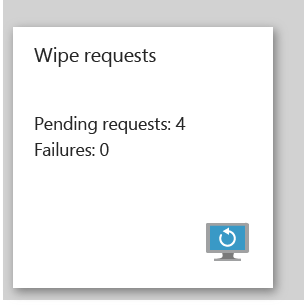

# Vymaz&#225;n&#237; data spravovan&#253;ch aplikac&#237; společnosti s Microsoft Intune
Můžete selektivně odebrat data společnosti z aplikací bez ovlivnění osobních dat na zařízení.  K vymazání dat aplikací společnosti musíte provést žádost o vymazání.  Po podání žádosti o vymazání se při příštím spuštění aplikace na zařízení z aplikace odeberou data společnosti.

Dlaždice **Žádost o vymazání** v okně **Správa mobilních aplikací Intune** zobrazuje počet nevyřízených žádostí a selhání.

> [!IMPORTANT]
> Aplikace Microsoft Word, Excel a PowerPoint nemají v aktuální verzi schopnost selektivního vymazání.

**V tomto tématu**

[Vytvoření žádosti o vymazání](#bkmk_makerequest)

[Monitorování žádostí o vymazání](#bkmk_monitorrequest)

#### Vytvoření žádosti o vymazání

1.  V okně **Správa obilních aplikací Intune**  klikněte na dlaždici **Žádosti o vymazání**.

    

2.  Klikněte na **Nové žádosti o vymazání**.

    

3.  V okně **Nová žádost o vymazání** kliknutím na **Uživatel** otevřete okno **Uživatel**, poté vyberte uživatele, jehož data aplikací chcete vymazat.

4.  Klikněte na **Zařízení**.  Otevře se okno **Zařízení**, ve kterém jsou uvedena všechny zařízení přidružená k vybranému uživateli.  Vyberte zařízení, které chcete vymazat.

5.  Vrátíte se do okna **Nová žádost o vymazání**. Kliknutím na **OK** vytvoříte žádost o vymazání. Služba vytvoří a sleduje samostatnou žádost o vymazání pro každou chráněnou aplikaci na zařízení.

Okno **Správa mobilních aplikací Intune** obsahuje souhrnnou sestavu o dlaždici **Žádost o vymazání**.  Zobrazí celkový stav a zahrnuje počet nevyřízených žádostí a selhání. Další informace získáte kliknutím na soubor, což otevře okno **Žádost o vymazání**.

#### Monitorování žádostí o vymazání

1.  V okně **Správa mobilních aplikací Intune** kliknutím na dlaždici **Žádost o vymazání** otevřete okno **Žádost o vymazání**.

2.  V okně **Žádost o vymazání** můžete zobrazit seznam žádostí seskupených podle uživatele.  Protože systém vytvoří žádost o vymazání pro každou chráněnou aplikaci spuštěnou na zařízení, může být u uživatele více žádostí.  Stav označuje, zda je žádost **nevyřízená**, **selhala** nebo byla **úspěšná**.

## Viz také
[Nakonfigurujte zásady ochrany před únikem informací pomocí Microsoft Intune.](../Topic/Configure_data_loss_prevention_app_policies_with_Microsoft_Intune.md)

